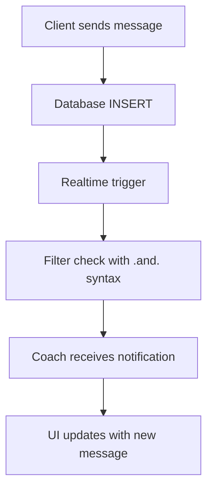

# Design Document: Chat Realtime Fix

## Overview

Данный дизайн описывает исправление критической ошибки в системе real-time чата, где тренеры не получают уведомления о новых сообщениях от клиентов из-за неправильного синтаксиса фильтров в Supabase Realtime.

## Architecture

### Current Problem

В файле `src/utils/chat/realtime.ts` на строке 78 используется неправильный синтаксис фильтра:

```typescript
filter: `sender_id=eq.${otherUserId},receiver_id=eq.${userId}`
```

Supabase Realtime требует использования `.and.` для объединения условий, а не запятой.

### Solution Architecture



## Components and Interfaces

### 1. Realtime Subscription Fix

**File:** `src/utils/chat/realtime.ts`

**Current Implementation:**
```typescript
filter: `sender_id=eq.${otherUserId},receiver_id=eq.${userId}`
```

**Fixed Implementation:**
```typescript
filter: `sender_id=eq.${otherUserId}.and.receiver_id=eq.${userId}`
```

### 2. Enhanced Error Handling

**Interface:**
```typescript
interface RealtimeError {
  type: 'connection' | 'subscription' | 'filter' | 'unknown'
  message: string
  details?: any
  timestamp: Date
}

interface ChatErrorHandler {
  onConnectionError: (error: RealtimeError) => void
  onSubscriptionError: (error: RealtimeError) => void
  onMessageError: (error: RealtimeError) => void
}
```

### 3. Connection Status Management

**Enhanced Interface:**
```typescript
interface ConnectionStatus {
  connected: boolean
  reconnecting: boolean
  error: string | null
  lastConnected?: Date
  reconnectAttempts: number
}
```

### 4. Message Validation

**Interface:**
```typescript
interface MessageValidator {
  validateMessage(content: string): ValidationResult
  isEmptyOrWhitespace(content: string): boolean
  exceedsMaxLength(content: string): boolean
}

interface ValidationResult {
  valid: boolean
  error?: 'empty' | 'too_long' | null
  message?: string
}

interface MessageValidationRules {
  maxLength: 5000  // Requirements 2.5
  minLength: 1     // Requirements 2.4
}
```

## Data Models

### Message Model (unchanged)
```typescript
interface Message {
  id: string
  sender_id: string
  receiver_id: string
  content: string
  created_at: string
  read_at: string | null
  is_deleted: boolean
}
```

### Error Log Model (new)
```typescript
interface ChatErrorLog {
  id: string
  user_id: string
  error_type: string
  error_message: string
  error_details: any
  created_at: string
}
```

## Correctness Properties

*A property is a characteristic or behavior that should hold true across all valid executions of a system-essentially, a formal statement about what the system should do. Properties serve as the bridge between human-readable specifications and machine-verifiable correctness guarantees.*

### Property 1: Realtime Message Delivery
*For any* message sent from client to coach, the coach should receive a realtime notification within 5 seconds
**Validates: Requirements 1.2**

### Property 2: Bidirectional Communication
*For any* message sent from coach to client, the client should receive a realtime notification within 5 seconds
**Validates: Requirements 1.3**

### Property 3: Message Chronological Order
*For any* set of messages in a chat, they should be displayed in chronological order based on created_at timestamp
**Validates: Requirements 1.5**

### Property 4: Empty Message Rejection
*For any* message input that is empty or contains only whitespace, the system should reject it before sending
**Validates: Requirements 2.4**

### Property 5: Message Length Validation
*For any* message input longer than 5000 characters, the system should reject it before sending
**Validates: Requirements 2.5**

### Property 6: Complete Message Loading
*For any* chat conversation, opening the chat should load all existing messages between the two users
**Validates: Requirements 1.1**

## Error Handling

### 1. Connection Errors
- **Timeout handling**: Exponential backoff for reconnection attempts
- **Max retry limit**: 5 attempts before showing permanent error
- **User feedback**: Clear status indicators for connection state
- **Logging**: Log error type, error message, and timestamp (Requirements 2.1)

### 2. Filter Syntax Validation
- **Development checks**: Validate filter syntax in development mode
- **Runtime monitoring**: Log filter errors for debugging
- **Fallback mechanism**: Graceful degradation if realtime fails

### 3. Message Delivery Failures
- **Retry mechanism**: Automatic retry for failed message sends
- **User notification**: Clear error messages for delivery failures (Requirements 2.3)
- **Offline support**: Queue messages when connection is lost

### 4. Message Validation
- **Empty message check**: Reject messages that are empty or contain only whitespace (Requirements 2.4)
- **Length validation**: Reject messages longer than 5000 characters (Requirements 2.5)
- **User feedback**: Show specific validation error to user
- **Pre-send validation**: Validate before attempting to send to database

## Testing Strategy

### Unit Tests
- Test filter syntax correction
- Test error handling functions
- Test connection status management
- Test message validation logic

### Integration Tests
- Test realtime subscription with correct filters
- Test message delivery between users
- Test error recovery scenarios
- Test connection status updates

### Property-Based Tests
- **Property 1**: Message delivery reliability across different network conditions
- **Property 2**: Bidirectional communication consistency
- **Property 3**: Message ordering preservation
- **Property 4**: Empty message rejection
- **Property 5**: Message length validation
- **Property 6**: Complete message loading accuracy

Each property test should run minimum 100 iterations and be tagged with:
**Feature: chat-realtime-fix, Property {number}: {property_text}**

### End-to-End Tests
- Full chat flow between coach and client
- Error scenarios (network failures, server errors)
- Reconnection scenarios
- Multiple concurrent chats

## Implementation Plan

### Phase 1: Critical Fix (Priority: High)
1. Fix filter syntax in `subscribeToMessages` function
2. Add validation for filter syntax
3. Test the fix with manual testing

### Phase 2: Error Handling (Priority: Medium)
1. Enhance error logging
2. Improve user feedback for connection issues
3. Add retry mechanisms

### Phase 3: Testing (Priority: Medium)
1. Add unit tests for realtime utilities
2. Add integration tests for message flow
3. Add E2E tests for complete chat scenarios

## Monitoring and Observability

### Metrics to Track
- Message delivery success rate
- Connection failure rate
- Reconnection attempts
- Average message delivery time

### Logging Enhancements
- Structured logging for realtime events
- Error categorization with type, message, and timestamp (Requirements 2.1)
- Performance metrics
- User session tracking
- Connection state transitions
- Message validation failures

## Security Considerations

### Data Protection
- Ensure RLS policies are correctly applied
- Validate user permissions before subscription
- Sanitize message content

### Rate Limiting
- Prevent message spam
- Limit reconnection attempts
- Throttle typing events

## Performance Optimizations

### Connection Management
- Reuse existing connections when possible
- Implement connection pooling
- Optimize subscription lifecycle

### Message Handling
- Batch message updates
- Implement message pagination
- Cache recent messages locally
