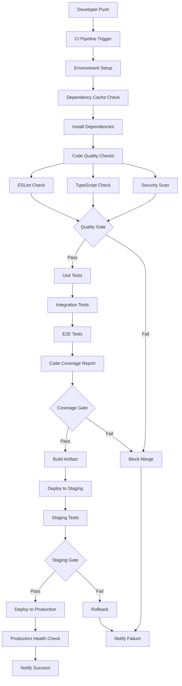

# Design Document: CI/CD Setup and Code Coverage

## Overview

Дизайн comprehensive CI/CD системы с автоматизированным тестированием, покрытием кода, quality gates и автоматическим развертыванием для обеспечения высокого качества релизов.

## Architecture

### CI/CD Pipeline Architecture



### Technology Stack

#### CI/CD Platform
- **GitHub Actions** (primary choice)

#### Testing Tools
- **Jest** - Unit and Integration tests
- **Playwright** - E2E tests
- **Testing Library** - React component tests

#### Code Quality Tools
- **ESLint** - Code style and quality
- **TypeScript** - Type checking
- **SonarQube** - Code quality analysis
- **Snyk** - Security vulnerability scanning

#### Coverage Tools
- **Istanbul/nyc** - Code coverage collection
- **Codecov** - Coverage reporting and visualization
- **Coverage badges** - Visual coverage indicators

## Components and Interfaces

### 1. CI Pipeline Configuration

**File:** `.github/workflows/ci.yml`

```yaml
name: CI Pipeline
on:
  push:
    branches: [main, develop]
  pull_request:
    branches: [main]

jobs:
  quality-checks:
    runs-on: ubuntu-latest
    steps:
      - uses: actions/checkout@v4
      - uses: actions/setup-node@v4
      - name: Cache dependencies
        uses: actions/cache@v3
      - name: Install dependencies
        run: npm ci
      - name: ESLint check
        run: npm run lint
      - name: TypeScript check
        run: npm run type-check
      - name: Security scan
        run: npm audit --audit-level high
```

### 2. Test Pipeline Configuration

```yaml
  test:
    needs: quality-checks
    runs-on: ubuntu-latest
    strategy:
      matrix:
        test-type: [unit, integration, e2e]
    steps:
      - name: Run tests
        run: npm run test:${{ matrix.test-type }}
      - name: Upload coverage
        uses: codecov/codecov-action@v3
```

### 3. Coverage Configuration

**File:** `jest.config.js` (enhanced)

```javascript
module.exports = {
  // ... existing config
  collectCoverage: true,
  coverageDirectory: 'coverage',
  coverageReporters: ['text', 'lcov', 'html', 'json'],
  coverageThreshold: {
    global: {
      branches: 80,
      functions: 80,
      lines: 80,
      statements: 80
    },
    './src/middleware/': {
      branches: 90,
      functions: 90,
      lines: 90,
      statements: 90
    },
    './src/utils/auth/': {
      branches: 90,
      functions: 90,
      lines: 90,
      statements: 90
    }
  }
}
```

### 4. Quality Gates Configuration

**File:** `.github/workflows/quality-gates.yml`

```yaml
name: Quality Gates
jobs:
  quality-gate:
    runs-on: ubuntu-latest
    steps:
      - name: Coverage Gate
        run: |
          COVERAGE=$(npm run test:coverage --silent | grep -o '[0-9]*\.[0-9]*%' | tail -1 | sed 's/%//')
          if (( $(echo "$COVERAGE < 80" | bc -l) )); then
            echo "Coverage $COVERAGE% is below 80% threshold"
            exit 1
          fi
      
      - name: Security Gate
        run: |
          npm audit --audit-level high --json > audit.json
          CRITICAL=$(cat audit.json | jq '.metadata.vulnerabilities.critical')
          if [ "$CRITICAL" -gt 0 ]; then
            echo "Found $CRITICAL critical vulnerabilities"
            exit 1
          fi
```

### 5. Deployment Pipeline

**File:** `.github/workflows/cd.yml`

```yaml
name: CD Pipeline
on:
  push:
    branches: [main]
  workflow_run:
    workflows: ["CI Pipeline"]
    types: [completed]
    branches: [main]

jobs:
  deploy-staging:
    if: ${{ github.event.workflow_run.conclusion == 'success' }}
    runs-on: ubuntu-latest
    steps:
      - name: Deploy to Staging
        run: |
          docker build -t app:${{ github.sha }} .
          docker tag app:${{ github.sha }} app:staging
          # Deploy to staging environment
      
      - name: Run Staging Tests
        run: npm run test:staging
  
  deploy-production:
    needs: deploy-staging
    runs-on: ubuntu-latest
    steps:
      - name: Deploy to Production
        run: |
          docker tag app:staging app:production
          # Deploy to production environment
      
      - name: Health Check
        run: |
          curl -f https://app.production.com/health || exit 1
```

## Data Models

### Pipeline Metrics
```typescript
interface PipelineMetrics {
  buildId: string
  duration: number
  status: 'success' | 'failure' | 'cancelled'
  testResults: {
    unit: TestResult
    integration: TestResult
    e2e: TestResult
  }
  coverage: CoverageReport
  qualityGates: QualityGateResult[]
}

interface TestResult {
  passed: number
  failed: number
  skipped: number
  duration: number
}

interface CoverageReport {
  overall: number
  lines: number
  functions: number
  branches: number
  statements: number
  files: FileCoverage[]
}

interface QualityGateResult {
  name: string
  status: 'passed' | 'failed'
  threshold: number
  actual: number
  message?: string
}
```

### Notification Models
```typescript
interface NotificationConfig {
  slack: {
    webhook: string
    channels: {
      success: string
      failure: string
      coverage: string
    }
  }
  email: {
    recipients: string[]
    templates: {
      success: string
      failure: string
      weekly: string
    }
  }
}

interface DeploymentNotification {
  environment: 'staging' | 'production'
  status: 'success' | 'failure' | 'rollback'
  version: string
  timestamp: Date
  metrics: PipelineMetrics
}
```

## Correctness Properties

*A property is a characteristic or behavior that should hold true across all valid executions of a system-essentially, a formal statement about what the system should do. Properties serve as the bridge between human-readable specifications and machine-verifiable correctness guarantees.*

Поскольку все acceptance criteria являются примерами конкретных сценариев CI/CD pipeline, все свойства будут основаны на этих примерах:

### Example 1: Automatic Test Execution
*For the specific case* when code is pushed to repository, unit tests should be automatically triggered and executed
**Validates: Requirements 1.1**

### Example 2: Test Sequence Execution
*For the specific case* when unit tests pass, integration tests should be automatically started
**Validates: Requirements 1.2**

### Example 3: E2E Test Triggering
*For the specific case* when integration tests pass, E2E tests should be automatically started
**Validates: Requirements 1.3**

### Example 4: Merge Blocking on Test Failure
*For the specific case* when any test fails, the merge should be blocked and developer notified
**Validates: Requirements 1.4**

### Example 5: Coverage Report Generation
*For the specific case* when build completes, code coverage report should be generated
**Validates: Requirements 2.1**

### Example 6: Coverage Threshold Enforcement
*For the specific case* when code coverage is below 80%, the merge should be blocked
**Validates: Requirements 2.2**

### Example 7: Critical Component Coverage
*For the specific case* when critical components have less than 90% coverage, the build should fail
**Validates: Requirements 2.3**

### Example 8: Automatic Artifact Creation
*For the specific case* when all tests pass in main branch, build artifact should be automatically created
**Validates: Requirements 3.1**

### Example 9: Staging Deployment
*For the specific case* when build artifact is created, automatic deployment to staging should occur
**Validates: Requirements 3.2**

### Example 10: Production Deployment Gate
*For the specific case* when staging tests pass, production deployment should be triggered
**Validates: Requirements 3.3**

## Error Handling

### 1. Pipeline Failure Recovery

```yaml
- name: Retry on Failure
  uses: nick-invision/retry@v2
  with:
    timeout_minutes: 5
    max_attempts: 3
    command: npm test
```

### 2. Rollback Mechanisms

```yaml
- name: Rollback on Failure
  if: failure()
  run: |
    kubectl rollout undo deployment/app
    docker tag app:previous app:production
```

### 3. Notification on Failures

```yaml
- name: Notify on Failure
  if: failure()
  uses: 8398a7/action-slack@v3
  with:
    status: failure
    text: "Build failed: ${{ github.event.head_commit.message }}"
```

## Testing Strategy

### Unit Tests for CI/CD Scripts
- Test pipeline configuration parsing
- Test quality gate logic
- Test notification systems
- Test deployment scripts

### Integration Tests for Pipeline
- Test full CI pipeline execution
- Test CD pipeline with staging/production
- Test rollback scenarios
- Test notification delivery

### Example-Based Tests
Since all requirements are example-based, we'll create specific test scenarios:

- **Example 1**: Test automatic unit test execution on push
- **Example 2**: Test integration test triggering after unit tests
- **Example 3**: Test E2E test execution sequence
- **Example 4**: Test merge blocking on test failures
- **Example 5**: Test coverage report generation
- **Example 6**: Test coverage threshold enforcement
- **Example 7**: Test critical component coverage checks
- **Example 8**: Test artifact creation on successful tests
- **Example 9**: Test staging deployment automation
- **Example 10**: Test production deployment gating

Each example test should verify the specific scenario described in the requirements.

### Performance Tests
- Measure pipeline execution time
- Test parallel test execution
- Test caching effectiveness
- Test resource usage optimization

## Implementation Plan

### Phase 1: Basic CI Setup
1. Configure GitHub Actions workflow
2. Set up basic test execution
3. Add code quality checks
4. Implement coverage reporting

### Phase 2: Advanced CI Features
1. Add quality gates
2. Implement parallel test execution
3. Add caching mechanisms
4. Set up notifications

### Phase 3: CD Pipeline
1. Configure staging deployment
2. Add production deployment
3. Implement rollback mechanisms
4. Add deployment notifications

### Phase 4: Monitoring & Optimization
1. Add pipeline metrics
2. Optimize performance
3. Add comprehensive monitoring
4. Create dashboards and reports

## Security Considerations

### 1. Secrets Management
- Use GitHub Secrets for sensitive data
- Rotate secrets regularly
- Limit secret access scope

### 2. Container Security
- Scan Docker images for vulnerabilities
- Use minimal base images
- Keep dependencies updated

### 3. Access Control
- Limit who can modify CI/CD configurations
- Use branch protection rules
- Require reviews for pipeline changes

## Performance Optimizations

### 1. Caching Strategy

```yaml
- name: Cache Node Modules
  uses: actions/cache@v3
  with:
    path: ~/.npm
    key: ${{ runner.os }}-node-${{ hashFiles('**/package-lock.json') }}
    restore-keys: |
      ${{ runner.os }}-node-
```

### 2. Parallel Execution

```yaml
strategy:
  matrix:
    test-group: [unit-1, unit-2, integration, e2e]
  max-parallel: 4
```

### 3. Incremental Builds

```yaml
- name: Check Changed Files
  uses: dorny/paths-filter@v2
  id: changes
  with:
    filters: |
      src:
        - 'src/**'
      tests:
        - '__tests__/**'
```

## Monitoring and Observability

### 1. Pipeline Metrics
- Build success/failure rates
- Average build duration
- Test execution times
- Coverage trends

### 2. Quality Metrics
- Code coverage over time
- Security vulnerability trends
- Code quality scores
- Technical debt metrics

### 3. Deployment Metrics
- Deployment frequency
- Lead time for changes
- Mean time to recovery
- Change failure rate

## Cost Optimization

### 1. Resource Management
- Use appropriate runner sizes
- Optimize build parallelization
- Clean up artifacts regularly
- Monitor usage costs

### 2. Efficient Workflows
- Skip unnecessary steps
- Use conditional execution
- Optimize Docker layers
- Minimize data transfer