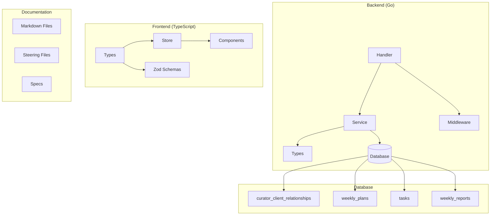
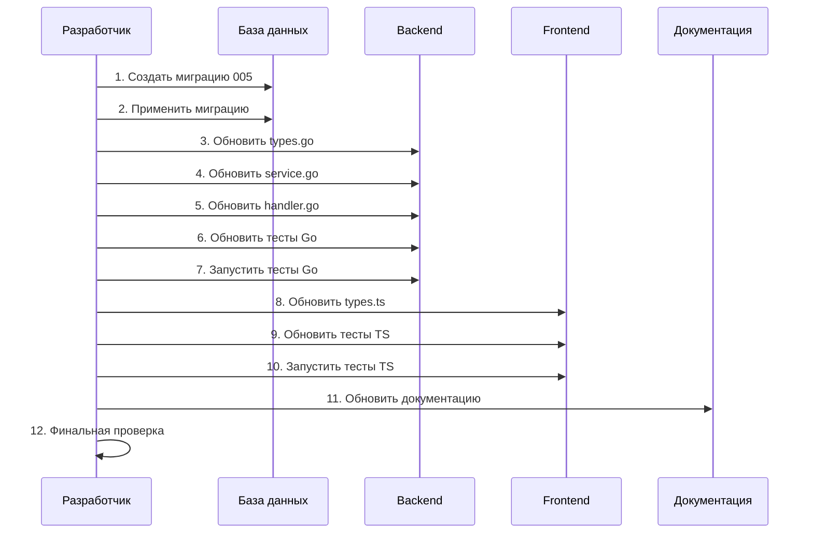

# Дизайн-документ: Рефакторинг Coach → Curator

## Обзор

Данный документ описывает техническую реализацию рефакторинга терминологии с "coach" (тренер) на "curator" (куратор) во всех компонентах системы BURCEV. Рефакторинг затрагивает backend (Go), frontend (TypeScript), базу данных (PostgreSQL) и документацию.

## Архитектура

### Затрагиваемые компоненты



### Стратегия миграции

Миграция выполняется в следующем порядке:
1. **Создание миграции БД** — переименование таблиц, колонок, индексов, политик
2. **Обновление Backend** — типы, сервисы, хендлеры, тесты
3. **Обновление Frontend** — типы, схемы, тесты
4. **Обновление документации** — markdown, steering, specs

## Компоненты и интерфейсы

### Backend: Изменения в типах (Go)

**Файл:** `apps/api/internal/modules/dashboard/types.go`

```go
// До рефакторинга
type WeeklyPlan struct {
    CoachID int64 `json:"coach_id" db:"coach_id"`
    // ...
}

// После рефакторинга
type WeeklyPlan struct {
    CuratorID int64 `json:"curator_id" db:"curator_id"`
    // ...
}
```

**Затрагиваемые структуры:**
- `WeeklyPlan.CoachID` → `WeeklyPlan.CuratorID`
- `Task.CoachID` → `Task.CuratorID`
- `WeeklyReport.CoachID` → `WeeklyReport.CuratorID`
- `WeeklyReport.CoachFeedback` → `WeeklyReport.CuratorFeedback`

### Backend: Изменения в сервисе (Go)

**Файл:** `apps/api/internal/modules/dashboard/service.go`

**Переименование функций:**
- `validateCoachClientRelationship` → `validateCuratorClientRelationship`

**Переименование параметров:**
- `coachID` → `curatorID` во всех функциях:
  - `CreatePlan(ctx, curatorID, clientID, plan)`
  - `UpdatePlan(ctx, curatorID, planID, updates)`
  - `CreateTask(ctx, curatorID, clientID, task)`
  - `sendWeeklyReportNotification(ctx, curatorID, report)`

### Backend: Изменения в хендлере (Go)

**Файл:** `apps/api/internal/modules/dashboard/handler.go`

**Изменения:**
- Проверка роли: `"coach"` → `"curator"`
- Сообщения об ошибках: `"Only coaches can..."` → `"Only curators can..."`
- Переменные: `coachID` → `curatorID`

### Frontend: Изменения в типах (TypeScript)

**Файл:** `apps/web/src/features/dashboard/types.ts`

```typescript
// До рефакторинга
export interface WeeklyPlan {
    coachId: string
    // ...
}

// После рефакторинга
export interface WeeklyPlan {
    curatorId: string
    // ...
}
```

**Затрагиваемые интерфейсы:**
- `WeeklyPlan.coachId` → `WeeklyPlan.curatorId`
- `Task.coachId` → `Task.curatorId`
- `WeeklyReport.coachId` → `WeeklyReport.curatorId`
- `WeeklyReport.coachFeedback` → `WeeklyReport.curatorFeedback`

### Frontend: Изменения в Zod-схемах

```typescript
// До рефакторинга
export const weeklyPlanSchema = z.object({
    coachId: z.string().min(1),
    // ...
})

// После рефакторинга
export const weeklyPlanSchema = z.object({
    curatorId: z.string().min(1),
    // ...
})
```

## Модели данных

### Миграция базы данных

**Новый файл миграции:** `005_rename_coach_to_curator_up.sql`

#### 1. Переименование таблицы

```sql
ALTER TABLE coach_client_relationships 
RENAME TO curator_client_relationships;
```

#### 2. Переименование колонок

```sql
-- curator_client_relationships
ALTER TABLE curator_client_relationships 
RENAME COLUMN coach_id TO curator_id;

-- weekly_plans
ALTER TABLE weekly_plans 
RENAME COLUMN coach_id TO curator_id;

-- tasks
ALTER TABLE tasks 
RENAME COLUMN coach_id TO curator_id;

-- weekly_reports
ALTER TABLE weekly_reports 
RENAME COLUMN coach_id TO curator_id;

ALTER TABLE weekly_reports 
RENAME COLUMN coach_feedback TO curator_feedback;
```

#### 3. Переименование индексов

```sql
-- Удаление старых индексов
DROP INDEX IF EXISTS idx_coach_client_coach;
DROP INDEX IF EXISTS idx_coach_client_client;
DROP INDEX IF EXISTS idx_weekly_plans_coach;
DROP INDEX IF EXISTS idx_tasks_coach;
DROP INDEX IF EXISTS idx_weekly_reports_coach;

-- Создание новых индексов
CREATE INDEX idx_curator_client_curator ON curator_client_relationships(curator_id, status);
CREATE INDEX idx_curator_client_client ON curator_client_relationships(client_id, status);
CREATE INDEX idx_weekly_plans_curator ON weekly_plans(curator_id, created_at DESC);
CREATE INDEX idx_tasks_curator ON tasks(curator_id, created_at DESC);
CREATE INDEX idx_weekly_reports_curator ON weekly_reports(curator_id, submitted_at DESC);
```

#### 4. Обновление RLS-политик

```sql
-- Удаление старых политик
DROP POLICY IF EXISTS "Coaches can view own relationships" ON curator_client_relationships;
DROP POLICY IF EXISTS "Coaches can create relationships" ON curator_client_relationships;
DROP POLICY IF EXISTS "Coaches can update own relationships" ON curator_client_relationships;
-- ... и остальные политики

-- Создание новых политик
CREATE POLICY "Curators can view own relationships"
  ON curator_client_relationships FOR SELECT
  USING (curator_id = current_setting('app.current_user_id')::BIGINT);
-- ... и остальные политики
```

#### 5. Обновление комментариев

```sql
COMMENT ON TABLE curator_client_relationships IS 'Relationships between curators and clients';
COMMENT ON TABLE weekly_plans IS 'Weekly nutrition and activity plans assigned by curators';
COMMENT ON TABLE tasks IS 'Tasks assigned by curators to clients';
COMMENT ON TABLE weekly_reports IS 'Weekly progress reports submitted by clients to curators';
```

### Миграция отката

**Файл:** `005_rename_coach_to_curator_down.sql`

Выполняет обратные операции для восстановления исходной структуры с "coach".

## Свойства корректности

*Свойство корректности — это характеристика или поведение, которое должно оставаться истинным для всех допустимых выполнений системы. Свойства служат мостом между человекочитаемыми спецификациями и машинно-проверяемыми гарантиями корректности.*


### Property 1: Отсутствие "coach" в Go-коде

*Для любого* Go-файла в директории `apps/api/`, после рефакторинга файл не должен содержать строку "coach" (за исключением комментариев о миграции).

**Validates: Requirements 1.1, 1.3, 1.4, 1.5**

### Property 2: Корректность проверки роли curator

*Для любого* запроса к защищённому эндпоинту, если пользователь имеет роль "curator", система должна предоставить доступ; если роль "coach" — система должна отклонить запрос.

**Validates: Requirements 1.6**

### Property 3: Сохранение данных при миграции

*Для любых* данных, вставленных в таблицы до миграции, после применения миграции данные должны быть доступны через новые имена колонок (curator_id вместо coach_id) с теми же значениями.

**Validates: Requirements 2.6**

### Property 4: Round-trip миграции

*Для любой* схемы базы данных, применение миграции UP и затем DOWN должно вернуть схему в исходное состояние (с именами coach_*).

**Validates: Requirements 2.7**

### Property 5: Отсутствие "coach" в TypeScript-коде

*Для любого* TypeScript-файла в директории `apps/web/src/features/dashboard/`, после рефакторинга файл не должен содержать строку "coach" в именах полей, переменных или типов.

**Validates: Requirements 3.1, 3.2, 3.3, 3.4, 3.5**

### Property 6: Отсутствие "coach" в документации

*Для любого* markdown-файла в директориях `.kiro/`, `docs/`, после рефакторинга файл не должен содержать "coach" или "тренер" (за исключением исторических ссылок).

**Validates: Requirements 4.1, 4.2, 4.3**

### Property 7: Корректность JSON API

*Для любого* API-ответа, содержащего информацию о кураторе, JSON должен содержать поле "curator_id" вместо "coach_id".

**Validates: Requirements 6.1, 6.2**

## Обработка ошибок

### Ошибки миграции БД

1. **Таблица не существует**: Миграция использует `IF EXISTS` для безопасного удаления
2. **Конфликт имён**: Проверка существования перед созданием новых объектов
3. **Нарушение FK**: Использование `CASCADE` для зависимых объектов

### Ошибки компиляции

1. **Go**: Компилятор выявит несоответствия типов после переименования полей
2. **TypeScript**: TSC выявит ошибки типизации

### Ошибки тестов

1. **Mock-объекты**: Обновление сигнатур методов
2. **Тестовые данные**: Замена "coach" на "curator" в fixtures

## Стратегия тестирования

### Unit-тесты

- Проверка валидации структур с новыми именами полей
- Проверка сообщений об ошибках на русском языке
- Проверка корректности JSON-сериализации

### Property-тесты

Используем **gopter** для Go и **fast-check** для TypeScript:

1. **Property 1-2**: Grep-поиск по файлам + проверка роли
2. **Property 3-4**: Тесты миграции с тестовыми данными
3. **Property 5-6**: Grep-поиск по файлам
4. **Property 7**: Тесты API-ответов
5. **Property 8**: Запуск полного набора тестов

### Интеграционные тесты

- Проверка API-эндпоинтов с новой терминологией
- Проверка RLS-политик с ролью "curator"

### Конфигурация тестов

- Минимум 100 итераций для property-тестов
- Тег формат: **Feature: coach-to-curator-refactoring, Property N: описание**

## Порядок выполнения


