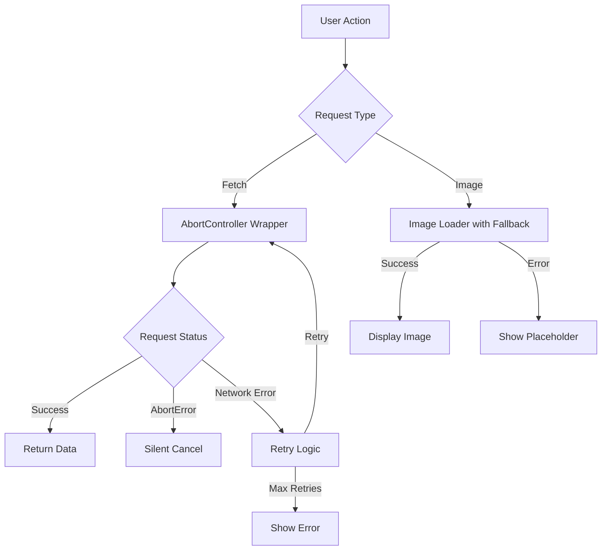

# Design Document: Error Handling Improvements

## Overview

Данный дизайн описывает исправление критических ошибок в обработке запросов, RLS политиках и сетевых ошибках, выявленных в production логах. Основные проблемы: AbortError при навигации, 403/406 ошибки при сохранении продуктов, и потеря сетевого соединения.

## Architecture

### Current Problems

1. **AbortError Logging**: При навигации запросы отменяются через AbortController, но ошибки логируются как неожиданные
2. **RLS Policy Violations**: Клиенты получают 403/406 ошибки при попытке сохранить продукты из внешних API
3. **Network Error Handling**: Отсутствует retry механизм и fallback для изображений

### Solution Architecture



## Components and Interfaces

### 1. Request Handler with AbortController

**File:** `src/utils/request-handler.ts` (new)

**Interface:**
```typescript
interface RequestOptions {
  signal?: AbortSignal
  retries?: number
  retryDelay?: number
  onRetry?: (attempt: number) => void
}

interface RequestHandler {
  fetch<T>(url: string, options?: RequestOptions): Promise<T>
  isAbortError(error: unknown): boolean
  shouldLogError(error: unknown): boolean
}
```

**Implementation:**
```typescript
export async function fetchWithAbort<T>(
  url: string,
  options: RequestOptions = {}
): Promise<T> {
  const { signal, retries = 3, retryDelay = 1000 } = options
  
  for (let attempt = 0; attempt <= retries; attempt++) {
    try {
      const response = await fetch(url, { signal })
      return await response.json()
    } catch (error) {
      // Don't log AbortError
      if (isAbortError(error)) {
        throw error
      }
      
      // Retry on network errors
      if (attempt < retries && isNetworkError(error)) {
        await delay(retryDelay * Math.pow(2, attempt))
        continue
      }
      
      // Log unexpected errors
      logger.error('Request failed', error, { url, attempt })
      throw error
    }
  }
}

export function isAbortError(error: unknown): boolean {
  return error instanceof Error && error.name === 'AbortError'
}
```

### 2. RLS Policy Fix for Products

**File:** `migrations/fix_products_rls.sql` (new)

**Current Policy:**
```sql
-- Too restrictive - only allows specific roles
CREATE POLICY "products_insert_policy" ON products
  FOR INSERT
  TO authenticated
  USING (auth.role() = 'admin');
```

**Fixed Policy:**
```sql
-- Allow all authenticated users to insert products
CREATE POLICY "products_insert_policy" ON products
  FOR INSERT
  TO authenticated
  WITH CHECK (true);

-- Allow all authenticated users to read products
CREATE POLICY "products_select_policy" ON products
  FOR SELECT
  TO authenticated
  USING (true);
```

### 3. Image Loader with Fallback

**File:** `src/utils/image-loader.ts` (new)

**Interface:**
```typescript
interface ImageLoaderOptions {
  fallbackUrl?: string
  onError?: (error: Error) => void
}

interface ImageLoader {
  loadImage(url: string, options?: ImageLoaderOptions): Promise<string>
  getPlaceholder(): string
}
```

**Implementation:**
```typescript
const PLACEHOLDER_IMAGE = '/images/product-placeholder.png'

export async function loadImage(
  url: string,
  options: ImageLoaderOptions = {}
): Promise<string> {
  const { fallbackUrl = PLACEHOLDER_IMAGE, onError } = options
  
  try {
    const response = await fetch(url, { method: 'HEAD' })
    if (response.ok) {
      return url
    }
  } catch (error) {
    logger.warn('Image load failed, using placeholder', { url, error })
    onError?.(error as Error)
  }
  
  return fallbackUrl
}
```

### 4. Component Cleanup Hook

**File:** `src/hooks/useAbortController.ts` (new)

**Interface:**
```typescript
interface UseAbortController {
  signal: AbortSignal
  abort: () => void
}
```

**Implementation:**
```typescript
export function useAbortController(): UseAbortController {
  const controllerRef = useRef<AbortController>()
  
  useEffect(() => {
    controllerRef.current = new AbortController()
    
    return () => {
      controllerRef.current?.abort()
    }
  }, [])
  
  return {
    signal: controllerRef.current?.signal!,
    abort: () => controllerRef.current?.abort()
  }
}
```

### 5. Prometheus Metrics Collector with Graceful Degradation

**File:** `src/utils/metrics/prometheus-collector.ts` (update)

**Interface:**
```typescript
interface PrometheusCollectorOptions {
  pushgatewayUrl: string
  retryInterval?: number
  silentMode?: boolean
}

interface PrometheusCollector {
  push(metrics: Record<string, number>): Promise<void>
  isAvailable(): boolean
  getStatus(): 'connected' | 'disconnected' | 'silent'
}
```

**Implementation:**
```typescript
export class PrometheusCollector {
  private available = false
  private silentMode = false
  private lastErrorLogged = false
  private retryTimer?: NodeJS.Timeout
  
  constructor(private options: PrometheusCollectorOptions) {
    this.checkAvailability()
  }
  
  private async checkAvailability(): Promise<void> {
    try {
      const response = await fetch(this.options.pushgatewayUrl, {
        method: 'HEAD',
        signal: AbortSignal.timeout(5000)
      })
      
      if (response.ok) {
        this.available = true
        this.silentMode = false
        
        if (this.lastErrorLogged) {
          logger.info('Prometheus Pushgateway connection restored')
          this.lastErrorLogged = false
        }
      }
    } catch (error) {
      this.available = false
      
      if (!this.lastErrorLogged) {
        logger.error('Prometheus Pushgateway unavailable, entering silent mode', error)
        this.lastErrorLogged = true
      }
      
      this.silentMode = true
    }
    
    // Retry every 60 seconds
    this.retryTimer = setTimeout(
      () => this.checkAvailability(),
      this.options.retryInterval || 60000
    )
  }
  
  async push(metrics: Record<string, number>): Promise<void> {
    if (!this.available || this.silentMode) {
      return // Silent failure
    }
    
    try {
      await fetch(this.options.pushgatewayUrl, {
        method: 'POST',
        body: JSON.stringify(metrics)
      })
    } catch (error) {
      // Don't log repeated errors
      if (!this.silentMode) {
        this.available = false
        this.checkAvailability()
      }
    }
  }
  
  isAvailable(): boolean {
    return this.available
  }
  
  getStatus(): 'connected' | 'disconnected' | 'silent' {
    if (this.available) return 'connected'
    if (this.silentMode) return 'silent'
    return 'disconnected'
  }
  
  destroy(): void {
    if (this.retryTimer) {
      clearTimeout(this.retryTimer)
    }
  }
}
```

## Data Models

### Error Context Model

```typescript
interface ErrorContext {
  url: string
  method: string
  attempt: number
  timestamp: Date
  userId?: string
  errorType: 'network' | 'abort' | 'server' | 'unknown'
}

interface NetworkError extends Error {
  context: ErrorContext
  isRetryable: boolean
}
```

## Correctness Properties

*A property is a characteristic or behavior that should hold true across all valid executions of a system-essentially, a formal statement about what the system should do. Properties serve as the bridge between human-readable specifications and machine-verifiable correctness guarantees.*

### Property 1: AbortError Silent Cancellation
*For any* request that is cancelled via AbortController, the system should not log the AbortError as an unexpected error
**Validates: Requirements 1.1, 1.2, 1.3**

### Property 2: Component Cleanup
*For any* component with active requests, unmounting the component should cancel all active requests
**Validates: Requirements 1.4**

### Property 3: Products INSERT Permission
*For any* authenticated user attempting to insert a product, the database should return HTTP 200 and successfully create the record
**Validates: Requirements 2.1, 2.3, 2.5**

### Property 4: Products SELECT Permission
*For any* authenticated user attempting to read products, the database should return HTTP 200 and successfully return records
**Validates: Requirements 2.2, 2.4, 2.5**

### Property 5: Image Fallback
*For any* image URL that fails to load, the system should display a placeholder image instead
**Validates: Requirements 3.2**

### Property 6: Retry with Exponential Backoff
*For any* failed network request, the system should retry up to 3 times with exponentially increasing delays (1s, 2s, 4s)
**Validates: Requirements 3.3**

### Property 7: Network Error Logging
*For any* network error, the system should log the error with complete context including URL, attempt number, and user ID
**Validates: Requirements 3.5**

### Property 8: Prometheus Silent Failure
*For any* attempt to push metrics when Prometheus Pushgateway is unavailable, the system should fail silently without logging repeated errors
**Validates: Requirements 4.2**

### Property 9: Prometheus Connection Recovery
*For any* successful reconnection to Prometheus Pushgateway after disconnection, the system should log the recovery and resume metric pushing
**Validates: Requirements 4.4, 4.5**

## Error Handling

### 1. AbortError Handling
- **Detection**: Check `error.name === 'AbortError'`
- **Logging**: Skip logging for AbortError
- **User feedback**: No notification needed (expected behavior)
- **Cleanup**: Ensure AbortController is properly disposed

### 2. RLS Policy Errors
- **Detection**: HTTP 403/406 status codes
- **Root cause**: Overly restrictive RLS policies
- **Fix**: Update policies to allow authenticated users
- **Migration**: Create migration script for policy updates

### 3. Network Errors
- **Detection**: `TypeError: Failed to fetch` or `NetworkError`
- **Retry logic**: Exponential backoff (1s, 2s, 4s)
- **Max retries**: 3 attempts
- **User feedback**: Show notification after all retries exhausted
- **Logging**: Log with full context for debugging

### 4. Image Loading Errors
- **Detection**: Failed fetch or 404 response
- **Fallback**: Use placeholder image
- **Logging**: Warn level (not critical)
- **User experience**: Seamless fallback without error message

## Testing Strategy

### Unit Tests
- Test AbortError detection and filtering
- Test retry logic with exponential backoff
- Test image fallback mechanism
- Test component cleanup on unmount

### Integration Tests
- Test RLS policies with different user roles
- Test request cancellation during navigation
- Test retry mechanism with simulated network failures
- Test image loading with failed URLs

### Property-Based Tests
- **Property 1**: AbortError filtering across random request scenarios
- **Property 2**: Component cleanup across random component lifecycles
- **Property 3**: Products INSERT across random product data
- **Property 4**: Products SELECT across random queries
- **Property 5**: Image fallback across random failed URLs
- **Property 6**: Retry timing across random network failures
- **Property 7**: Error logging completeness across random errors

Each property test should run minimum 100 iterations and be tagged with:
**Feature: error-handling-improvements, Property {number}: {property_text}**

### Database Tests
- Test RLS policies for products table
- Test INSERT operations by client users
- Test SELECT operations by client users
- Verify HTTP 200 responses for allowed operations

## Implementation Plan

### Phase 1: AbortError Handling (Priority: High)
1. Create request handler utility with AbortController support
2. Add AbortError detection and filtering
3. Create useAbortController hook for components
4. Update existing fetch calls to use new handler

### Phase 2: RLS Policy Fix (Priority: Critical)
1. Create migration script for products RLS policies
2. Update INSERT policy to allow authenticated users
3. Update SELECT policy to allow authenticated users
4. Test policies with different user roles

### Phase 3: Network Error Handling (Priority: High)
1. Implement retry logic with exponential backoff
2. Add network error detection
3. Create image loader with fallback
4. Add user notifications for persistent errors

### Phase 4: Testing (Priority: Medium)
1. Add unit tests for request handler
2. Add integration tests for RLS policies
3. Add property tests for error handling
4. Add E2E tests for complete flows

## Monitoring and Observability

### Metrics to Track
- AbortError occurrence rate (should decrease)
- RLS policy violation rate (should reach zero)
- Network error retry success rate
- Image fallback usage rate

### Logging Enhancements
- Structured logging for all network errors
- Error context with URL, attempt, user ID
- Separate log levels for expected vs unexpected errors
- Performance metrics for retry delays

## Security Considerations

### RLS Policy Updates
- Ensure policies don't expose sensitive data
- Validate user authentication before operations
- Audit policy changes for security implications
- Test with different user roles and permissions

### Request Handling
- Validate URLs before fetching
- Sanitize error messages before logging
- Prevent information leakage in error responses
- Rate limit retry attempts to prevent abuse

## Performance Optimizations

### Request Handling
- Reuse AbortController instances when possible
- Cancel pending requests on navigation
- Implement request deduplication
- Cache successful responses

### Image Loading
- Preload placeholder image
- Use lazy loading for product images
- Implement image caching strategy
- Optimize placeholder image size

### Retry Logic
- Use exponential backoff to reduce server load
- Implement circuit breaker for persistent failures
- Add jitter to retry delays to prevent thundering herd
- Track retry metrics for optimization
