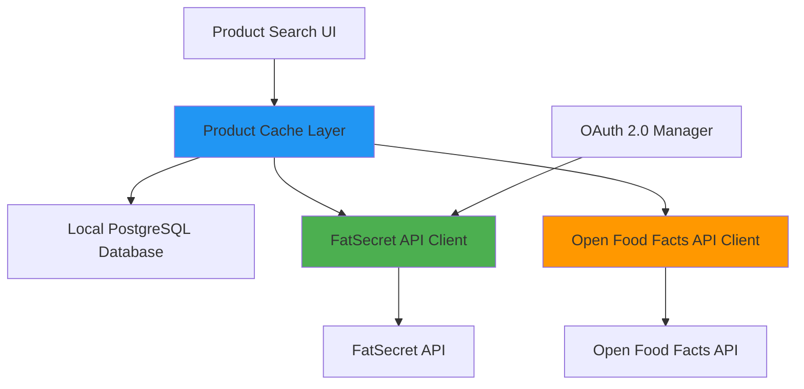

# Design Document: FatSecret API Integration

## Overview

This design document describes the integration of FatSecret API as the primary food database source for the BURCEV fitness application. The integration will provide users with access to over 1.5 million verified food items from FatSecret's comprehensive database, with Open Food Facts API serving as a fallback source.

The system will use OAuth 2.0 for authentication, implement intelligent caching to minimize API calls, and provide seamless fallback mechanisms to ensure continuous service availability.

## Architecture

### High-Level Architecture



### Request Flow

```mermaid
sequenceDiagram
    participant User
    participant UI as Product Search UI
    participant Cache as Cache Layer
    participant DB as PostgreSQL
    participant FS as FatSecret API
    participant OFF as Open Food Facts API
    
    User->>UI: Enter search query
    UI->>Cache: searchProducts(query)
    Cache->>DB: Query local cache
    
    alt Sufficient results in cache
        DB-->>Cache: Return cached products
        Cache-->>UI: Display results
    else Need more results
        Cache->>FS: Search FatSecret API
        alt FatSecret returns results
            FS-->>Cache: Return products
            Cache->>DB: Save to cache
            Cache-->>UI: Display results
        else FatSecret fails/no results
            Cache->>OFF: Search Open Food Facts
            OFF-->>Cache: Return products
            Cache->>DB: Save to cache
            Cache-->>UI: Display results
        end
    end
```

## Components and Interfaces

### 1. FatSecret API Client (`src/utils/products/fatsecret.ts`)

Handles all communication with FatSecret API including authentication and request signing.

```typescript
interface FatSecretConfig {
  clientId: string
  clientSecret: string
  baseUrl: string
  timeout: number
}

interface FatSecretAuthToken {
  access_token: string
  token_type: string
  expires_in: number
  expires_at: number
}

class FatSecretClient {
  private config: FatSecretConfig
  private token: FatSecretAuthToken | null
  
  constructor(config: FatSecretConfig)
  
  // Authentication
  async authenticate(): Promise<void>
  async getAccessToken(): Promise<string>
  private async refreshTokenIfNeeded(): Promise<void>
  
  // Search operations
  async searchFoods(query: string, maxResults: number, pageNumber: number): Promise<FatSecretFood[]>
  async getFoodById(foodId: string): Promise<FatSecretFood | null>
  async findFoodByBarcode(barcode: string): Promise<FatSecretFood | null>
  
  // Helper methods
  private async makeRequest<T>(endpoint: string, params: Record<string, string>): Promise<T>
  private handleApiError(error: any): void
}
```

### 2. Product Transformation Layer (`src/utils/products/transform.ts`)

Converts FatSecret API responses to internal Product format.

```typescript
interface FatSecretFood {
  food_id: string
  food_name: string
  brand_name?: string
  food_type: 'Generic' | 'Brand'
  food_url?: string
  food_images?: {
    food_image: Array<{
      image_url: string
      image_type: string
    }>
  }
  servings: {
    serving: FatSecretServing[]
  }
}

interface FatSecretServing {
  serving_id: string
  serving_description: string
  metric_serving_amount: string
  metric_serving_unit: string
  calories: string
  carbohydrate: string
  protein: string
  fat: string
  saturated_fat?: string
  fiber?: string
  sugar?: string
  sodium?: string
}

function transformFatSecretFood(food: FatSecretFood): Product {
  // Find 100g serving or calculate from available servings
  const serving100g = findOrCalculate100gServing(food.servings.serving)
  
  return {
    name: food.food_name,
    brand: food.brand_name,
    barcode: null, // FatSecret doesn't return barcode in search
    calories_per_100g: parseFloat(serving100g.calories),
    protein_per_100g: parseFloat(serving100g.protein),
    fats_per_100g: parseFloat(serving100g.fat),
    carbs_per_100g: parseFloat(serving100g.carbohydrate),
    source: 'fatsecret',
    source_id: food.food_id,
    image_url: extractImageUrl(food.food_images),
  }
}

function findOrCalculate100gServing(servings: FatSecretServing[]): FatSecretServing {
  // 1. Look for exact 100g serving
  // 2. If not found, calculate from closest metric serving
  // 3. Return calculated values
}

function extractImageUrl(images?: FatSecretFood['food_images']): string | null {
  // Extract highest quality image URL
}
```

### 3. Enhanced Product API (`src/utils/products/api.ts`)

Updated to integrate FatSecret as primary source.

```typescript
// Updated search flow
async function searchProducts(query: string, limit: number = 20): Promise<Product[]> {
  if (!query || query.length < 2) {
    return []
  }

  try {
    // 1. Search local database first
    const dbResults = await searchProductsInDB(query, limit)
    
    if (dbResults.length >= limit) {
      return dbResults
    }
    
    // 2. Search FatSecret API
    const remainingLimit = limit - dbResults.length
    let apiResults: Product[] = []
    
    try {
      const fatSecretResults = await searchFatSecretAPI(query, remainingLimit)
      apiResults = fatSecretResults
      
      // Save to database asynchronously
      fatSecretResults.forEach(product => {
        saveProductToDB(product).catch(err => {
          logger.warn('Failed to cache FatSecret product', { error: err, productId: product.source_id })
        })
      })
    } catch (fatSecretError) {
      logger.warn('FatSecret API failed, falling back to Open Food Facts', { error: fatSecretError })
      
      // 3. Fallback to Open Food Facts
      const openFoodFactsResults = await searchProductsInAPI(query, remainingLimit)
      apiResults = openFoodFactsResults
      
      // Save to database asynchronously
      openFoodFactsResults.forEach(product => {
        saveProductToDB(product).catch(err => {
          logger.warn('Failed to cache Open Food Facts product', { error: err })
        })
      })
    }
    
    // Combine results: DB first (popular), then API
    return [...dbResults, ...apiResults].slice(0, limit)
  } catch (error) {
    logger.error('Product search failed completely', { error, query })
    // Last resort: return only DB results
    return await searchProductsInDB(query, limit)
  }
}

async function searchFatSecretAPI(query: string, limit: number): Promise<Product[]> {
  const client = getFatSecretClient()
  const foods = await client.searchFoods(query, limit, 0)
  return foods.map(transformFatSecretFood)
}

async function getProductByBarcode(barcode: string): Promise<Product | null> {
  try {
    // 1. Check local database
    const dbProduct = await getProductByBarcodeFromDB(barcode)
    if (dbProduct) {
      return dbProduct
    }
    
    // 2. Try FatSecret API
    try {
      const client = getFatSecretClient()
      const food = await client.findFoodByBarcode(barcode)
      
      if (food) {
        const product = transformFatSecretFood(food)
        product.barcode = barcode // Add barcode to product
        
        // Save to database
        await saveProductToDB(product)
        return product
      }
    } catch (fatSecretError) {
      logger.warn('FatSecret barcode search failed, trying Open Food Facts', { error: fatSecretError, barcode })
    }
    
    // 3. Fallback to Open Food Facts
    const offProduct = await getProductByBarcodeFromOpenFoodFacts(barcode)
    if (offProduct) {
      await saveProductToDB(offProduct)
      return offProduct
    }
    
    return null
  } catch (error) {
    logger.error('Barcode search failed', { error, barcode })
    return null
  }
}
```

### 4. OAuth 2.0 Token Manager (`src/utils/products/fatsecret-auth.ts`)

Manages OAuth 2.0 authentication tokens with automatic refresh.

```typescript
interface TokenCache {
  token: FatSecretAuthToken | null
  refreshPromise: Promise<FatSecretAuthToken> | null
}

class FatSecretAuthManager {
  private cache: TokenCache = { token: null, refreshPromise: null }
  private config: FatSecretConfig
  
  constructor(config: FatSecretConfig)
  
  async getToken(): Promise<string> {
    // Return cached token if valid
    if (this.cache.token && !this.isTokenExpired(this.cache.token)) {
      return this.cache.token.access_token
    }
    
    // If refresh is in progress, wait for it
    if (this.cache.refreshPromise) {
      const token = await this.cache.refreshPromise
      return token.access_token
    }
    
    // Start new refresh
    this.cache.refreshPromise = this.fetchNewToken()
    
    try {
      const token = await this.cache.refreshPromise
      this.cache.token = token
      return token.access_token
    } finally {
      this.cache.refreshPromise = null
    }
  }
  
  private async fetchNewToken(): Promise<FatSecretAuthToken> {
    const response = await fetch('https://oauth.fatsecret.com/connect/token', {
      method: 'POST',
      headers: {
        'Content-Type': 'application/x-www-form-urlencoded',
        'Authorization': `Basic ${Buffer.from(`${this.config.clientId}:${this.config.clientSecret}`).toString('base64')}`
      },
      body: new URLSearchParams({
        grant_type: 'client_credentials',
        scope: 'basic'
      })
    })
    
    if (!response.ok) {
      throw new Error(`OAuth failed: ${response.status}`)
    }
    
    const data = await response.json()
    return {
      access_token: data.access_token,
      token_type: data.token_type,
      expires_in: data.expires_in,
      expires_at: Date.now() + (data.expires_in * 1000) - 60000 // 1 min buffer
    }
  }
  
  private isTokenExpired(token: FatSecretAuthToken): boolean {
    return Date.now() >= token.expires_at
  }
}
```

### 5. Configuration Module (`src/config/fatsecret.ts`)

Centralized configuration for FatSecret API.

```typescript
interface FatSecretConfiguration {
  enabled: boolean
  clientId: string
  clientSecret: string
  baseUrl: string
  timeout: number
  maxResults: number
  fallbackEnabled: boolean
}

export function getFatSecretConfig(): FatSecretConfiguration {
  const enabled = process.env.FATSECRET_ENABLED !== 'false'
  const clientId = process.env.FATSECRET_CLIENT_ID || ''
  const clientSecret = process.env.FATSECRET_CLIENT_SECRET || ''
  
  if (enabled && (!clientId || !clientSecret)) {
    logger.error('FatSecret credentials missing, disabling integration')
    return {
      enabled: false,
      clientId: '',
      clientSecret: '',
      baseUrl: 'https://platform.fatsecret.com/rest/server.api',
      timeout: 5000,
      maxResults: 20,
      fallbackEnabled: true
    }
  }
  
  return {
    enabled,
    clientId,
    clientSecret,
    baseUrl: process.env.FATSECRET_BASE_URL || 'https://platform.fatsecret.com/rest/server.api',
    timeout: parseInt(process.env.FATSECRET_TIMEOUT || '5000'),
    maxResults: parseInt(process.env.FATSECRET_MAX_RESULTS || '20'),
    fallbackEnabled: process.env.FATSECRET_FALLBACK_ENABLED !== 'false'
  }
}
```

## Data Models

### Updated Product Type

```typescript
// Update source type to include 'fatsecret'
export type ProductSource = 'fatsecret' | 'openfoodfacts' | 'usda' | 'user'

export interface Product {
  id?: string
  name: string
  brand?: string
  barcode?: string | null
  calories_per_100g: number
  protein_per_100g: number
  fats_per_100g: number
  carbs_per_100g: number
  source: ProductSource
  source_id?: string | null
  image_url?: string | null
}
```

### Database Schema Updates

```sql
-- Update products table to support fatsecret source
ALTER TABLE products 
  ALTER COLUMN source TYPE VARCHAR(20);

-- Add index for faster source-based queries
CREATE INDEX IF NOT EXISTS idx_products_source ON products(source);

-- Add index for source_id lookups
CREATE INDEX IF NOT EXISTS idx_products_source_id ON products(source, source_id);
```

## Correctness Properties

*A property is a characteristic or behavior that should hold true across all valid executions of a system—essentially, a formal statement about what the system should do. Properties serve as the bridge between human-readable specifications and machine-verifiable correctness guarantees.*

### Property 1: Authentication Token Validity

*For any* API request to FatSecret, the authentication token used must be valid and not expired.

**Validates: Requirements 1.1, 1.2**

### Property 2: Search Result Source Priority

*For any* search query, when both local database and FatSecret API return results, the combined results must prioritize database results (by usage_count) before FatSecret results.

**Validates: Requirements 2.1, 4.3**

### Property 3: Fallback Activation

*For any* search query, when FatSecret API fails or returns no results, the system must automatically query Open Food Facts API.

**Validates: Requirements 2.3, 2.6, 5.1, 5.2**

### Property 4: Product Transformation Consistency

*For any* FatSecret food item with valid nutritional data, transforming it to internal Product format must preserve all KBJU values within acceptable rounding error (±1%).

**Validates: Requirements 2.2, 3.1**

### Property 5: Cache Persistence

*For any* product retrieved from FatSecret API, the product must be saved to the local database with source='fatsecret' and the original food_id as source_id.

**Validates: Requirements 4.1, 4.5**

### Property 6: Usage Count Increment

*For any* cached product that is selected by a user, the product's usage_count must be incremented by exactly 1.

**Validates: Requirements 4.4**

### Property 7: Barcode Search Priority

*For any* barcode search, the system must check the local database first, then FatSecret API, then Open Food Facts API, in that order.

**Validates: Requirements 6.1, 6.2, 6.3**

### Property 8: Barcode Product Caching

*For any* product found by barcode from FatSecret or Open Food Facts, the product must be saved to the database with the barcode value preserved.

**Validates: Requirements 6.5**

### Property 9: Source Attribution

*For any* product displayed to the user, the product's source field must accurately reflect where the data originated (fatsecret, openfoodfacts, or user).

**Validates: Requirements 5.4**

### Property 10: Favorite Product Database Persistence

*For any* product from FatSecret API that a user adds to favorites, the product must first be saved to the local database before creating the favorite association.

**Validates: Requirements 10.7**

### Property 11: API Error Logging

*For any* API request that fails (FatSecret or Open Food Facts), the system must log the error with context including query/barcode, error details, and timestamp.

**Validates: Requirements 8.1, 8.2, 8.3**

### Property 12: Configuration Validation

*For any* system startup, when FatSecret credentials are missing from environment variables, the system must log an error and disable FatSecret integration without crashing.

**Validates: Requirements 11.5**

## Error Handling

### Error Categories

1. **Authentication Errors**
   - Invalid credentials → Log error, disable FatSecret, use fallback
   - Token refresh failure → Retry once, then use fallback
   - Rate limit exceeded → Log warning, use fallback, implement exponential backoff

2. **API Request Errors**
   - Network timeout → Retry once with increased timeout, then fallback
   - 4xx errors → Log error, use fallback
   - 5xx errors → Retry once, then fallback
   - Invalid response format → Log error, use fallback

3. **Data Transformation Errors**
   - Missing nutritional data → Skip product or use partial data
   - Invalid serving sizes → Calculate from available data or skip
   - Missing 100g serving → Calculate proportionally from other servings

4. **Database Errors**
   - Save failure → Log warning, continue (caching is non-critical)
   - Query failure → Return empty results, log error

### Error Response Strategy

```typescript
interface ApiErrorResponse {
  success: false
  error: {
    code: string
    message: string
    source: 'fatsecret' | 'openfoodfacts' | 'database'
  }
  fallbackUsed: boolean
}

function handleApiError(error: any, context: string): void {
  logger.error(`FatSecret API error: ${context}`, {
    error: error.message,
    stack: error.stack,
    context
  })
  
  // Emit metrics for monitoring
  trackApiError('fatsecret', context)
}
```

## Testing Strategy

### Unit Tests

Unit tests will verify specific examples and edge cases:

1. **Authentication Tests**
   - Valid credentials produce valid token
   - Invalid credentials throw appropriate error
   - Token expiration triggers refresh
   - Concurrent requests share same token refresh

2. **Transformation Tests**
   - FatSecret food with 100g serving transforms correctly
   - FatSecret food without 100g serving calculates correctly
   - Missing optional fields handled gracefully
   - Brand vs Generic foods transform correctly

3. **Error Handling Tests**
   - Network timeout triggers fallback
   - Invalid response format handled
   - Missing credentials disable integration
   - Rate limit errors logged and handled

4. **Barcode Tests**
   - Valid GTIN-13 barcode finds product
   - Invalid barcode returns null
   - Database cache checked first

### Property-Based Tests

Property tests will verify universal properties across all inputs (minimum 100 iterations each):

1. **Property Test: Authentication Token Validity**
   - Generate random time offsets
   - Verify token refresh logic always provides valid token
   - **Feature: fatsecret-integration, Property 1: Authentication Token Validity**

2. **Property Test: Search Result Ordering**
   - Generate random search queries and mock results
   - Verify database results always appear before API results
   - Verify results ordered by usage_count within database results
   - **Feature: fatsecret-integration, Property 2: Search Result Source Priority**

3. **Property Test: Fallback Mechanism**
   - Generate random API failure scenarios
   - Verify fallback always activates when primary fails
   - Verify no fallback when primary succeeds
   - **Feature: fatsecret-integration, Property 3: Fallback Activation**

4. **Property Test: Transformation Accuracy**
   - Generate random FatSecret food objects with various serving sizes
   - Verify KBJU values preserved within 1% error
   - Verify all required fields populated
   - **Feature: fatsecret-integration, Property 4: Product Transformation Consistency**

5. **Property Test: Cache Persistence**
   - Generate random products from FatSecret
   - Verify all saved to database with correct source and source_id
   - **Feature: fatsecret-integration, Property 5: Cache Persistence**

6. **Property Test: Usage Count**
   - Generate random product selections
   - Verify usage_count increments exactly once per selection
   - **Feature: fatsecret-integration, Property 6: Usage Count Increment**

7. **Property Test: Barcode Search Order**
   - Generate random barcodes and mock responses
   - Verify database checked before FatSecret before Open Food Facts
   - **Feature: fatsecret-integration, Property 7: Barcode Search Priority**

8. **Property Test: Source Attribution**
   - Generate random products from different sources
   - Verify source field always matches actual origin
   - **Feature: fatsecret-integration, Property 9: Source Attribution**

9. **Property Test: Error Logging**
   - Generate random API errors
   - Verify all errors logged with required context
   - **Feature: fatsecret-integration, Property 11: API Error Logging**

### Integration Tests

1. **End-to-End Search Flow**
   - User enters query → Results displayed from FatSecret
   - FatSecret fails → Results from Open Food Facts
   - Both fail → Results from database only

2. **Barcode Scanning Flow**
   - User scans barcode → Product found and displayed
   - Product added to meal → Usage recorded

3. **Favorites Flow**
   - User adds FatSecret product to favorites
   - Product appears in favorites tab
   - Product cached in database

### Testing with Real API

For development and testing:
- Use FatSecret test credentials
- Implement request mocking for CI/CD
- Monitor API usage to stay within limits
- Test with various locales (Russian, English)

## Performance Considerations

### Caching Strategy

1. **Three-tier caching**:
   - Memory cache (ProductSearchCache) - 5 minutes TTL
   - Database cache - Permanent with usage tracking
   - API calls - Only when cache misses

2. **Cache warming**:
   - Pre-populate common Russian food items
   - Track popular searches and pre-cache

3. **Rate limiting**:
   - FatSecret free tier: 5000 calls/day
   - Implement request queuing if approaching limit
   - Prioritize user-initiated searches over background tasks

### API Call Optimization

1. **Batch operations**: Not supported by FatSecret, use individual calls
2. **Debouncing**: 300ms delay on search input
3. **Request deduplication**: Prevent duplicate concurrent requests
4. **Pagination**: Load 20 results initially, more on demand

### Response Time Targets

- Database query: < 100ms
- FatSecret API call: < 2s
- Total search response: < 3s
- Fallback activation: < 5s total

## Security Considerations

1. **Credential Storage**:
   - Store in environment variables only
   - Never commit to version control
   - Use different credentials for dev/prod

2. **API Key Protection**:
   - Server-side only (never expose to client)
   - Rotate keys periodically
   - Monitor for unauthorized usage

3. **Data Validation**:
   - Validate all API responses before processing
   - Sanitize user input before API calls
   - Prevent injection attacks in search queries

4. **Rate Limiting**:
   - Implement user-level rate limiting
   - Prevent abuse of search functionality
   - Monitor for suspicious patterns

## Deployment Considerations

### Environment Variables

```bash
# FatSecret API Configuration
FATSECRET_ENABLED=true
FATSECRET_CLIENT_ID=your_client_id
FATSECRET_CLIENT_SECRET=your_client_secret
FATSECRET_BASE_URL=https://platform.fatsecret.com/rest/server.api
FATSECRET_TIMEOUT=5000
FATSECRET_MAX_RESULTS=20
FATSECRET_FALLBACK_ENABLED=true
```

### Migration Steps

1. **Phase 1: Add FatSecret support**
   - Deploy new code with FatSecret disabled
   - Test in production with feature flag
   - Monitor error rates and performance

2. **Phase 2: Enable FatSecret**
   - Enable for 10% of users
   - Monitor API usage and costs
   - Gradually increase to 100%

3. **Phase 3: Optimize**
   - Analyze popular searches
   - Pre-populate cache
   - Tune fallback thresholds

### Monitoring

1. **Metrics to track**:
   - FatSecret API call count
   - API response times
   - Fallback activation rate
   - Cache hit rate
   - Error rates by type

2. **Alerts**:
   - API rate limit approaching (80%)
   - High error rate (> 5%)
   - Slow response times (> 5s)
   - Authentication failures

3. **Logging**:
   - All API calls with timing
   - All errors with context
   - Fallback activations
   - Cache performance

## Future Enhancements

1. **Multi-language support**: Leverage FatSecret's 23 language support
2. **Recipe search**: Integrate FatSecret recipe database
3. **Meal planning**: Use FatSecret meal suggestions
4. **Nutritional analysis**: Detailed micronutrient tracking
5. **Image recognition**: FatSecret's image recognition API
6. **Barcode scanning**: Native camera integration for barcode scanning
