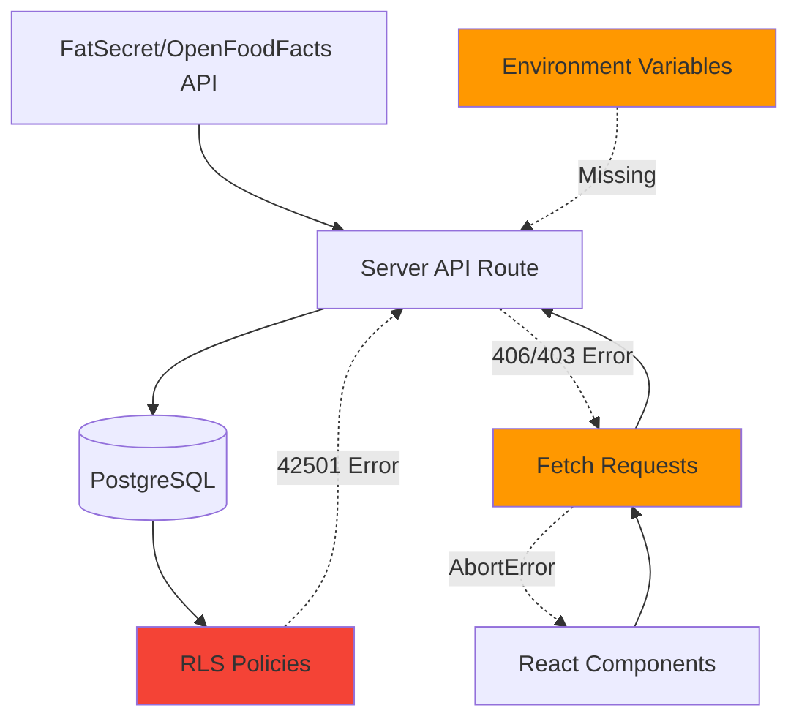

# Design Document: FatSecret Post-Merge Fixes

## Overview

Этот документ описывает исправления критических проблем, возникших после мержа FatSecret интеграции. Основные проблемы включают ошибки Row Level Security (RLS) при сохранении продуктов, проблемы с загрузкой данных на клиенте (AbortError), ошибки доступа к таблицам БД (406/403), и отсутствие конфигурации FatSecret credentials.

## Architecture

### Problem Areas



### Root Causes

1. **RLS Policy Issue**: Текущая политика требует super_admin для INSERT в products, но API интеграция работает от имени обычного пользователя
2. **Client Request Cancellation**: React компоненты размонтируются до завершения запросов, вызывая AbortError
3. **Missing RLS Policies**: Недостаточные политики для nutrition_targets и daily_logs
4. **Missing Environment Variables**: FATSECRET_CLIENT_ID и FATSECRET_CLIENT_SECRET не настроены
5. **Optional Service Errors**: Prometheus pushgateway логирует ошибки как ERROR вместо DEBUG

## Components and Interfaces

### 1. Database Migration Script

Создание новой миграции для исправления RLS политик.

```sql
-- migrations/v11.0_fix_products_rls_for_api.sql

-- Drop existing restrictive policy if exists
DROP POLICY IF EXISTS products_insert_policy ON products;

-- Create new policy allowing API to insert products from external sources
CREATE POLICY products_api_insert_policy ON products
  FOR INSERT
  WITH CHECK (
    -- Allow super_admin to insert any products
    (auth.jwt() ->> 'user_role' = 'super_admin')
    OR
    -- Allow any authenticated user to insert products from external APIs
    (source IN ('fatsecret', 'openfoodfacts', 'usda') AND auth.uid() IS NOT NULL)
  );

-- Ensure users can read all products
CREATE POLICY IF NOT EXISTS products_select_policy ON products
  FOR SELECT
  USING (true);

-- Only super_admin can update products
CREATE POLICY IF NOT EXISTS products_update_policy ON products
  FOR UPDATE
  USING (auth.jwt() ->> 'user_role' = 'super_admin')
  WITH CHECK (auth.jwt() ->> 'user_role' = 'super_admin');

-- Only super_admin can delete products
CREATE POLICY IF NOT EXISTS products_delete_policy ON products
  FOR DELETE
  USING (auth.jwt() ->> 'user_role' = 'super_admin');

-- Fix nutrition_targets RLS if needed
DROP POLICY IF EXISTS nutrition_targets_select_policy ON nutrition_targets;
CREATE POLICY nutrition_targets_select_policy ON nutrition_targets
  FOR SELECT
  USING (
    user_id = auth.uid()
    OR auth.jwt() ->> 'user_role' IN ('super_admin', 'curator')
  );

-- Fix daily_logs RLS if needed
DROP POLICY IF EXISTS daily_logs_select_policy ON daily_logs;
CREATE POLICY daily_logs_select_policy ON daily_logs
  FOR SELECT
  USING (
    user_id = auth.uid()
    OR auth.jwt() ->> 'user_role' IN ('super_admin', 'curator')
  );

-- Add index for better performance
CREATE INDEX IF NOT EXISTS idx_products_source_user ON products(source, user_id);
```

### 2. Product Save Logic Update

Обновление логики сохранения продуктов для обработки дубликатов.

```typescript
// src/utils/products/db.ts

interface ProductSaveResult {
  success: boolean
  productId?: string
  error?: string
  isDuplicate?: boolean
}

export async function saveProductToDB(product: Product): Promise<ProductSaveResult> {
  try {
    const supabase = createClient()
    
    // Check if product already exists by source and source_id
    if (product.source_id && product.source !== 'user') {
      const { data: existing, error: checkError } = await supabase
        .from('products')
        .select('id, usage_count')
        .eq('source', product.source)
        .eq('source_id', product.source_id)
        .single()
      
      if (existing) {
        // Product exists, increment usage_count
        const { error: updateError } = await supabase
          .from('products')
          .update({ usage_count: (existing.usage_count || 0) + 1 })
          .eq('id', existing.id)
        
        if (updateError) {
          logger.warn('Failed to update product usage_count', {
            productId: existing.id,
            error: updateError
          })
        }
        
        return {
          success: true,
          productId: existing.id,
          isDuplicate: true
        }
      }
    }
    
    // Insert new product
    const { data, error } = await supabase
      .from('products')
      .insert({
        name: product.name,
        brand: product.brand,
        barcode: product.barcode,
        calories_per_100g: product.calories_per_100g,
        protein_per_100g: product.protein_per_100g,
        fats_per_100g: product.fats_per_100g,
        carbs_per_100g: product.carbs_per_100g,
        source: product.source,
        source_id: product.source_id,
        image_url: product.image_url,
        usage_count: 1
      })
      .select('id')
      .single()
    
    if (error) {
      // Check if it's an RLS error
      if (error.code === '42501') {
        logger.error('RLS policy violation when saving product', {
          error,
          product: {
            name: product.name,
            source: product.source,
            source_id: product.source_id
          }
        })
      }
      
      return {
        success: false,
        error: error.message
      }
    }
    
    logger.info('Product saved successfully', {
      productId: data.id,
      source: product.source,
      name: product.name
    })
    
    return {
      success: true,
      productId: data.id,
      isDuplicate: false
    }
  } catch (error) {
    logger.error('Unexpected error saving product', { error, product })
    return {
      success: false,
      error: error instanceof Error ? error.message : 'Unknown error'
    }
  }
}
```

### 3. Client Request Cancellation Handling

Обновление компонентов для корректной обработки AbortError.

```typescript
// src/components/Header.tsx

export function Header() {
  const [user, setUser] = useState<User | null>(null)
  const [loading, setLoading] = useState(true)
  
  useEffect(() => {
    const abortController = new AbortController()
    
    async function loadUser() {
      try {
        const supabase = createClient()
        const { data: { user }, error } = await supabase.auth.getUser()
        
        // Check if request was cancelled
        if (abortController.signal.aborted) {
          return
        }
        
        if (error) {
          logger.error('Failed to load user', { error })
          setUser(null)
        } else {
          setUser(user)
        }
      } catch (error) {
        // Don't log AbortError as it's expected
        if (error instanceof Error && error.name === 'AbortError') {
          return
        }
        
        logger.error('Header: exception loading user', { error })
        setUser(null)
      } finally {
        if (!abortController.signal.aborted) {
          setLoading(false)
        }
      }
    }
    
    loadUser()
    
    // Cleanup: cancel request if component unmounts
    return () => {
      abortController.abort()
    }
  }, [])
  
  if (loading) {
    return <HeaderSkeleton />
  }
  
  return (
    <header>
      {/* Header content */}
    </header>
  )
}
```

### 4. FatSecret Configuration with Validation

Улучшение конфигурации FatSecret с валидацией и graceful degradation.

```typescript
// src/config/fatsecret.ts

interface FatSecretConfig {
  enabled: boolean
  clientId: string
  clientSecret: string
  baseUrl: string
  timeout: number
  maxResults: number
  fallbackEnabled: boolean
}

let configCache: FatSecretConfig | null = null

export function getFatSecretConfig(): FatSecretConfig {
  // Return cached config if available
  if (configCache) {
    return configCache
  }
  
  const clientId = process.env.FATSECRET_CLIENT_ID || ''
  const clientSecret = process.env.FATSECRET_CLIENT_SECRET || ''
  
  // Check if credentials are provided
  const hasCredentials = clientId.length > 0 && clientSecret.length > 0
  
  if (!hasCredentials) {
    logger.error('FatSecret credentials missing, disabling integration', {
      hasClientId: clientId.length > 0,
      hasClientSecret: clientSecret.length > 0,
      context: 'fatsecret-config'
    })
  }
  
  configCache = {
    enabled: hasCredentials && process.env.FATSECRET_ENABLED !== 'false',
    clientId,
    clientSecret,
    baseUrl: process.env.FATSECRET_BASE_URL || 'https://platform.fatsecret.com/rest/server.api',
    timeout: parseInt(process.env.FATSECRET_TIMEOUT || '5000', 10),
    maxResults: parseInt(process.env.FATSECRET_MAX_RESULTS || '20', 10),
    fallbackEnabled: process.env.FATSECRET_FALLBACK_ENABLED !== 'false'
  }
  
  return configCache
}

export function isFatSecretEnabled(): boolean {
  return getFatSecretConfig().enabled
}

// Reset cache (useful for testing)
export function resetFatSecretConfig(): void {
  configCache = null
}
```

### 5. Prometheus Metrics Error Handling

Обновление логирования ошибок Prometheus для необязательного сервиса.

```typescript
// src/lib/metrics.ts

async function pushMetric(metric: Metric): Promise<void> {
  const pushgatewayUrl = process.env.PROMETHEUS_PUSHGATEWAY_URL
  
  // If pushgateway is not configured, silently skip
  if (!pushgatewayUrl) {
    return
  }
  
  try {
    const response = await fetch(pushgatewayUrl, {
      method: 'POST',
      headers: { 'Content-Type': 'text/plain' },
      body: formatMetric(metric),
      signal: AbortSignal.timeout(2000) // 2 second timeout
    })
    
    if (!response.ok) {
      logger.debug('Failed to push metric to Prometheus', {
        metricName: metric.name,
        status: response.status
      })
    }
  } catch (error) {
    // Log at DEBUG level, not ERROR, since this is optional
    if (error instanceof Error && error.name === 'AbortError') {
      logger.debug('Prometheus push timeout', { metricName: metric.name })
    } else {
      logger.debug('Error pushing metric to Prometheus', {
        metricName: metric.name,
        error: error instanceof Error ? error.message : 'Unknown error'
      })
    }
  }
}
```

### 6. Enhanced Error Logging

Улучшение логирования для RLS и API ошибок.

```typescript
// src/utils/logger.ts

interface RLSErrorContext {
  table: string
  operation: 'SELECT' | 'INSERT' | 'UPDATE' | 'DELETE'
  userId?: string
  errorCode: string
  errorMessage: string
}

export function logRLSError(context: RLSErrorContext): void {
  logger.error('RLS policy violation', {
    ...context,
    timestamp: new Date().toISOString(),
    severity: 'high'
  })
}

interface APIErrorContext {
  endpoint: string
  method: string
  statusCode: number
  errorMessage: string
  userId?: string
  requestBody?: any
}

export function logAPIError(context: APIErrorContext): void {
  logger.error('API request failed', {
    ...context,
    timestamp: new Date().toISOString()
  })
}

// Helper to detect and log RLS errors from Supabase
export function handleSupabaseError(error: any, context: { table: string; operation: string }): void {
  if (error.code === '42501') {
    logRLSError({
      table: context.table,
      operation: context.operation as any,
      errorCode: error.code,
      errorMessage: error.message
    })
  } else if (error.code === 'PGRST116') {
    // 406 Not Acceptable - usually RLS related
    logger.error('Supabase query failed (possibly RLS)', {
      ...context,
      errorCode: error.code,
      errorMessage: error.message
    })
  } else {
    logger.error('Supabase error', {
      ...context,
      error
    })
  }
}
```

## Data Models

No changes to data models required. All fixes are in application logic and database policies.

## Correctness Properties

*A property is a characteristic or behavior that should hold true across all valid executions of a system—essentially, a formal statement about what the system should do. Properties serve as the bridge between human-readable specifications and machine-verifiable correctness guarantees.*

### Property 1: Product Save Success

*For any* product from FatSecret or OpenFoodFacts API, saving to the database must succeed without RLS errors when user is authenticated.

**Validates: Requirements 1.1, 1.2**

### Property 2: Duplicate Product Handling

*For any* product that already exists in the database (same source and source_id), attempting to save it again must increment usage_count instead of creating a duplicate.

**Validates: Requirements 1.4**

### Property 3: AbortError Handling

*For any* component that makes fetch requests, unmounting the component must cancel pending requests without logging errors or updating state.

**Validates: Requirements 2.1, 9.1, 9.2, 9.5**

### Property 4: RLS Policy Coverage

*For any* authenticated user, reading their own nutrition_targets and daily_logs must succeed without 406 errors.

**Validates: Requirements 3.2, 4.2**

### Property 5: Configuration Graceful Degradation

*For any* missing FatSecret credentials, the system must log a warning, disable FatSecret integration, and continue operating with OpenFoodFacts only.

**Validates: Requirements 5.3, 5.6**

### Property 6: Products Read Access

*For any* authenticated user, querying products from any source (fatsecret, openfoodfacts, user) must succeed without 403 or 406 errors.

**Validates: Requirements 6.1, 6.2, 6.4**

### Property 7: Optional Service Error Level

*For any* optional service (like Prometheus pushgateway) that is unavailable, errors must be logged at DEBUG level, not ERROR level.

**Validates: Requirements 10.1, 10.5**

### Property 8: Migration Idempotency

*For any* number of times the migration is run, the final state of RLS policies must be identical and correct.

**Validates: Requirements 8.4**

## Error Handling

### Error Categories and Responses

1. **RLS Errors (42501)**
   - Log with full context (table, operation, user)
   - Return user-friendly error message
   - Track in monitoring system

2. **406 Not Acceptable**
   - Usually indicates RLS policy issue
   - Log query details
   - Suggest checking RLS policies

3. **403 Forbidden**
   - Check authentication status
   - Verify user permissions
   - Log access attempt

4. **AbortError**
   - Expected during component unmount
   - Don't log as error
   - Clean up state properly

5. **Missing Configuration**
   - Log at ERROR level
   - Disable affected feature
   - Continue with fallback

### Error Recovery Strategies

```typescript
// Example: Retry logic for transient errors
async function fetchWithRetry<T>(
  fetcher: () => Promise<T>,
  maxRetries: number = 2
): Promise<T> {
  let lastError: Error | null = null
  
  for (let attempt = 0; attempt <= maxRetries; attempt++) {
    try {
      return await fetcher()
    } catch (error) {
      lastError = error as Error
      
      // Don't retry on AbortError
      if (error instanceof Error && error.name === 'AbortError') {
        throw error
      }
      
      // Don't retry on client errors (4xx)
      if (error instanceof Response && error.status >= 400 && error.status < 500) {
        throw error
      }
      
      // Wait before retry (exponential backoff)
      if (attempt < maxRetries) {
        await new Promise(resolve => setTimeout(resolve, Math.pow(2, attempt) * 1000))
      }
    }
  }
  
  throw lastError
}
```

## Testing Strategy

### Unit Tests

1. **RLS Policy Tests**
   - Test product insert with authenticated user
   - Test product insert with super_admin
   - Test product insert from different sources
   - Verify duplicate handling

2. **Configuration Tests**
   - Test with missing credentials
   - Test with invalid credentials
   - Test with valid credentials
   - Verify graceful degradation

3. **Error Handling Tests**
   - Test AbortError handling
   - Test RLS error logging
   - Test API error logging
   - Test retry logic

### Integration Tests

1. **Product Save Flow**
   - Search product via FatSecret
   - Save to database
   - Verify no RLS errors
   - Verify product accessible

2. **Client Component Loading**
   - Mount component
   - Start data fetch
   - Unmount before completion
   - Verify no errors logged

3. **Fallback Mechanism**
   - Disable FatSecret
   - Search products
   - Verify OpenFoodFacts used
   - Verify no crashes

### Manual Testing Checklist

- [ ] Apply migration script
- [ ] Verify products can be saved from API
- [ ] Search products and verify no 403/406 errors
- [ ] Navigate between pages quickly (test AbortError handling)
- [ ] Check logs for ERROR level messages (should be minimal)
- [ ] Test with FatSecret credentials missing
- [ ] Test with Prometheus pushgateway unavailable

## Deployment Plan

### Phase 1: Database Migration

1. Backup current database
2. Apply migration script
3. Verify RLS policies updated
4. Test product insert manually

### Phase 2: Code Deployment

1. Deploy updated code to staging
2. Test all affected features
3. Monitor error logs
4. Deploy to production

### Phase 3: Configuration

1. Add FatSecret credentials to environment
2. Restart application
3. Verify FatSecret integration working
4. Monitor API usage

### Phase 4: Monitoring

1. Check error rates (should decrease significantly)
2. Monitor RLS policy violations (should be zero)
3. Verify product save success rate
4. Check client-side error logs

## Rollback Plan

If issues occur after deployment:

1. **Database Rollback**
   ```sql
   -- Restore previous RLS policies
   DROP POLICY products_api_insert_policy ON products;
   CREATE POLICY products_insert_policy ON products
     FOR INSERT
     WITH CHECK (auth.jwt() ->> 'user_role' = 'super_admin');
   ```

2. **Code Rollback**
   - Revert to previous commit
   - Redeploy application
   - Verify system stability

3. **Configuration Rollback**
   - Remove FatSecret credentials if causing issues
   - System will automatically fall back to OpenFoodFacts

## Success Criteria

The fixes will be considered successful when:

1. ✅ No RLS errors (42501) in logs for product saves
2. ✅ No 406 errors for nutrition_targets or daily_logs
3. ✅ No 403 errors for products queries
4. ✅ No AbortError logged as ERROR level
5. ✅ FatSecret integration working with proper credentials
6. ✅ Prometheus errors logged at DEBUG level only
7. ✅ All existing functionality continues to work
8. ✅ Error rate decreased by >90%
