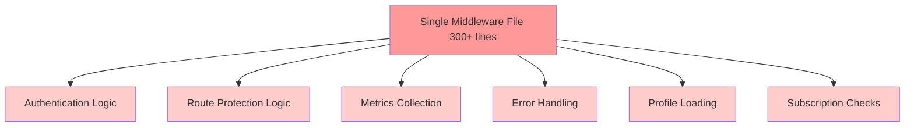
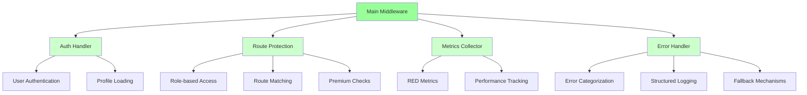

# Design Document: Middleware Refactoring

## Overview

Рефакторинг монолитного middleware файла в модульную архитектуру с четким разделением ответственности, улучшенной обработкой ошибок и повышенной тестируемостью.

## Architecture

### Current Architecture Problems



### Proposed Modular Architecture



## Components and Interfaces

### 1. Auth Handler

**File:** `src/middleware/handlers/auth.ts`

```typescript
interface AuthResult {
  user: User | null
  profile: UserProfile | null
  error: AuthError | null
  isPremium: boolean
  isSuperAdmin: boolean
}

interface AuthHandler {
  authenticate(request: NextRequest): Promise<AuthResult>
  loadProfile(userId: string): Promise<UserProfile | null>
  checkPremiumStatus(profile: UserProfile): boolean
}
```

### 2. Route Protection Handler

**File:** `src/middleware/handlers/routeProtection.ts`

```typescript
interface RouteConfig {
  path: string
  roles: string[]
  requiresPremium: boolean
  isPublic: boolean
}

interface RouteProtectionResult {
  allowed: boolean
  redirectTo?: string
  reason?: string
}

interface RouteProtectionHandler {
  checkAccess(
    pathname: string, 
    userRole: string, 
    isPremium: boolean
  ): RouteProtectionResult
  
  loadRouteConfig(): RouteConfig[]
  isPublicRoute(pathname: string): boolean
}
```

### 3. Metrics Collector Handler

**File:** `src/middleware/handlers/metrics.ts`

```typescript
interface RequestMetrics {
  route: string
  method: string
  statusCode: number
  duration: number
  userId?: string
  userRole?: string
}

interface MetricsHandler {
  startRequest(request: NextRequest): RequestContext
  recordSuccess(context: RequestContext, response: NextResponse): void
  recordError(context: RequestContext, error: Error): void
  recordRedirect(context: RequestContext, redirectTo: string): void
}
```

### 4. Error Handler

**File:** `src/middleware/handlers/error.ts`

```typescript
interface MiddlewareError {
  type: 'auth' | 'database' | 'network' | 'validation' | 'unknown'
  message: string
  details?: any
  context: RequestContext
  timestamp: Date
}

interface ErrorHandler {
  handleError(error: Error, context: RequestContext): NextResponse
  categorizeError(error: Error): MiddlewareError['type']
  logError(error: MiddlewareError): void
  createErrorResponse(error: MiddlewareError): NextResponse
}
```

### 5. Configuration System

**File:** `src/middleware/config/routes.ts`

```typescript
interface MiddlewareConfig {
  routes: RouteConfig[]
  auth: {
    enabled: boolean
    cacheTimeout: number
  }
  metrics: {
    enabled: boolean
    collectUserMetrics: boolean
  }
  errorHandling: {
    logLevel: 'debug' | 'info' | 'warn' | 'error'
    enableFallback: boolean
  }
}
```

## Data Models

### Request Context
```typescript
interface RequestContext {
  id: string
  pathname: string
  method: string
  startTime: number
  user?: User
  profile?: UserProfile
  ip?: string
  userAgent?: string
}
```

### Cache Models
```typescript
interface ProfileCache {
  userId: string
  profile: UserProfile
  timestamp: number
  ttl: number
}

interface RouteCache {
  pathname: string
  result: RouteProtectionResult
  timestamp: number
  ttl: number
}
```

## Correctness Properties

*A property is a characteristic or behavior that should hold true across all valid executions of a system-essentially, a formal statement about what the system should do. Properties serve as the bridge between human-readable specifications and machine-verifiable correctness guarantees.*

### Property 1: Error Fallback Reliability
*For any* logging error that occurs, the error handler should use a fallback mechanism and never silently fail
**Validates: Requirements 2.1, 2.5**

### Property 2: Error Categorization Consistency
*For any* error type, the error handler should consistently categorize it into the correct category (auth, database, network, unknown)
**Validates: Requirements 2.3**

### Property 3: Structured Logging Completeness
*For any* request processed, the logs should contain all required context information (userId, pathname, method, timestamp)
**Validates: Requirements 2.4**

### Property 4: Profile Caching Efficiency
*For any* user profile request within cache TTL, the system should return cached data without making database calls
**Validates: Requirements 3.1**

### Property 5: Metrics Non-blocking Behavior
*For any* request processing, metrics collection should not increase response time by more than 10ms
**Validates: Requirements 3.3**

### Property 6: Database Query Optimization
*For any* middleware execution, the number of database queries should not exceed the minimum required for the operation
**Validates: Requirements 3.4**

### Property 7: Authentication Configuration Flexibility
*For any* authentication configuration change, the system should adapt without requiring code changes
**Validates: Requirements 5.3**

### Property 8: Component Toggle Functionality
*For any* middleware component, it should be possible to enable/disable it through configuration without affecting other components
**Validates: Requirements 5.4**

### Property 9: Dynamic Role Management
*For any* new role or route added to configuration, the system should recognize and enforce it without restart
**Validates: Requirements 5.5**

## Error Handling

### 1. Hierarchical Error Handling

```typescript
// Primary error handler
try {
  await primaryOperation()
} catch (error) {
  try {
    await fallbackOperation()
  } catch (fallbackError) {
    await emergencyFallback(error, fallbackError)
  }
}
```

### 2. Error Categorization Logic

```typescript
function categorizeError(error: Error): MiddlewareError['type'] {
  if (error.message.includes('auth') || error.message.includes('session')) {
    return 'auth'
  }
  if (error.message.includes('database') || error.message.includes('PGRST')) {
    return 'database'
  }
  if (error.message.includes('network') || error.message.includes('fetch')) {
    return 'network'
  }
  if (error.message.includes('validation')) {
    return 'validation'
  }
  return 'unknown'
}
```

### 3. Fallback Mechanisms

- **Logging Fallback**: Console.log if structured logging fails
- **Cache Fallback**: Direct database query if cache fails
- **Auth Fallback**: Redirect to login if auth check fails
- **Route Fallback**: Allow access if route config fails to load

## Testing Strategy

### Unit Tests
- Test each handler independently
- Mock external dependencies
- Test error scenarios and edge cases
- Test configuration loading and validation

### Integration Tests
- Test handler composition
- Test full middleware flow
- Test error propagation between handlers
- Test cache behavior across handlers

### Property-Based Tests
- **Property 1**: Error fallback reliability across different error types
- **Property 2**: Error categorization consistency with various error messages
- **Property 3**: Structured logging completeness with different request types
- **Property 4**: Profile caching efficiency with concurrent requests
- **Property 5**: Metrics non-blocking behavior under load
- **Property 6**: Database query optimization across different routes
- **Property 7**: Authentication configuration flexibility with various configs
- **Property 8**: Component toggle functionality with different combinations
- **Property 9**: Dynamic role management with runtime changes

Each property test should run minimum 100 iterations and be tagged with:
**Feature: middleware-refactoring, Property {number}: {property_text}**

### Performance Tests
- Measure middleware execution time
- Test cache hit/miss ratios
- Test memory usage with different loads
- Test concurrent request handling

## Implementation Plan

### Phase 1: Core Refactoring
1. Extract Auth Handler from main middleware
2. Extract Route Protection Handler
3. Extract Error Handler
4. Create main middleware composition

### Phase 2: Advanced Features
1. Implement caching system
2. Add configuration management
3. Implement metrics collection
4. Add plugin architecture support

### Phase 3: Optimization & Testing
1. Add comprehensive test suite
2. Performance optimization
3. Documentation and examples
4. Migration guide

## Performance Optimizations

### 1. Caching Strategy

```typescript
// Profile cache with TTL
const profileCache = new Map<string, ProfileCache>()

async function getCachedProfile(userId: string): Promise<UserProfile | null> {
  const cached = profileCache.get(userId)
  if (cached && Date.now() - cached.timestamp < cached.ttl) {
    return cached.profile
  }
  
  const profile = await loadProfileFromDB(userId)
  if (profile) {
    profileCache.set(userId, {
      userId,
      profile,
      timestamp: Date.now(),
      ttl: 5 * 60 * 1000 // 5 minutes
    })
  }
  
  return profile
}
```

### 2. Lazy Loading

```typescript
// Lazy load heavy operations
const metricsCollector = lazy(() => import('./handlers/metrics'))
const routeConfig = lazy(() => import('./config/routes'))
```

### 3. Request Batching

```typescript
// Batch multiple operations
async function batchOperations(context: RequestContext) {
  const [user, profile, routeConfig] = await Promise.all([
    getUser(context),
    getProfile(context.user?.id),
    getRouteConfig()
  ])
  
  return { user, profile, routeConfig }
}
```

## Security Considerations

### 1. Input Validation
- Validate all configuration inputs
- Sanitize user data before caching
- Validate route patterns

### 2. Cache Security
- Implement cache invalidation
- Prevent cache poisoning
- Secure cache keys

### 3. Error Information Leakage
- Sanitize error messages for users
- Log full details only in development
- Prevent sensitive data in logs

## Migration Strategy

### 1. Backward Compatibility
- Maintain existing middleware interface
- Gradual migration of functionality
- Feature flags for new components

### 2. Testing During Migration
- A/B testing between old and new middleware
- Performance comparison
- Error rate monitoring

### 3. Rollback Plan
- Quick rollback mechanism
- Monitoring and alerting
- Automated rollback triggers