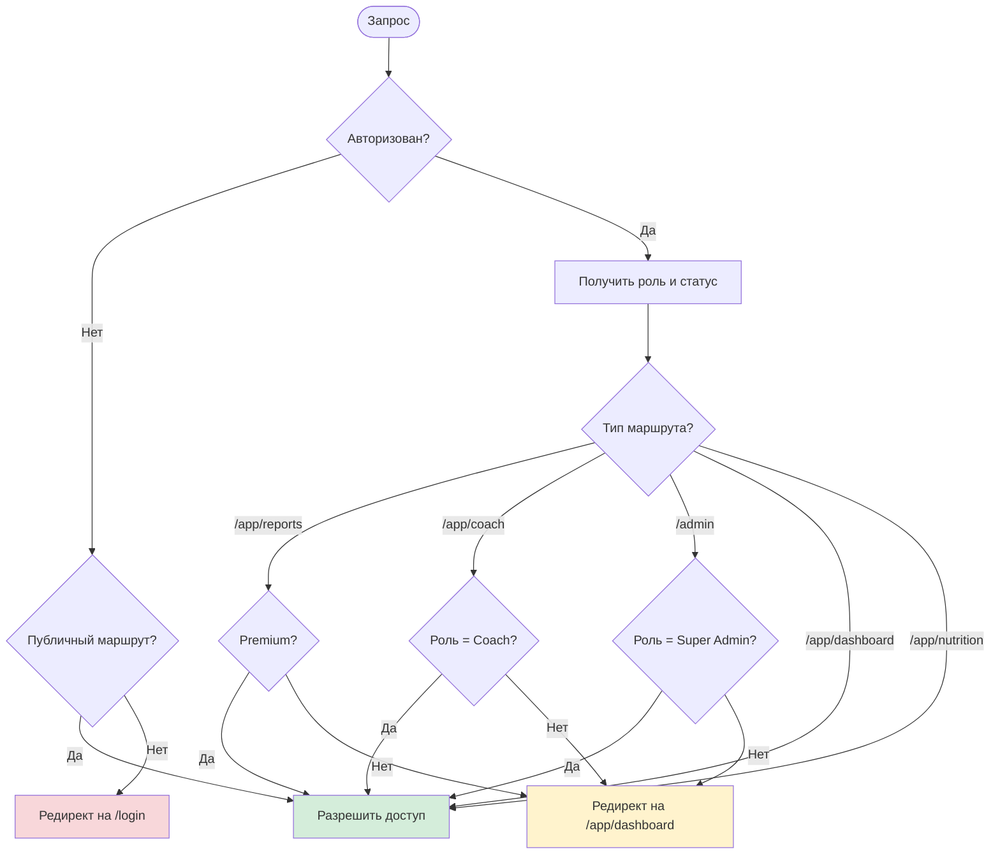
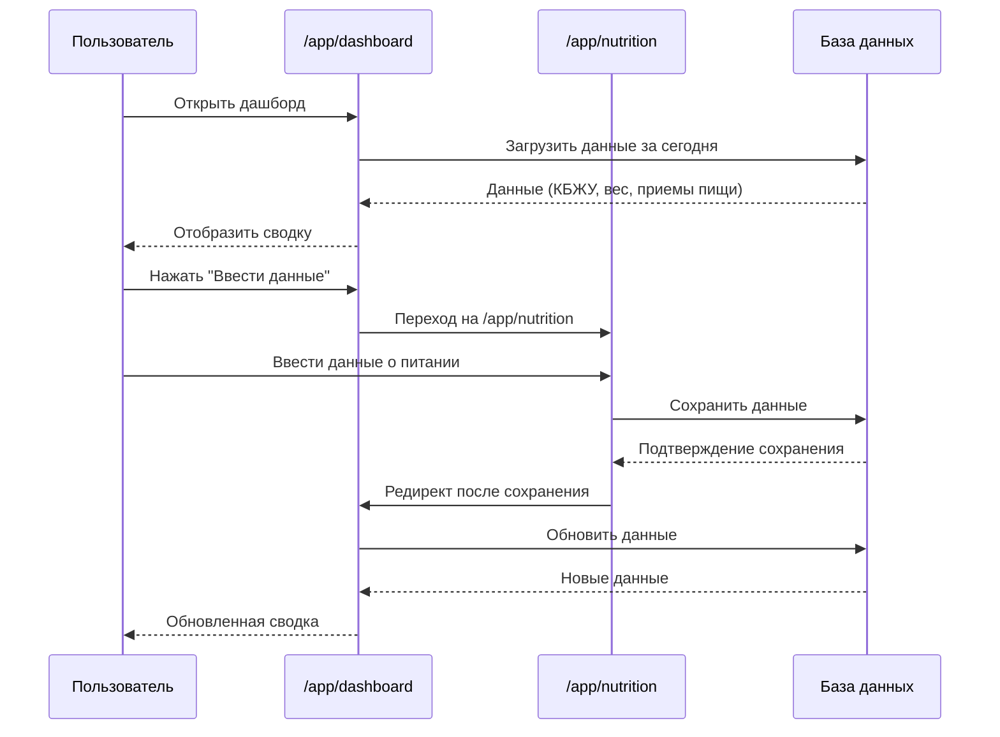
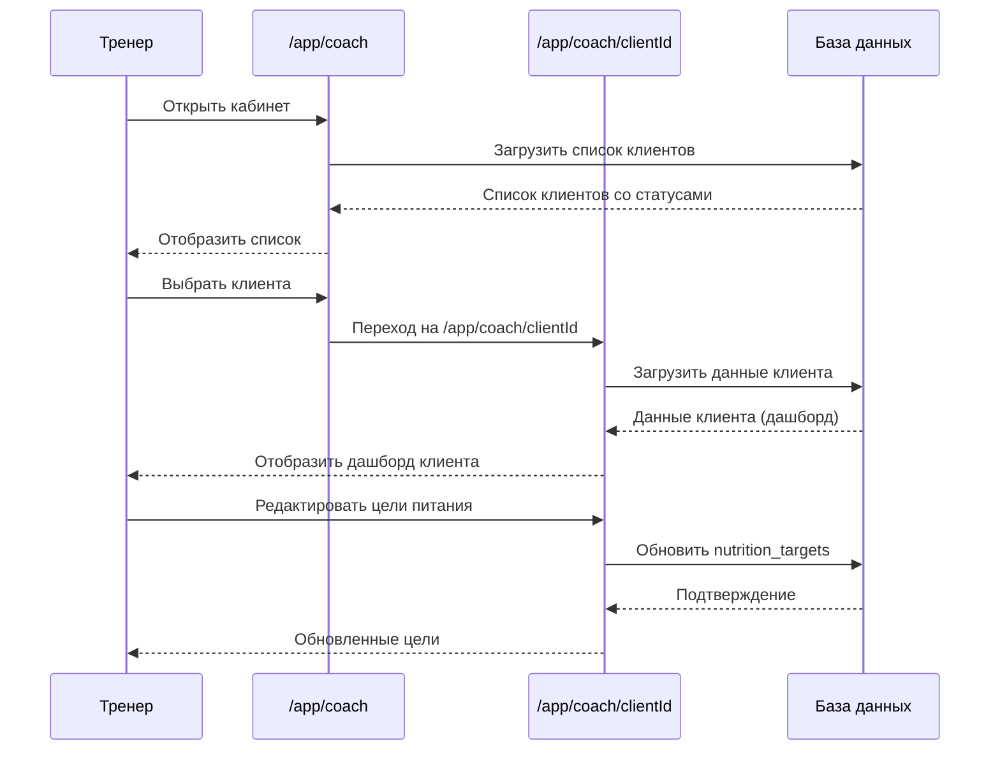

# Диаграммы навигации приложения My Fitness App

Этот документ содержит визуальные Mermaid диаграммы навигации между страницами приложения. Основано на текстовой диаграмме из [Application_Structure.md](./Application_Structure.md).

---

## Общая навигация приложения

```mermaid
flowchart TD
    Start([Пользователь]) --> Landing[/ Landing Page]
    
    Landing -->|Не авторизован| Register[/register]
    Landing -->|Не авторизован| Login[/login]
    Landing -->|Авторизован: Client| Dashboard[/app/dashboard]
    Landing -->|Авторизован: Coach| Coach[/app/coach]
    Landing -->|Авторизован: Admin| Admin[/admin]
    
    Register -->|Успешная регистрация| Dashboard
    Register -->|Есть аккаунт| Login
    
    Login -->|Client| Dashboard
    Login -->|Coach| Coach
    Login -->|Super Admin| Admin
    Login -->|Нет аккаунта| Register
    
    Dashboard -->|Ввести данные| Nutrition[/app/nutrition]
    Dashboard -->|Редактировать прием| Nutrition
    Dashboard -->|Отчеты Premium| Reports[/app/reports]
    Dashboard -->|Выход| Login
    
    Nutrition -->|Сохранить/Отмена| Dashboard
    
    Reports -->|Назад| Dashboard
    Reports -->|Выход| Login
    
    Coach -->|Выбрать клиента| ClientView[/app/coach/clientId]
    Coach -->|Выход| Login
    
    ClientView -->|Назад| Coach
    
    Admin -->|Выход| Login
    
    style Landing fill:#e1f5ff
    style Register fill:#e1f5ff
    style Login fill:#e1f5ff
    style Dashboard fill:#d4edda
    style Nutrition fill:#d4edda
    style Reports fill:#fff3cd
    style Coach fill:#cfe2ff
    style ClientView fill:#cfe2ff
    style Admin fill:#f8d7da
```

**Легенда цветов:**
- 🔵 Голубой — публичные страницы
- 🟢 Зеленый — страницы клиентов
- 🟡 Желтый — Premium функции
- 🔵 Синий — страницы тренеров
- 🔴 Красный — админ-панель

---

## Навигация для клиентов (Client Flow)

```mermaid
flowchart LR
    Start([Клиент входит]) --> Login[/login]
    Login --> Dashboard[/app/dashboard]
    
    Dashboard -->|Ввести питание| Nutrition[/app/nutrition]
    Dashboard -->|Добавить прием| Nutrition
    Dashboard -->|Редактировать прием| Nutrition
    Dashboard -->|Отчеты Premium| Reports[/app/reports]
    
    Nutrition -->|Сохранить| Dashboard
    Nutrition -->|Отмена| Dashboard
    
    Reports -->|Назад| Dashboard
    
    style Dashboard fill:#d4edda
    style Nutrition fill:#d4edda
    style Reports fill:#fff3cd
```

**Описание:**
- Клиент начинает с дашборда после входа
- Может переходить на ввод питания и обратно
- Premium клиенты имеют доступ к отчетам

---

## Навигация для тренеров (Coach Flow)

```mermaid
flowchart LR
    Start([Тренер входит]) --> Login[/login]
    Login --> Coach[/app/coach]
    
    Coach -->|Выбрать клиента| ClientView[/app/coach/clientId]
    ClientView -->|Назад| Coach
    ClientView -->|Редактировать цели| ClientView
    
    style Coach fill:#cfe2ff
    style ClientView fill:#cfe2ff
```

**Описание:**
- Тренер видит список клиентов
- Может просматривать детальный дашборд каждого клиента
- Может редактировать цели по питанию для клиентов

---

## Навигация для супер-администраторов (Admin Flow)

```mermaid
flowchart LR
    Start([Админ входит]) --> Login[/login]
    Login --> Admin[/admin]
    
    Admin -->|Управление пользователями| Admin
    Admin -->|Редактирование профилей| Admin
    
    style Admin fill:#f8d7da
```

**Описание:**
- Админ работает в одной панели управления
- Все операции выполняются в рамках админ-панели

---

## Система ролей и доступа

```mermaid
flowchart TD
    User([Пользователь]) --> Auth{Авторизован?}
    
    Auth -->|Нет| Public[Публичные страницы]
    Public --> Landing[/ Landing]
    Public --> Register[/register]
    Public --> Login[/login]
    
    Auth -->|Да| Role{Роль?}
    
    Role -->|Client| ClientPages[Страницы клиента]
    ClientPages --> Dashboard[/app/dashboard]
    ClientPages --> Nutrition[/app/nutrition]
    ClientPages -->|Premium| Reports[/app/reports]
    
    Role -->|Coach| CoachPages[Страницы тренера]
    CoachPages --> CoachDash[/app/coach]
    CoachPages --> ClientView[/app/coach/clientId]
    
    Role -->|Super Admin| AdminPages[Страницы админа]
    AdminPages --> Admin[/admin]
    
    style Public fill:#e1f5ff
    style ClientPages fill:#d4edda
    style CoachPages fill:#cfe2ff
    style AdminPages fill:#f8d7da
```

**Описание:**
- Показывает, как система определяет доступ на основе авторизации и роли
- Разные роли получают доступ к разным наборам страниц

---

## Защита маршрутов (Middleware Logic)



**Описание:**
- Показывает логику проверки доступа в middleware
- Разные маршруты требуют разных проверок (авторизация, роль, Premium статус)

---

## Детальная навигация: Dashboard → Nutrition



---

## Детальная навигация: Coach → Client View



---

*Документ создан: 16 декабря 2025*

