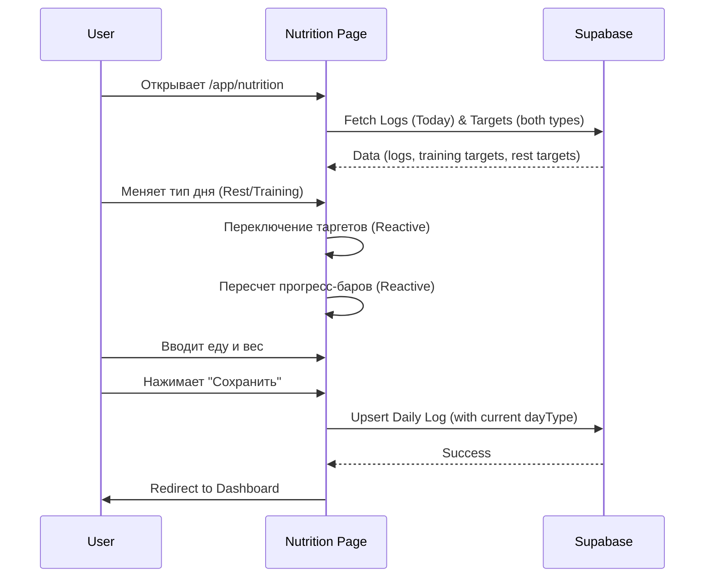
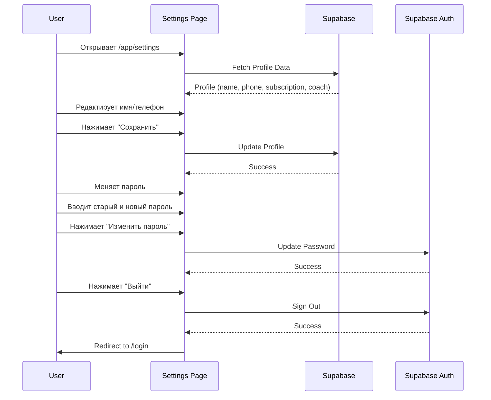
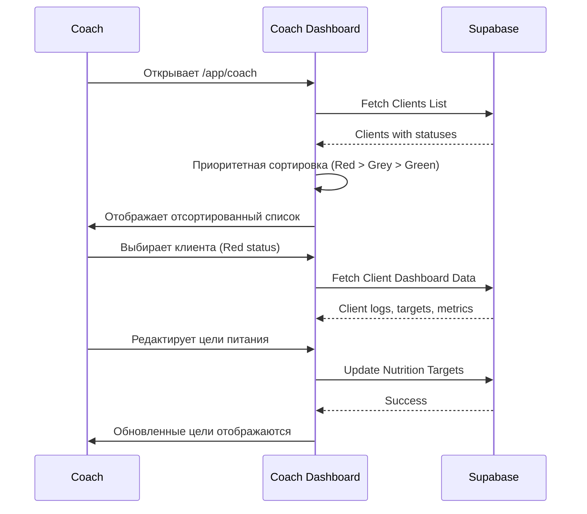
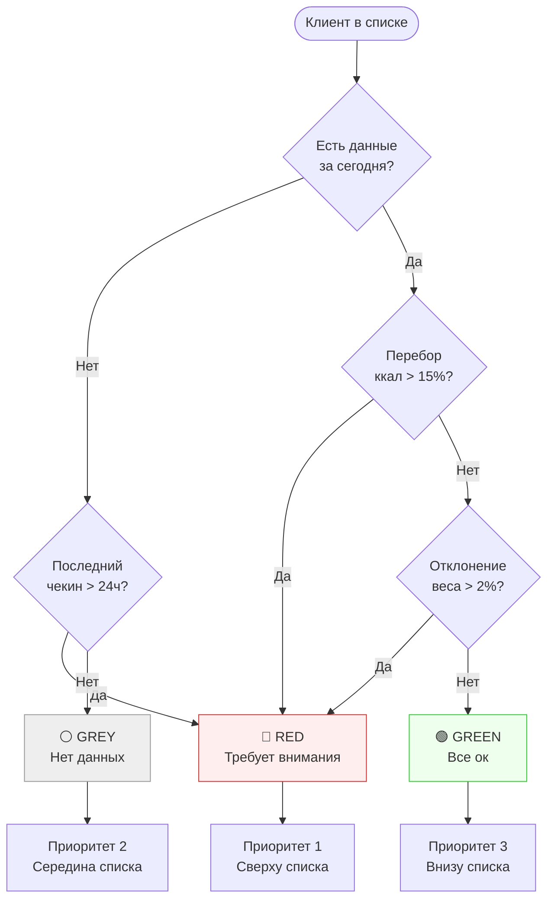
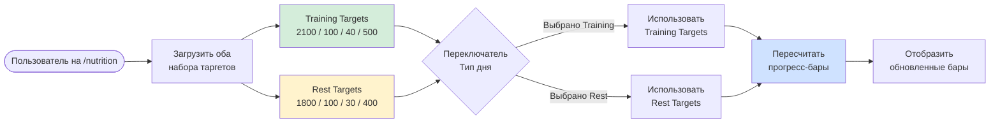

# Диаграммы навигации My Fitness App v1.1

## Общая навигация
Добавлен раздел настроек и уточнены переходы.

```mermaid
flowchart TD
    Start([Пользователь]) --> Landing[/ Landing Page]
    
    %% Auth Flow
    Landing -->|Guest| Login[/login]
    Landing -->|Guest| Register[/register]
    
    %% Role Based Redirects
    Login -->|Client| Dashboard[/app/dashboard]
    Login -->|Coach| CoachList[/app/coach]
    Login -->|Admin| AdminPanel[/admin]
    
    %% Client Zone
    subgraph Client App
        Dashboard -->|Ввод еды| Nutrition[/app/nutrition]
        Dashboard -->|Аналитика| Reports[/app/reports]
        Dashboard -->|Профиль| Settings[/app/settings]
        
        Nutrition -->|Save/Cancel| Dashboard
        Reports -->|Back| Dashboard
        Settings -->|Logout| Login
    end
    
    %% Coach Zone
    subgraph Coach App
        CoachList -->|Select Client| ClientView[/app/coach/:id]
        CoachList -->|Logout| Login
        ClientView -->|Back| CoachList
        ClientView -->|Edit Targets| ClientSettings[Client Targets]
    end
    
    %% Admin Zone
    subgraph Admin Area
        AdminPanel -->|Manage Users| UserEdit[Edit User / Assign Coach]
        AdminPanel -->|Logout| Login
    end

    style Landing fill:#f9f9f9,stroke:#333
    style Dashboard fill:#d4edda,stroke:#28a745
    style Nutrition fill:#d4edda,stroke:#28a745
    style Settings fill:#e2e3e5,stroke:#333
    style CoachList fill:#cfe2ff,stroke:#0d6efd
    style AdminPanel fill:#f8d7da,stroke:#dc3545
```

## Детальный флоу: Ввод питания (Client)



## Детальный флоу: Настройки профиля (Client)



## Детальный флоу: Кабинет тренера (Coach)



## Система приоритетов для тренера (Traffic Light Logic)



## Динамическое переключение типа дня

