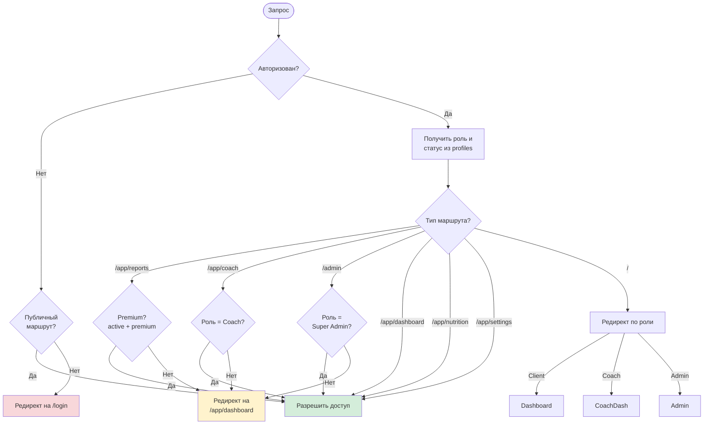
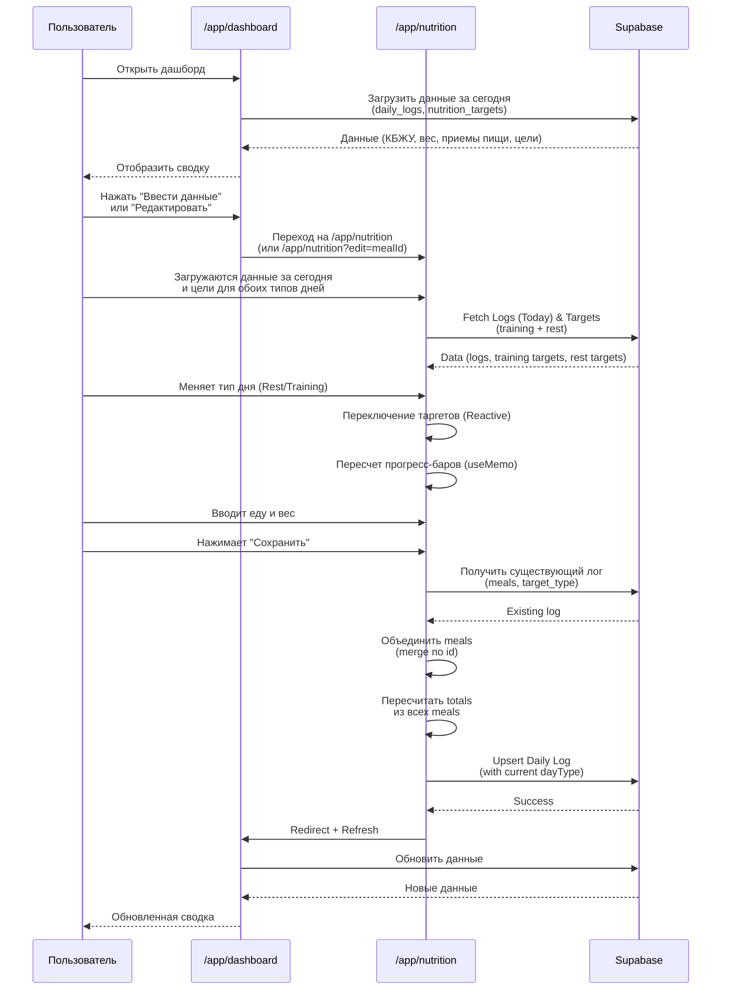
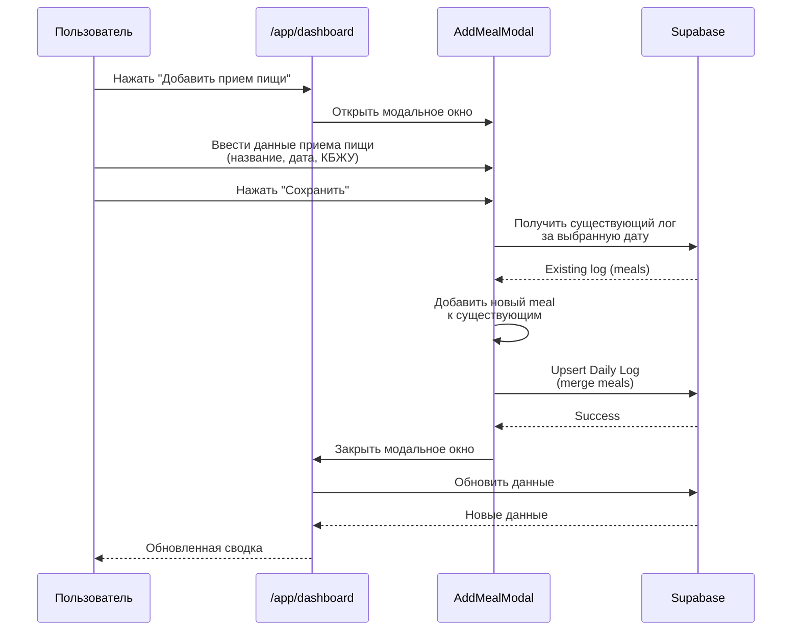
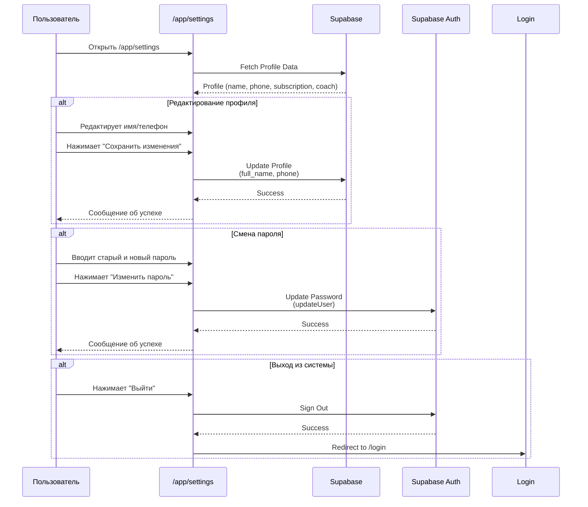
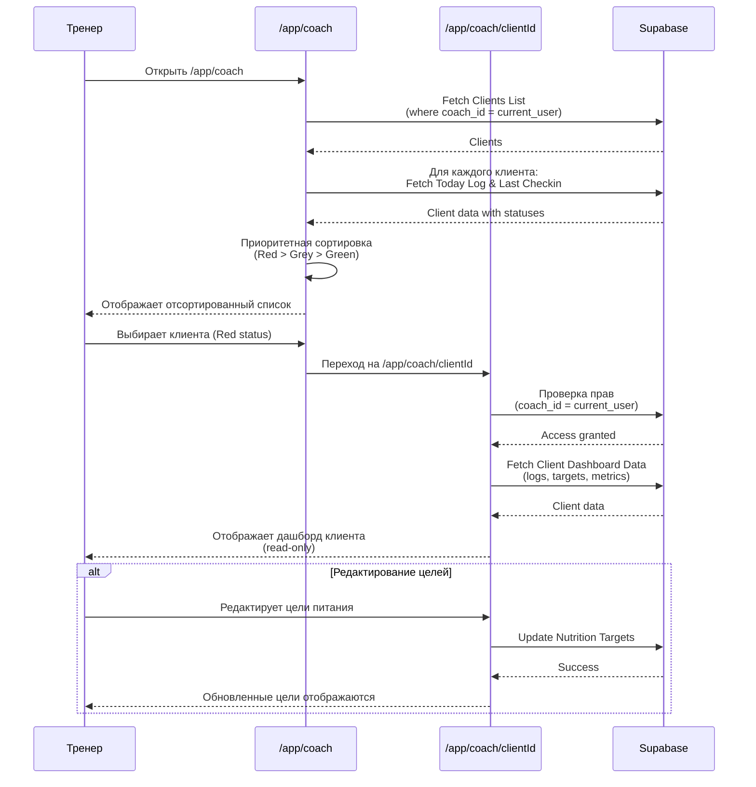
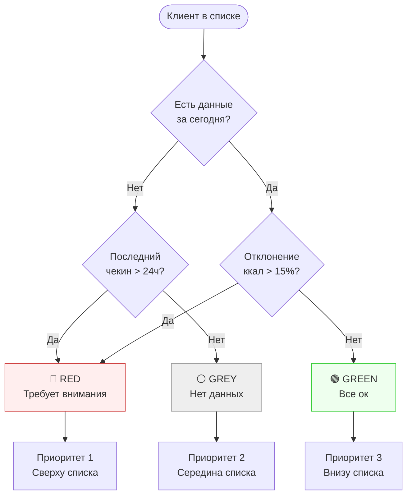
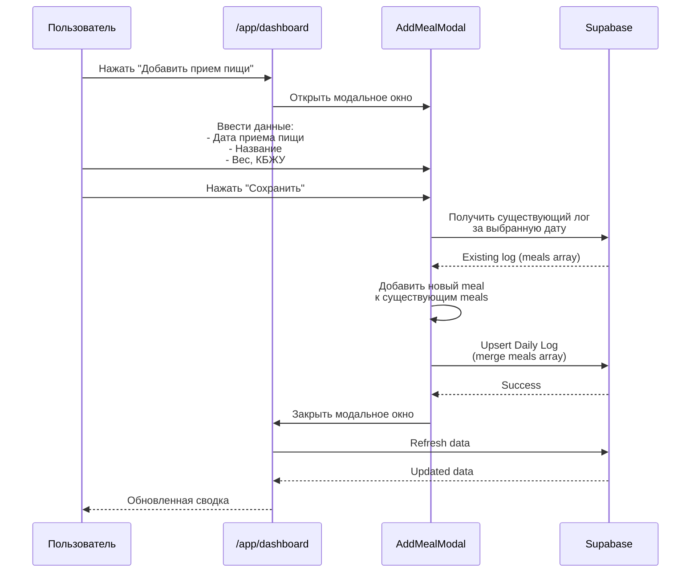
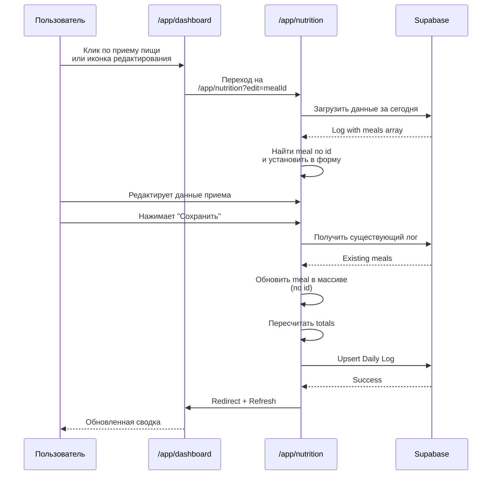

# Диаграммы навигации My Fitness App v3.0

Документация v3.0 отражает **текущую реализацию** навигации в коде (по состоянию на 17 декабря 2025).

---

## Общая навигация приложения

```mermaid
flowchart TD
    Start([Пользователь]) --> Landing[/ Landing Page]
    
    %% Auth Flow
    Landing -->|Guest| Login[/login]
    Landing -->|Guest| Register[/register]
    Landing -->|Auth: Client| Dashboard[/app/dashboard]
    Landing -->|Auth: Coach| CoachList[/app/coach]
    Landing -->|Auth: Admin| AdminPanel[/admin]
    
    %% Registration
    Register -->|Success| Dashboard
    
    %% Login Flow
    Login -->|Client| Dashboard
    Login -->|Coach| CoachList
    Login -->|Super Admin| AdminPanel
    Login -->|No Account| Register
    
    %% Client Zone
    subgraph Client App["/app/*"]
        Dashboard -->|Ввод питания| Nutrition[/app/nutrition]
        Dashboard -->|Редактировать прием| Nutrition
        Dashboard -->|Добавить прием| Nutrition
        Dashboard -->|Отчеты Premium| Reports[/app/reports]
        Dashboard -->|Настройки| Settings[/app/settings]
        
        Nutrition -->|Save/Cancel| Dashboard
        Reports -->|Back| Dashboard
        Settings -->|Back| Dashboard
        Settings -->|Logout| Login
    end
    
    %% Coach Zone
    subgraph Coach App["/app/coach"]
        CoachList -->|Select Client| ClientView[/app/coach/clientId]
        CoachList -->|Logout| Login
        ClientView -->|Back| CoachList
    end
    
    %% Admin Zone
    subgraph Admin Area["/admin"]
        AdminPanel -->|Manage Users| AdminPanel
        AdminPanel -->|Logout| Login
    end

    style Landing fill:#e1f5ff,stroke:#333
    style Login fill:#e1f5ff,stroke:#333
    style Register fill:#e1f5ff,stroke:#333
    style Dashboard fill:#d4edda,stroke:#28a745
    style Nutrition fill:#d4edda,stroke:#28a745
    style Reports fill:#fff3cd,stroke:#ffc107
    style Settings fill:#e2e3e5,stroke:#333
    style CoachList fill:#cfe2ff,stroke:#0d6efd
    style ClientView fill:#cfe2ff,stroke:#0d6efd
    style AdminPanel fill:#f8d7da,stroke:#dc3545
```

**Легенда цветов:**
- 🔵 Голубой — публичные страницы
- 🟢 Зеленый — страницы клиентов
- 🟡 Желтый — Premium функции
- 🔵 Синий — страницы тренеров
- 🔴 Красный — админ-панель
- ⚪ Серый — настройки

---

## Навигация для клиентов (Client Flow)

```mermaid
flowchart LR
    Start([Клиент входит]) --> Login[/login]
    Login --> Dashboard[/app/dashboard]
    
    Dashboard -->|Ввести питание| Nutrition[/app/nutrition]
    Dashboard -->|Добавить прием| AddMeal[AddMealModal]
    Dashboard -->|Редактировать прием| Nutrition
    Dashboard -->|Отчеты Premium| Reports[/app/reports]
    Dashboard -->|Настройки| Settings[/app/settings]
    
    AddMeal -->|Save| Dashboard
    Nutrition -->|Save| Dashboard
    Nutrition -->|Cancel| Dashboard
    Reports -->|Back| Dashboard
    Settings -->|Back| Dashboard
    Settings -->|Logout| Login
    
    style Dashboard fill:#d4edda
    style Nutrition fill:#d4edda
    style Reports fill:#fff3cd
    style Settings fill:#e2e3e5
    style AddMeal fill:#fff9c4
```

**Описание:**
- Клиент начинает с дашборда после входа
- Может переходить на ввод питания и обратно
- Premium клиенты имеют доступ к отчетам
- Настройки доступны всем клиентам
- Модальное окно для добавления приемов пищи доступно с дашборда

---

## Навигация для тренеров (Coach Flow)

```mermaid
flowchart LR
    Start([Тренер входит]) --> Login[/login]
    Login --> Coach[/app/coach]
    
    Coach -->|Выбрать клиента| ClientView[/app/coach/clientId]
    ClientView -->|Back| Coach
    ClientView -->|Edit Targets| ClientView
    Coach -->|Logout| Login
    
    style Coach fill:#cfe2ff
    style ClientView fill:#cfe2ff
```

**Описание:**
- Тренер видит список клиентов с приоритетной сортировкой
- Может просматривать детальный дашборд каждого клиента
- Может редактировать цели по питанию для клиентов
- Все действия в режиме только для чтения, кроме редактирования целей

---

## Навигация для супер-администраторов (Admin Flow)

```mermaid
flowchart LR
    Start([Админ входит]) --> Login[/login]
    Login --> Admin[/admin]
    
    Admin -->|Edit User| EditModal[Edit User Modal]
    EditModal -->|Save| Admin
    EditModal -->|Cancel| Admin
    Admin -->|Logout| Login
    
    style Admin fill:#f8d7da
    style EditModal fill:#fff9c4
```

**Описание:**
- Админ работает в одной панели управления
- Все операции выполняются в рамках админ-панели
- Модальное окно для редактирования пользователей

---

## Система ролей и доступа

```mermaid
flowchart TD
    User([Пользователь]) --> Auth{Авторизован?}
    
    Auth -->|Нет| Public[Публичные страницы]
    Public --> Landing[/ Landing]
    Public --> Register[/register]
    Public --> Login[/login]
    
    Auth -->|Да| Role{Роль?}
    
    Role -->|Client| ClientPages[Страницы клиента]
    ClientPages --> Dashboard[/app/dashboard]
    ClientPages --> Nutrition[/app/nutrition]
    ClientPages --> Settings[/app/settings]
    ClientPages -->|Premium| Reports[/app/reports]
    
    Role -->|Coach| CoachPages[Страницы тренера]
    CoachPages --> CoachDash[/app/coach]
    CoachPages --> ClientView[/app/coach/clientId]
    
    Role -->|Super Admin| AdminPages[Страницы админа]
    AdminPages --> Admin[/admin]
    
    style Public fill:#e1f5ff
    style ClientPages fill:#d4edda
    style CoachPages fill:#cfe2ff
    style AdminPages fill:#f8d7da
```

**Описание:**
- Показывает, как система определяет доступ на основе авторизации и роли
- Разные роли получают доступ к разным наборам страниц
- Premium функции доступны только клиентам с активной подпиской

---

## Защита маршрутов (Middleware Logic)



**Описание:**
- Показывает логику проверки доступа в middleware
- Разные маршруты требуют разных проверок (авторизация, роль, Premium статус)
- Автоматические редиректы на основе роли для главной страницы

---

## Детальный флоу: Dashboard → Nutrition



---

## Детальный флоу: Dashboard → Add Meal Modal



---

## Детальный флоу: Настройки профиля (Settings)



---

## Детальный флоу: Кабинет тренера (Coach)



---

## Система приоритетов для тренера (Traffic Light Logic)



**Описание:**
- Показывает логику определения статуса клиента
- Приоритетная сортировка: Red (1) > Grey (2) > Green (3)
- Red клиенты всегда отображаются сверху списка

---

## Динамическое переключение типа дня

```mermaid
flowchart LR
    Start([Пользователь на /nutrition]) --> Load[Загрузить оба<br/>набора таргетов]
    Load --> Training[Training Targets<br/>2100 / 100 / 40 / 500]
    Load --> Rest[Rest Targets<br/>1800 / 100 / 30 / 400]
    
    Training --> Toggle{Переключатель<br/>Тип дня}
    Rest --> Toggle
    
    Toggle -->|Выбрано Training| UseTraining[Использовать<br/>Training Targets]
    Toggle -->|Выбрано Rest| UseRest[Использовать<br/>Rest Targets]
    
    UseTraining --> CheckTargets{Таргеты<br/>найдены?}
    UseRest --> CheckTargets
    
    CheckTargets -->|Да| Recalc[Пересчитать<br/>прогресс-бары]
    CheckTargets -->|Нет| Warning[Показать предупреждение:<br/>"Цели не установлены"]
    
    Recalc --> Display[Отобразить<br/>обновленные бары]
    Warning --> Display
    
    style Training fill:#d4edda
    style Rest fill:#fff3cd
    style Recalc fill:#cfe2ff
    style Warning fill:#fff3cd
```

**Описание:**
- Показывает логику динамического переключения типа дня
- Оба набора таргетов загружаются при открытии страницы
- При смене типа дня прогресс-бары пересчитываются автоматически
- Если таргеты не найдены, показывается предупреждение

---

## Флоу добавления приема пищи с дашборда



---

## Флоу редактирования приема пищи



---

*Документ создан: 17 декабря 2025 (на основе текущей реализации в коде)*

