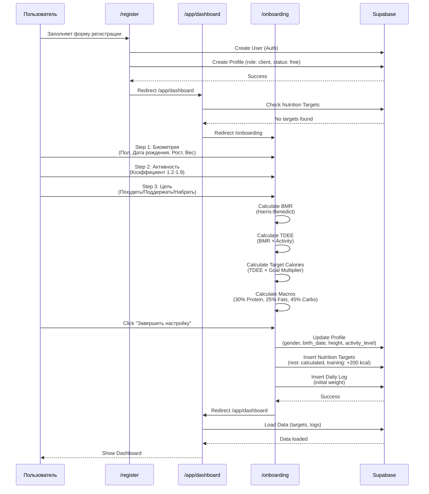
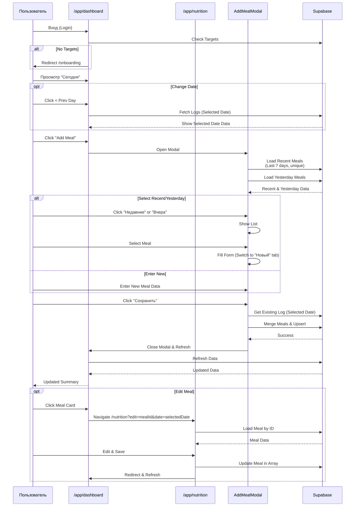
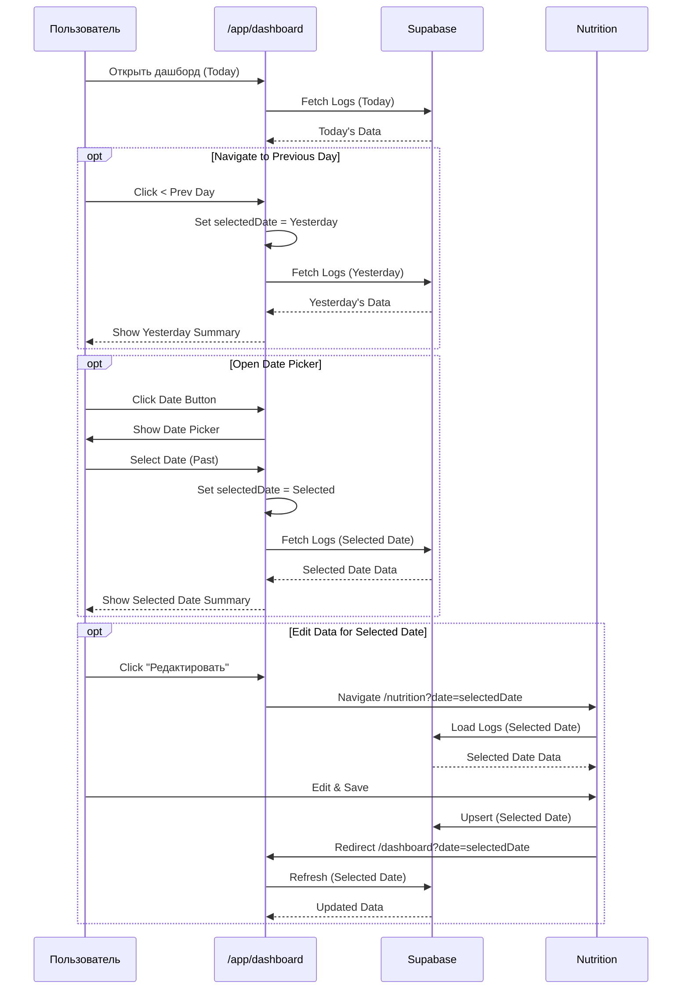
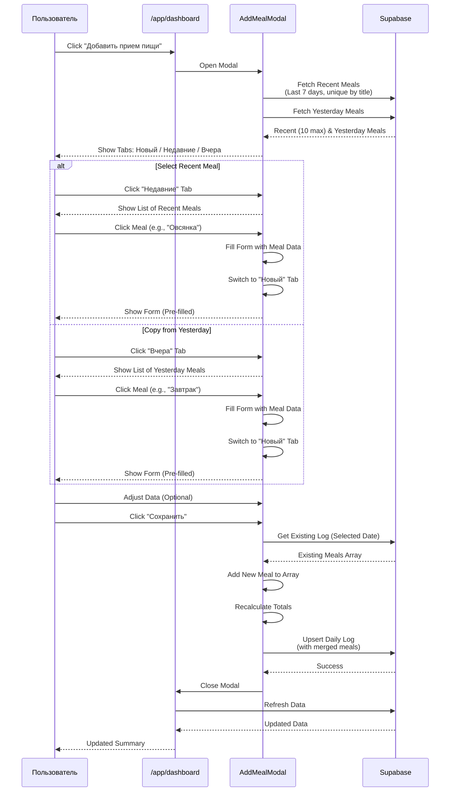
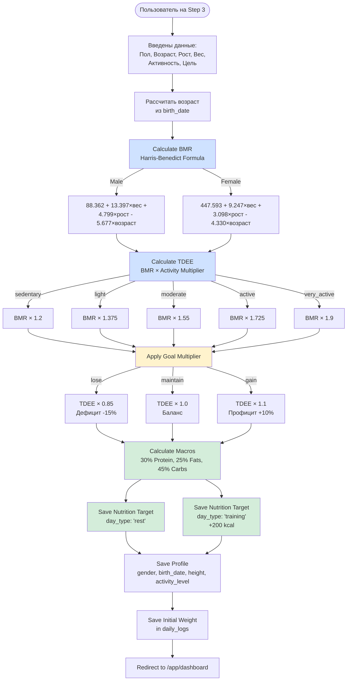
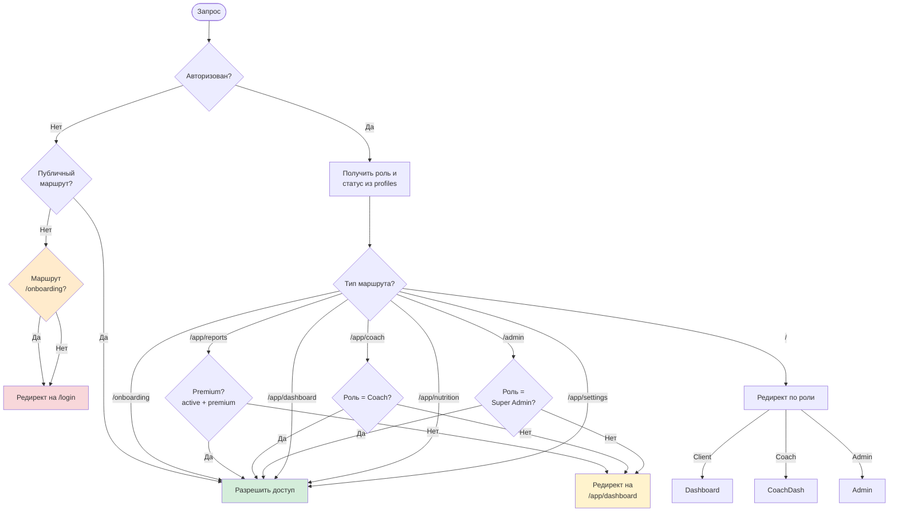
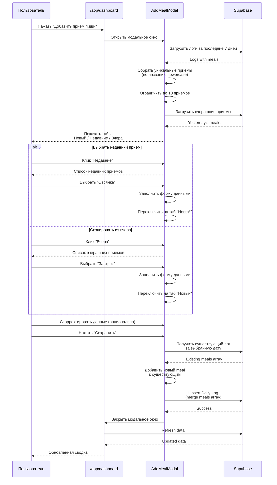
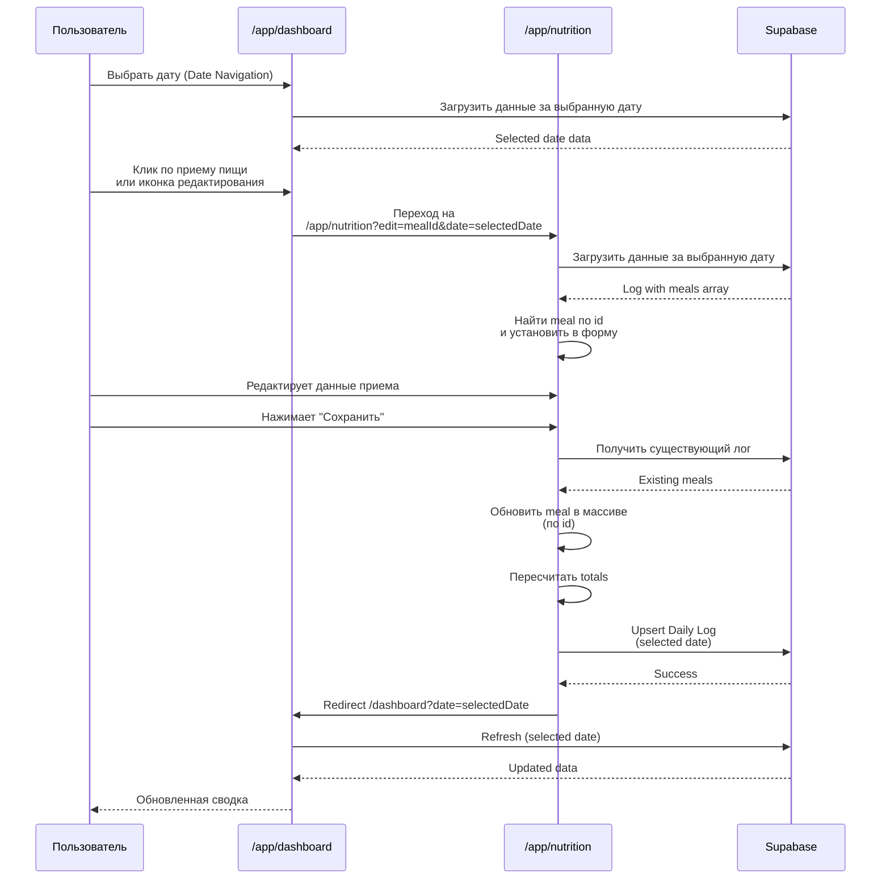

# Диаграммы навигации My Fitness App v3.1

Документация v3.1 отражает **текущую реализацию** навигации в коде (по состоянию на 17 декабря 2025) с добавлением **Onboarding**, **навигации по датам** и **умного копирования приемов пищи**.

---

## Общая навигация приложения (с Onboarding)

```mermaid
flowchart TD
    Start([Пользователь]) --> Landing[/ Landing Page]
    
    %% Auth Flow
    Landing -->|Guest| Login[/login]
    Landing -->|Guest| Register[/register]
    Landing -->|Auth: Client| CheckTargets{Есть цели?}
    Landing -->|Auth: Coach| CoachList[/app/coach]
    Landing -->|Auth: Admin| AdminPanel[/admin]
    
    %% Registration & Onboarding Flow
    Register -->|Success| CheckTargets
    Login -->|Client| CheckTargets
    
    CheckTargets -->|Нет| Onboarding[/onboarding]
    CheckTargets -->|Да| Dashboard[/app/dashboard]
    Onboarding -->|Save & Calc| Dashboard
    
    %% Client Zone
    subgraph Client App["/app/*"]
        Dashboard -->|Change Date| Dashboard
        Dashboard -->|Input| Nutrition[/app/nutrition]
        Dashboard -->|Add Meal| AddMealModal[AddMealModal]
        Dashboard -->|Settings| Settings[/app/settings]
        Dashboard -->|Reports| Reports[/app/reports]
        
        Nutrition -->|Save/Cancel| Dashboard
        AddMealModal -->|Save| Dashboard
        Reports -->|Back| Dashboard
        Settings -->|Back| Dashboard
        Settings -->|Logout| Login
    end
    
    %% Coach Zone
    subgraph Coach App["/app/coach"]
        CoachList -->|Select Client| ClientView[/app/coach/clientId]
        CoachList -->|Logout| Login
        ClientView -->|Back| CoachList
    end
    
    %% Admin Zone
    subgraph Admin Area["/admin"]
        AdminPanel -->|Manage Users| AdminPanel
        AdminPanel -->|Logout| Login
    end

    style Landing fill:#e1f5ff,stroke:#333
    style Login fill:#e1f5ff,stroke:#333
    style Register fill:#e1f5ff,stroke:#333
    style Onboarding fill:#ffebcc,stroke:#fd7e14,stroke-width:2px
    style Dashboard fill:#d4edda,stroke:#28a745
    style Nutrition fill:#d4edda,stroke:#28a745
    style Reports fill:#fff3cd,stroke:#ffc107
    style Settings fill:#e2e3e5,stroke:#333
    style CoachList fill:#cfe2ff,stroke:#0d6efd
    style ClientView fill:#cfe2ff,stroke:#0d6efd
    style AdminPanel fill:#f8d7da,stroke:#dc3545
    style AddMealModal fill:#fff9c4,stroke:#ffc107
```

**Легенда цветов:**
- 🔵 Голубой — публичные страницы
- 🟠 Оранжевый — Onboarding (новый в v3.1)
- 🟢 Зеленый — страницы клиентов
- 🟡 Желтый — Premium функции / Модальные окна
- 🔵 Синий — страницы тренеров
- 🔴 Красный — админ-панель
- ⚪ Серый — настройки

---

## Детальный флоу: Регистрация и Onboarding



---

## Детальный флоу: Ежедневное использование (The Loop)



---

## Навигация для клиентов (Client Flow) с Date Navigation

```mermaid
flowchart LR
    Start([Клиент входит]) --> Login[/login]
    Login --> CheckTargets{Есть цели?}
    CheckTargets -->|Нет| Onboarding[/onboarding]
    CheckTargets -->|Да| Dashboard[/app/dashboard]
    Onboarding --> Dashboard
    
    Dashboard -->|Change Date| Dashboard
    Dashboard -->|Ввести питание| Nutrition[/app/nutrition]
    Dashboard -->|Добавить прием| AddMealModal[AddMealModal]
    Dashboard -->|Редактировать прием| Nutrition
    Dashboard -->|Отчеты Premium| Reports[/app/reports]
    Dashboard -->|Настройки| Settings[/app/settings]
    
    AddMealModal -->|Select Recent| AddMealModal
    AddMealModal -->|Copy Yesterday| AddMealModal
    AddMealModal -->|Save| Dashboard
    
    Nutrition -->|Save| Dashboard
    Nutrition -->|Cancel| Dashboard
    Reports -->|Back| Dashboard
    Settings -->|Back| Dashboard
    Settings -->|Logout| Login
    
    style Onboarding fill:#ffebcc
    style Dashboard fill:#d4edda
    style Nutrition fill:#d4edda
    style Reports fill:#fff3cd
    style Settings fill:#e2e3e5
    style AddMealModal fill:#fff9c4
```

---

## Детальный флоу: Date Navigation



---

## Детальный флоу: Smart Copy (AddMealModal)



---

## Детальный флоу: Onboarding Calculation



---

## Система ролей и доступа (с Onboarding)

```mermaid
flowchart TD
    User([Пользователь]) --> Auth{Авторизован?}
    
    Auth -->|Нет| Public[Публичные страницы]
    Public --> Landing[/ Landing]
    Public --> Register[/register]
    Public --> Login[/login]
    
    Auth -->|Да| Role{Роль?}
    
    Role -->|Client| CheckTargets{Есть цели<br/>в nutrition_targets?}
    CheckTargets -->|Нет| Onboarding[/onboarding]
    CheckTargets -->|Да| ClientPages[Страницы клиента]
    
    Onboarding -->|After Setup| ClientPages
    
    ClientPages --> Dashboard[/app/dashboard]
    ClientPages --> Nutrition[/app/nutrition]
    ClientPages --> Settings[/app/settings]
    ClientPages -->|Premium| Reports[/app/reports]
    
    Role -->|Coach| CoachPages[Страницы тренера]
    CoachPages --> CoachDash[/app/coach]
    CoachPages --> ClientView[/app/coach/clientId]
    
    Role -->|Super Admin| AdminPages[Страницы админа]
    AdminPages --> Admin[/admin]
    
    style Public fill:#e1f5ff
    style Onboarding fill:#ffebcc,stroke:#fd7e14,stroke-width:2px
    style ClientPages fill:#d4edda
    style CoachPages fill:#cfe2ff
    style AdminPages fill:#f8d7da
```

---

## Защита маршрутов (Middleware Logic) v3.1



---

## Флоу добавления приема пищи с копированием



---

## Флоу редактирования приема пищи с Date Navigation



---

*Документ создан: 17 декабря 2025 (на основе текущей реализации в коде v3.1)*


