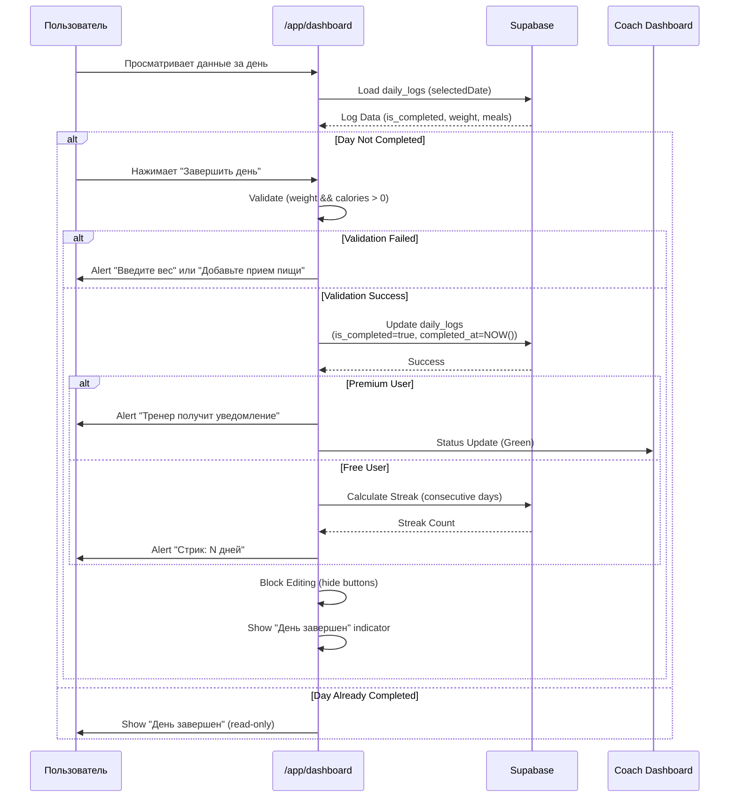
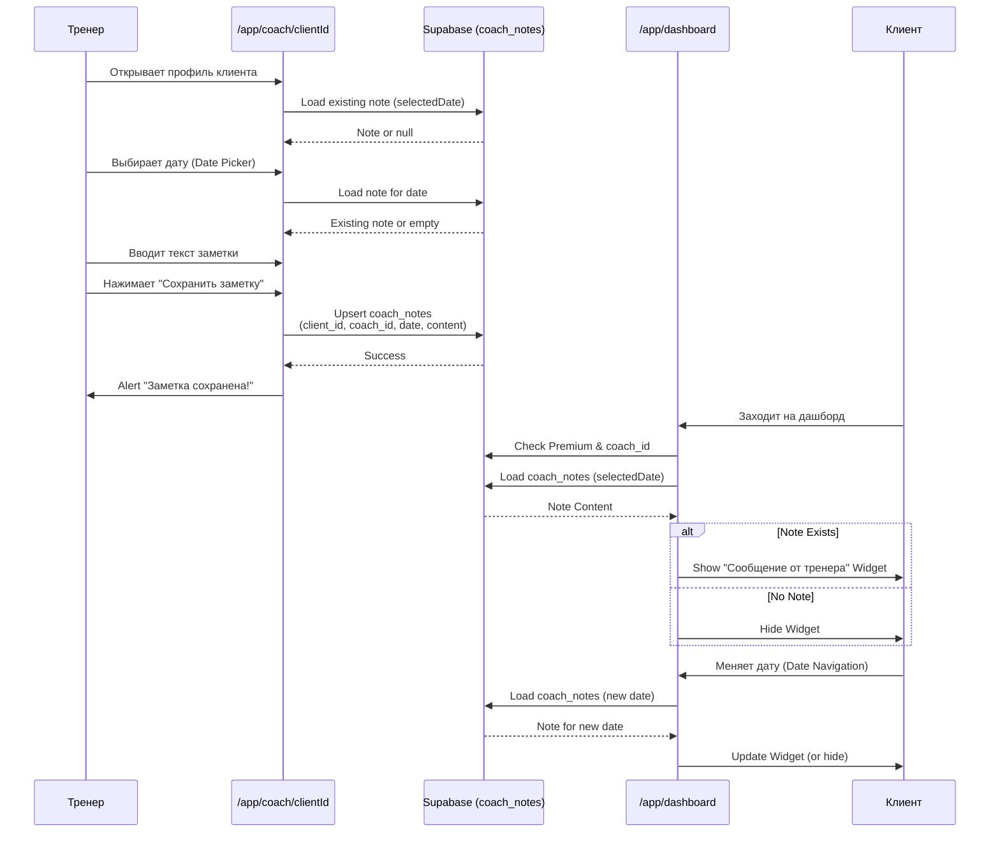
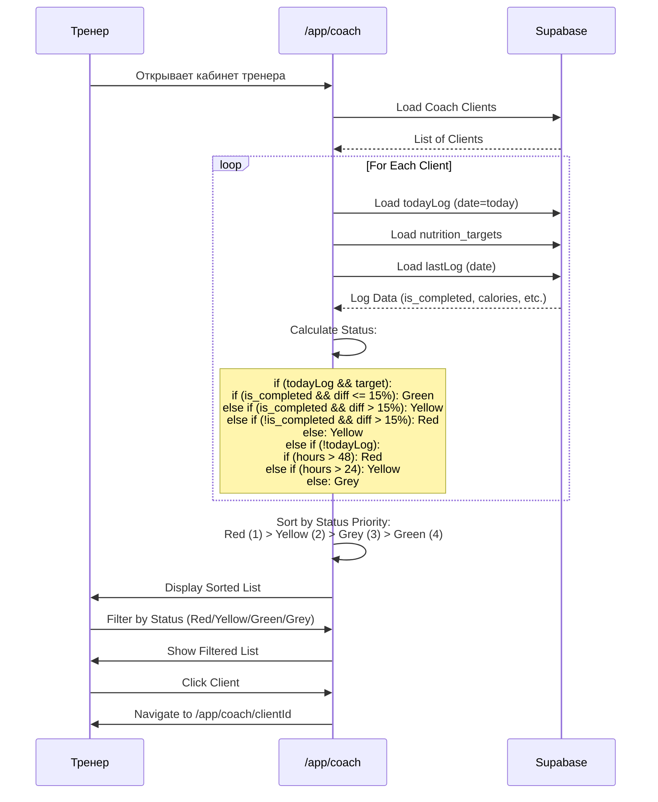
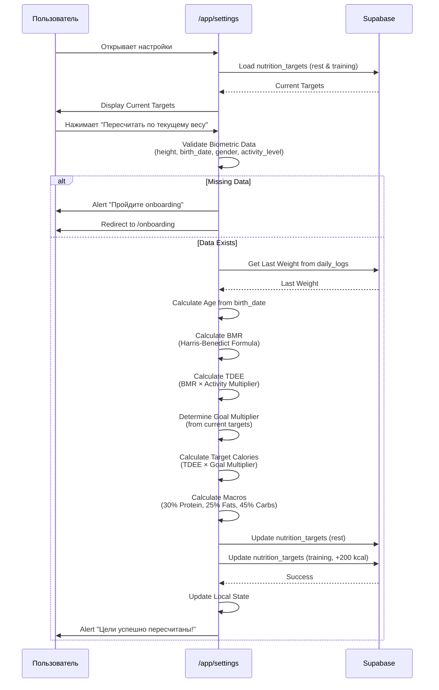
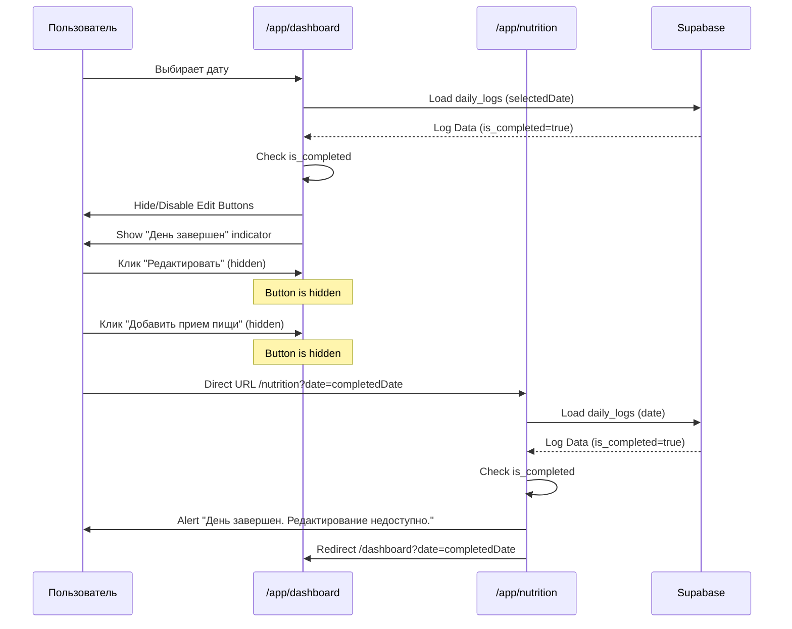
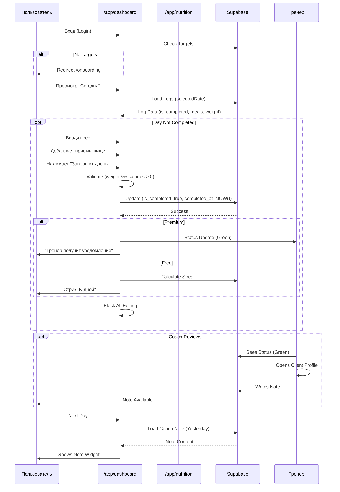
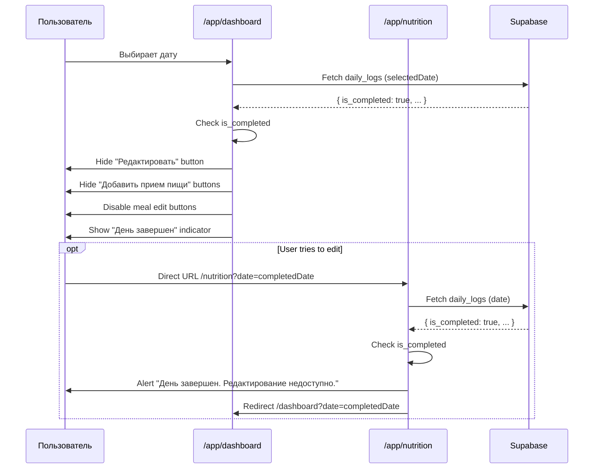
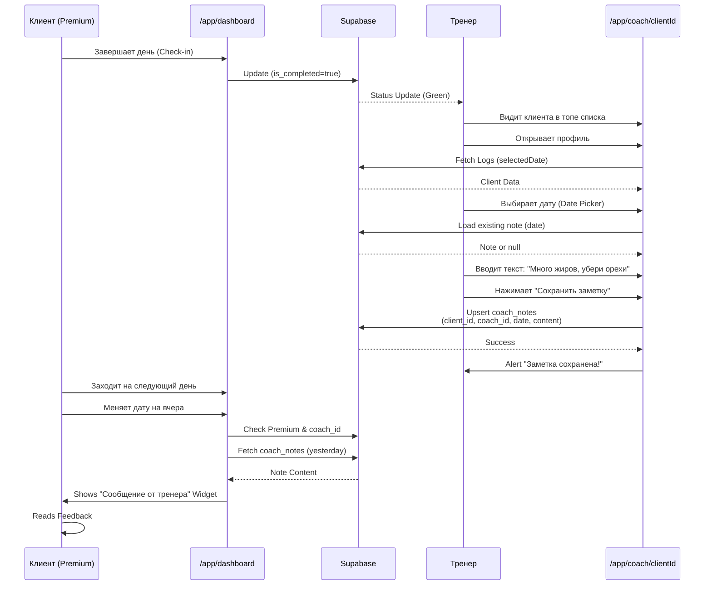

# Диаграммы навигации My Fitness App v3.2

Документация v3.2 отражает **текущую реализацию** навигации в коде (по состоянию на 17 декабря 2025) с добавлением **Feedback Loop** (петли обратной связи): Daily Check-in, Coach Feedback, улучшенный Coach Dashboard и пересчет целей.

---

## Общая навигация приложения (с Feedback Loop)

```mermaid
flowchart TD
    Start([Пользователь]) --> Landing[/ Landing Page]
    
    %% Auth Flow
    Landing -->|Guest| Login[/login]
    Landing -->|Guest| Register[/register]
    Landing -->|Auth: Client| CheckTargets{Есть цели?}
    Landing -->|Auth: Coach| CoachList[/app/coach]
    Landing -->|Auth: Admin| AdminPanel[/admin]
    
    %% Registration & Onboarding Flow
    Register -->|Success| CheckTargets
    Login -->|Client| CheckTargets
    
    CheckTargets -->|Нет| Onboarding[/onboarding]
    CheckTargets -->|Да| Dashboard[/app/dashboard]
    Onboarding -->|Save & Calc| Dashboard
    
    %% Client Zone
    subgraph Client App["/app/*"]
        Dashboard -->|Change Date| Dashboard
        Dashboard -->|Input| Nutrition[/app/nutrition]
        Dashboard -->|Add Meal| AddMealModal[AddMealModal]
        Dashboard -->|Check-in| CheckIn{Validate & Save}
        Dashboard -->|Read Note| CoachNote[Coach Note Widget]
        Dashboard -->|Settings| Settings[/app/settings]
        Dashboard -->|Reports| Reports[/app/reports]
        
        Nutrition -->|Save/Cancel| Dashboard
        AddMealModal -->|Save| Dashboard
        CheckIn -->|Free| SuccessModal[Success: Streak]
        CheckIn -->|Premium| NotifyCoach[Notify Coach]
        Reports -->|Back| Dashboard
        Settings -->|Recalculate| RecalcTargets[Update Targets]
        Settings -->|Back| Dashboard
        Settings -->|Logout| Login
    end
    
    %% Coach Zone
    subgraph Coach App["/app/coach"]
        CoachList -->|Traffic Light Sort| ClientView[/app/coach/clientId]
        CoachList -->|Logout| Login
        ClientView -->|Write Note| SaveNote[Save Coach Note]
        ClientView -->|Back| CoachList
        SaveNote -.->|Realtime| CoachNote
    end
    
    %% Admin Zone
    subgraph Admin Area["/admin"]
        AdminPanel -->|Manage Users| AdminPanel
        AdminPanel -->|Logout| Login
    end

    style Landing fill:#e1f5ff,stroke:#333
    style Login fill:#e1f5ff,stroke:#333
    style Register fill:#e1f5ff,stroke:#333
    style Onboarding fill:#ffebcc,stroke:#fd7e14,stroke-width:2px
    style Dashboard fill:#d4edda,stroke:#28a745
    style Nutrition fill:#d4edda,stroke:#28a745
    style Reports fill:#fff3cd,stroke:#ffc107
    style Settings fill:#e2e3e5,stroke:#333
    style CoachList fill:#cfe2ff,stroke:#0d6efd
    style ClientView fill:#cfe2ff,stroke:#0d6efd
    style AdminPanel fill:#f8d7da,stroke:#dc3545
    style AddMealModal fill:#fff9c4,stroke:#ffc107
    style CheckIn fill:#fff3cd,stroke:#ffc107,stroke-width:2px
    style CoachNote fill:#cfe2ff,stroke:#0d6efd,stroke-dasharray: 5 5
    style SaveNote fill:#cfe2ff,stroke:#0d6efd
```

**Легенда цветов:**
- 🔵 Голубой — публичные страницы
- 🟠 Оранжевый — Onboarding
- 🟢 Зеленый — страницы клиентов
- 🟡 Желтый — Premium функции / Модальные окна / Check-in
- 🔵 Синий — страницы тренеров / Coach Feedback
- 🔴 Красный — админ-панель
- ⚪ Серый — настройки

---

## Детальный флоу: Daily Check-in



---

## Детальный флоу: Coach Feedback (Асинхронный чат)



---

## Детальный флоу: Coach Dashboard v2 (Traffic Light System)



---

## Детальный флоу: Target Recalculation



---

## Навигация для клиентов (Client Flow) с Check-in

```mermaid
flowchart LR
    Start([Клиент входит]) --> Login[/login]
    Login --> CheckTargets{Есть цели?}
    CheckTargets -->|Нет| Onboarding[/onboarding]
    CheckTargets -->|Да| Dashboard[/app/dashboard]
    Onboarding --> Dashboard
    
    Dashboard -->|Change Date| Dashboard
    Dashboard -->|Ввести питание| Nutrition[/app/nutrition]
    Dashboard -->|Добавить прием| AddMealModal[AddMealModal]
    Dashboard -->|Завершить день| CheckIn[Check-in]
    Dashboard -->|Прочитать заметку| CoachNote[Coach Note]
    Dashboard -->|Отчеты Premium| Reports[/app/reports]
    Dashboard -->|Настройки| Settings[/app/settings]
    
    AddMealModal -->|Save| Dashboard
    Nutrition -->|Save| Dashboard
    CheckIn -->|Validate| CheckIn
    CheckIn -->|Success| Dashboard
    CheckIn -->|Block Editing| Dashboard
    
    Settings -->|Пересчитать цели| Settings
    Settings -->|Back| Dashboard
    Settings -->|Logout| Login
    
    Reports -->|Back| Dashboard
    
    style Onboarding fill:#ffebcc
    style Dashboard fill:#d4edda
    style Nutrition fill:#d4edda
    style Reports fill:#fff3cd
    style Settings fill:#e2e3e5
    style AddMealModal fill:#fff9c4
    style CheckIn fill:#fff3cd,stroke:#ffc107,stroke-width:2px
    style CoachNote fill:#cfe2ff
```

---

## Навигация для тренеров (Coach Flow) с Feedback

```mermaid
flowchart LR
    Start([Тренер входит]) --> Login[/login]
    Login --> CoachList[/app/coach]
    
    CoachList -->|Traffic Light Sort| CoachList
    CoachList -->|Filter by Status| CoachList
    CoachList -->|Select Client| ClientView[/app/coach/clientId]
    
    ClientView -->|Select Date| ClientView
    ClientView -->|Write Note| SaveNote[Save Note]
    ClientView -->|Back| CoachList
    
    SaveNote -.->|Realtime| ClientDashboard[Client Dashboard]
    
    style CoachList fill:#cfe2ff
    style ClientView fill:#cfe2ff
    style SaveNote fill:#cfe2ff
    style ClientDashboard fill:#d4edda,stroke-dasharray: 5 5
```

---

## Детальный флоу: Блокировка редактирования завершенных дней



---

## Система ролей и доступа (с Feedback Loop)

```mermaid
flowchart TD
    User([Пользователь]) --> Auth{Авторизован?}
    
    Auth -->|Нет| Public[Публичные страницы]
    Public --> Landing[/ Landing]
    Public --> Register[/register]
    Public --> Login[/login]
    
    Auth -->|Да| Role{Роль?}
    
    Role -->|Client| CheckTargets{Есть цели<br/>в nutrition_targets?}
    CheckTargets -->|Нет| Onboarding[/onboarding]
    CheckTargets -->|Да| ClientPages[Страницы клиента]
    
    Onboarding -->|After Setup| ClientPages
    
    ClientPages --> Dashboard[/app/dashboard]
    ClientPages --> Nutrition[/app/nutrition]
    ClientPages --> Settings[/app/settings]
    ClientPages -->|Premium| Reports[/app/reports]
    
    Dashboard -->|Check-in| CheckIn[Daily Check-in]
    Dashboard -->|Read Note| CoachNote[Coach Feedback]
    Settings -->|Recalculate| Recalc[Recalculate Targets]
    
    Role -->|Coach| CoachPages[Страницы тренера]
    CoachPages --> CoachDash[/app/coach]
    CoachPages --> ClientView[/app/coach/clientId]
    ClientView -->|Write Note| SaveNote[Save Coach Note]
    
    Role -->|Super Admin| AdminPages[Страницы админа]
    AdminPages --> Admin[/admin]
    
    style Public fill:#e1f5ff
    style Onboarding fill:#ffebcc,stroke:#fd7e14,stroke-width:2px
    style ClientPages fill:#d4edda
    style CoachPages fill:#cfe2ff
    style AdminPages fill:#f8d7da
    style CheckIn fill:#fff3cd,stroke:#ffc107,stroke-width:2px
    style CoachNote fill:#cfe2ff,stroke:#0d6efd,stroke-dasharray: 5 5
    style SaveNote fill:#cfe2ff,stroke:#0d6efd
    style Recalc fill:#e2e3e5
```

---

## Детальный флоу: Ежедневное использование с Check-in



---

## Детальный флоу: Пересчет целей в настройках

```mermaid
flowchart TD
    Start([Пользователь в настройках]) --> LoadTargets[Загрузить текущие цели]
    LoadTargets --> DisplayTargets[Отобразить цели<br/>Rest & Training]
    
    DisplayTargets --> UserClick[Пользователь нажимает<br/>"Пересчитать по текущему весу"]
    
    UserClick --> ValidateBio{Есть биометрические<br/>данные?}
    ValidateBio -->|Нет| RedirectOnboarding[Редирект на /onboarding]
    ValidateBio -->|Да| GetWeight[Получить последний вес<br/>из daily_logs]
    
    GetWeight --> CheckWeight{Вес найден?}
    CheckWeight -->|Нет| AlertWeight[Alert: "Введите вес"]
    CheckWeight -->|Да| CalcAge[Рассчитать возраст<br/>из birth_date]
    
    CalcAge --> CalcBMR[Calculate BMR<br/>Harris-Benedict]
    CalcBMR --> CalcTDEE[Calculate TDEE<br/>BMR × Activity]
    
    CalcTDEE --> GetGoalMultiplier[Определить Goal Multiplier<br/>из текущих целей]
    GetGoalMultiplier --> CalcTargetCal[Calculate Target Calories<br/>TDEE × Goal Multiplier]
    
    CalcTargetCal --> CalcMacros[Calculate Macros<br/>30% Protein, 25% Fats, 45% Carbs]
    
    CalcMacros --> UpdateRest[Update nutrition_targets<br/>day_type: 'rest']
    CalcMacros --> UpdateTraining[Update nutrition_targets<br/>day_type: 'training'<br/>+200 kcal]
    
    UpdateRest --> UpdateState[Update Local State]
    UpdateTraining --> UpdateState
    UpdateState --> ShowSuccess[Alert: "Цели успешно пересчитаны!"]
    
    style ValidateBio fill:#fff3cd
    style CalcBMR fill:#cfe2ff
    style CalcTDEE fill:#cfe2ff
    style CalcMacros fill:#d4edda
    style UpdateRest fill:#d4edda
    style UpdateTraining fill:#d4edda
```

---

## Детальный флоу: Coach Dashboard v2 - Определение статуса

```mermaid
flowchart TD
    Start([Загрузка клиента]) --> LoadData[Загрузить:<br/>todayLog, target, lastLog]
    
    LoadData --> CheckTodayLog{Есть todayLog?}
    
    CheckTodayLog -->|Да| CheckTarget{Есть target?}
    CheckTarget -->|Да| CalcDiff[Рассчитать отклонение<br/>diff = |actual - target| / target]
    
    CalcDiff --> CheckCompleted{is_completed?}
    CheckCompleted -->|Да| CheckDiffCompleted{diff <= 15%?}
    CheckDiffCompleted -->|Да| StatusGreen[🟢 Green:<br/>День закрыт, в норме]
    CheckDiffCompleted -->|Нет| StatusYellow1[🟡 Yellow:<br/>День закрыт, отклонение > 15%]
    
    CheckCompleted -->|Нет| CheckDiffNotCompleted{diff > 15%?}
    CheckDiffNotCompleted -->|Да| StatusRed1[🔴 Red:<br/>День не закрыт, отклонение > 15%]
    CheckDiffNotCompleted -->|Нет| StatusYellow2[🟡 Yellow:<br/>День не закрыт, в пределах нормы]
    
    CheckTarget -->|Нет| StatusGrey1[⚪ Grey:<br/>Нет цели]
    
    CheckTodayLog -->|Нет| CheckHours[Рассчитать hoursSinceLastCheckin]
    CheckHours --> CheckHours48{hours > 48?}
    CheckHours48 -->|Да| StatusRed2[🔴 Red:<br/>Нет отчета > 48 часов]
    CheckHours48 -->|Нет| CheckHours24{hours > 24?}
    CheckHours24 -->|Да| StatusYellow3[🟡 Yellow:<br/>Нет отчета > 24 часов]
    CheckHours24 -->|Нет| StatusGrey2[⚪ Grey:<br/>Нет данных, но недавно был чекин]
    
    StatusGreen --> Sort[Сортировка по приоритету:<br/>Red (1) > Yellow (2) > Grey (3) > Green (4)]
    StatusYellow1 --> Sort
    StatusRed1 --> Sort
    StatusYellow2 --> Sort
    StatusGrey1 --> Sort
    StatusRed2 --> Sort
    StatusYellow3 --> Sort
    StatusGrey2 --> Sort
    
    Sort --> Display[Отображение в списке]
    
    style StatusRed1 fill:#f8d7da
    style StatusRed2 fill:#f8d7da
    style StatusYellow1 fill:#fff3cd
    style StatusYellow2 fill:#fff3cd
    style StatusYellow3 fill:#fff3cd
    style StatusGreen fill:#d4edda
    style StatusGrey1 fill:#e2e3e5
    style StatusGrey2 fill:#e2e3e5
```

---

## Флоу блокировки редактирования завершенных дней



---

## Флоу Coach Feedback (Полный цикл)



---

*Документ создан: 17 декабря 2025 (на основе текущей реализации в коде v3.2)*


