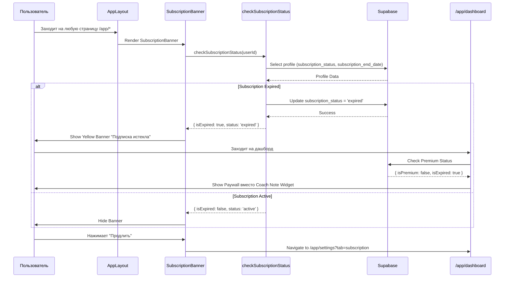
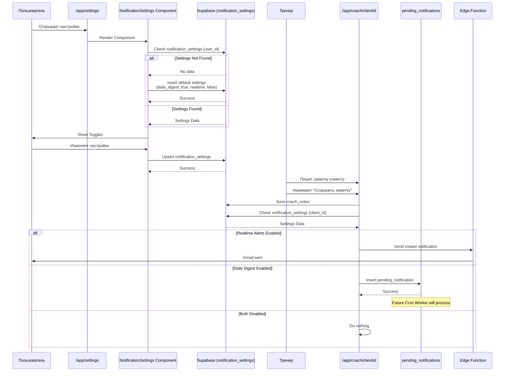
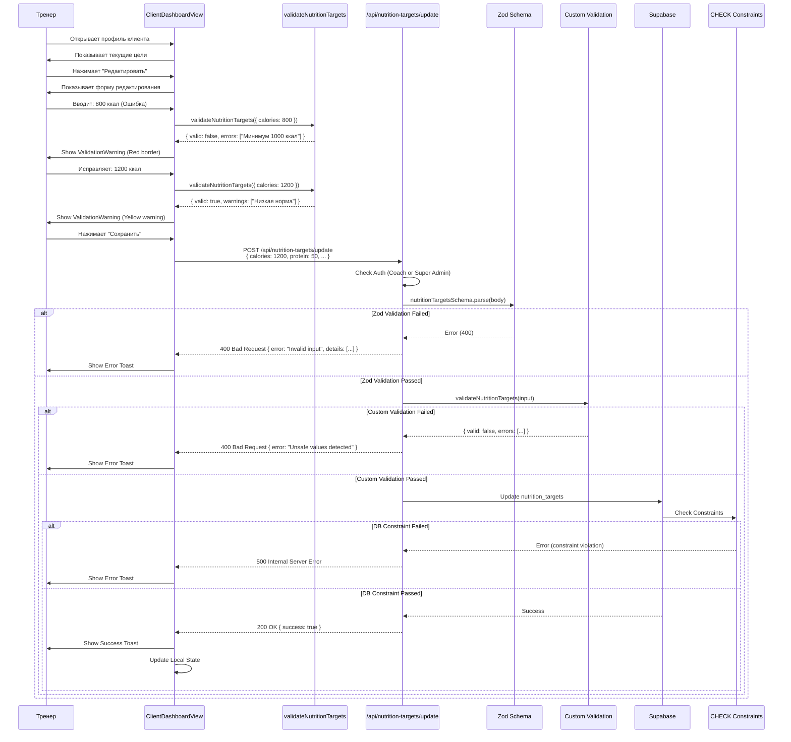
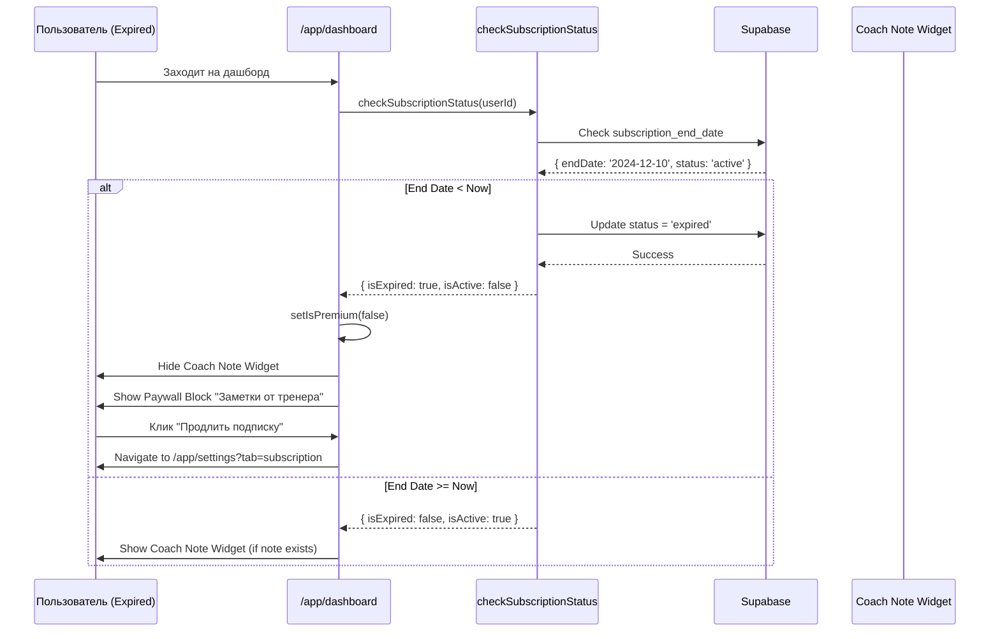
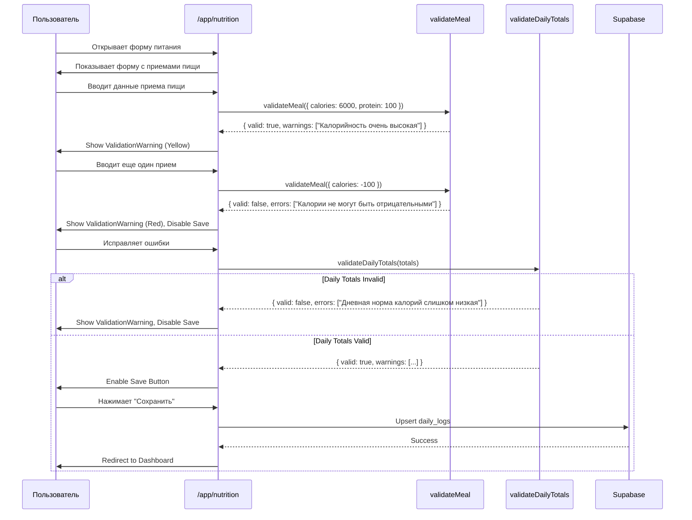
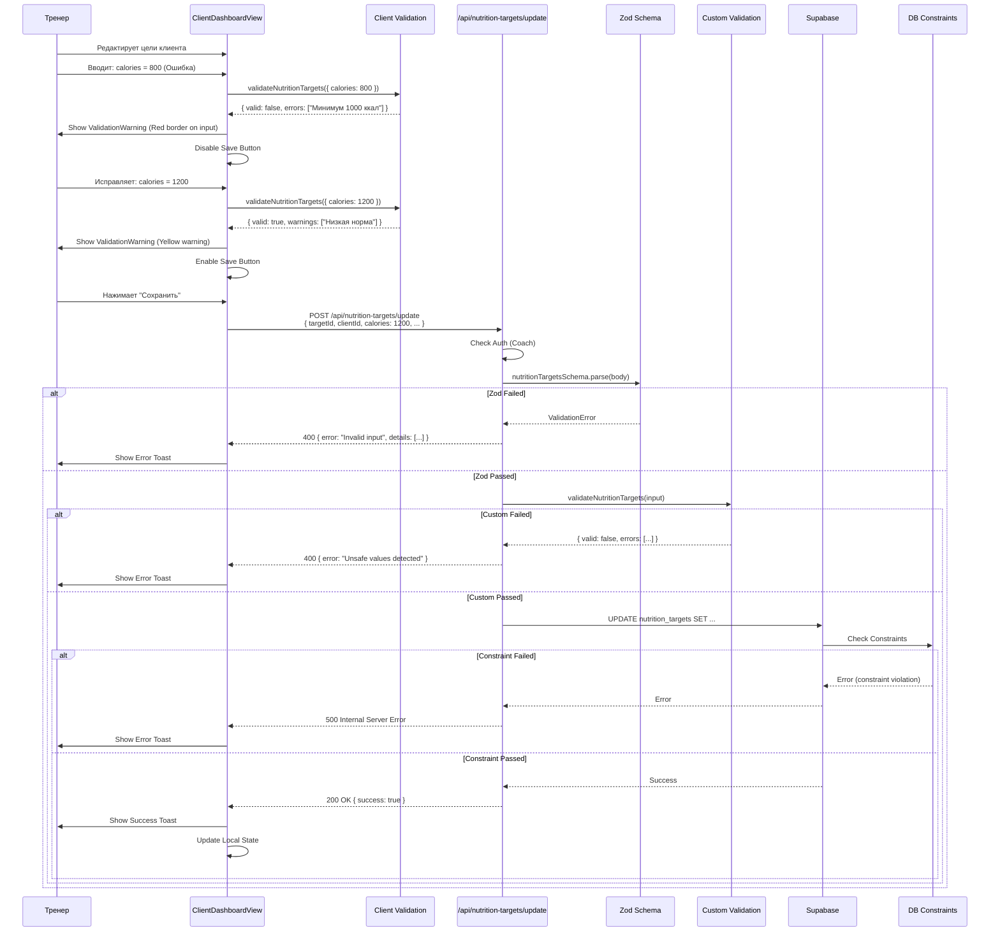
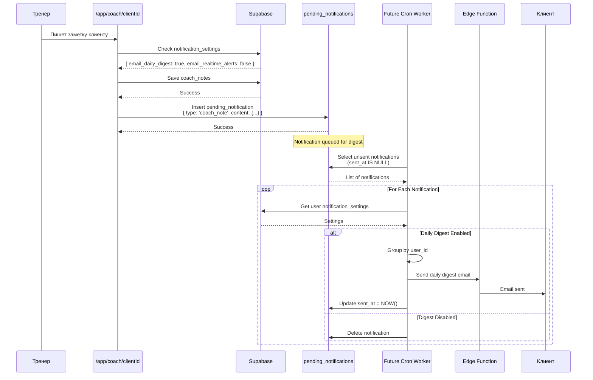
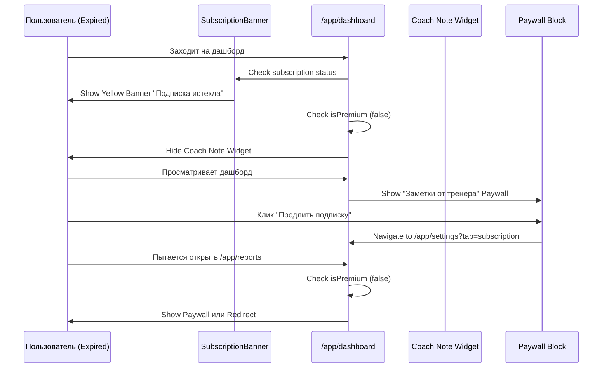

# Диаграммы навигации My Fitness App v3.4

Документация v3.4 отражает **текущую реализацию** навигации в коде (по состоянию на 17 декабря 2025) с добавлением функций **Reliability & Safety**: Subscription Lifecycle UI, Notification Preferences и Coach Input Guardrails.

---

## Общая навигация приложения (с Reliability & Safety)

```mermaid
flowchart TD
    Start([Пользователь]) --> Landing[/ Landing Page]
    
    %% Auth Flow
    Landing -->|Guest| Login[/login]
    Landing -->|Guest| Register[/register]
    Landing -->|Auth: Client| CheckTargets{Есть цели?}
    Landing -->|Auth: Coach| CoachList[/app/coach]
    Landing -->|Auth: Admin| AdminPanel[/admin]
    
    %% Registration & Onboarding Flow
    Register -->|Success| CheckTargets
    Login -->|Client| CheckTargets
    
    CheckTargets -->|Нет| Onboarding[/onboarding]
    CheckTargets -->|Да| Dashboard[/app/dashboard]
    Onboarding -->|Save & Calc| Dashboard
    
    %% Client Zone
    subgraph Client App["/app/*"]
        Dashboard -->|Change Date| Dashboard
        Dashboard -->|Input| Nutrition[/app/nutrition]
        Dashboard -->|Add Meal| AddMealModal[AddMealModal]
        Dashboard -->|Check-in| CheckIn{Validate & Save}
        Dashboard -->|Read Note| CoachNote[Coach Note Widget]
        Dashboard -->|Settings| Settings[/app/settings]
        Dashboard -->|Reports| Reports[/app/reports]
        
        Nutrition -->|Save/Cancel| Dashboard
        AddMealModal -->|Save| Dashboard
        CheckIn -->|Free| SuccessModal[Success: Streak]
        CheckIn -->|Premium| NotifyCoach[Notify Coach]
        Reports -->|Back| Dashboard
        Settings -->|Recalculate| RecalcTargets[Update Targets]
        Settings -->|Notifications| NotificationSettings[Notification Settings]
        Settings -->|Back| Dashboard
        Settings -->|Logout| Login
        
        %% Subscription Banner (Global)
        AppLayout[AppLayout] -.->|Shows| SubscriptionBanner[Subscription Banner]
        SubscriptionBanner -.->|If Expired| Settings
    end
    
    %% Coach Zone
    subgraph Coach App["/app/coach"]
        CoachList -->|Traffic Light Sort| ClientView[/app/coach/clientId]
        CoachList -->|Logout| Login
        ClientView -->|Write Note| SaveNote[Save Coach Note]
        ClientView -->|Update Targets| ValidateTargets[Validate & Save]
        ClientView -->|Back| CoachList
        SaveNote -.->|Check Prefs| NotificationQueue[Notification Queue]
        SaveNote -.->|Realtime| SendEmail[Send Email]
        ValidateTargets -->|API| ValidateAPI[/api/nutrition-targets/update]
        ValidateAPI -->|Zod + Custom| ValidationResult{Valid?}
        ValidationResult -->|Error| ErrorToast[Error Toast]
        ValidationResult -->|Success| DB[(Database)]
    end
    
    %% Admin Zone
    subgraph Admin Area["/admin"]
        AdminPanel -->|Manage Users| AdminPanel
        AdminPanel -->|Logout| Login
    end

    style Landing fill:#e1f5ff,stroke:#333
    style Login fill:#e1f5ff,stroke:#333
    style Register fill:#e1f5ff,stroke:#333
    style Onboarding fill:#ffebcc,stroke:#fd7e14,stroke-width:2px
    style Dashboard fill:#d4edda,stroke:#28a745
    style Nutrition fill:#d4edda,stroke:#28a745
    style Reports fill:#fff3cd,stroke:#ffc107
    style Settings fill:#e2e3e5,stroke:#333
    style CoachList fill:#cfe2ff,stroke:#0d6efd
    style ClientView fill:#cfe2ff,stroke:#0d6efd
    style AdminPanel fill:#f8d7da,stroke:#dc3545
    style AddMealModal fill:#fff9c4,stroke:#ffc107
    style CheckIn fill:#fff3cd,stroke:#ffc107,stroke-width:2px
    style CoachNote fill:#cfe2ff,stroke:#0d6efd,stroke-dasharray: 5 5
    style SaveNote fill:#cfe2ff,stroke:#0d6efd
    style SubscriptionBanner fill:#fff3cd,stroke:#ffc107,stroke-width:2px
    style NotificationSettings fill:#e2e3e5,stroke:#333
    style ValidateAPI fill:#198754,stroke:#333,color:#fff
    style ValidationResult fill:#198754,stroke:#333,color:#fff
    style ErrorToast fill:#dc3545,stroke:#333,color:#fff
```

**Легенда цветов:**
- 🔵 Голубой — публичные страницы
- 🟠 Оранжевый — Onboarding
- 🟢 Зеленый — страницы клиентов
- 🟡 Желтый — Premium функции / Модальные окна / Check-in / Subscription Banner
- 🔵 Синий — страницы тренеров / Coach Feedback
- 🔴 Красный — админ-панель / Ошибки валидации
- ⚪ Серый — настройки / Notification Settings
- 🟢 Темно-зеленый — API валидация

---

## Детальный флоу: Subscription Lifecycle



---

## Детальный флоу: Notification Preferences



---

## Детальный флоу: Coach Input Guardrails (Валидация целей)



---

## Детальный флоу: Блокировка Premium функций при истечении подписки



---

## Детальный флоу: Валидация в форме питания



---

## Навигация для клиентов (Client Flow) с Subscription Lifecycle

```mermaid
flowchart LR
    Start([Клиент входит]) --> Login[/login]
    Login --> CheckTargets{Есть цели?}
    CheckTargets -->|Нет| Onboarding[/onboarding]
    CheckTargets -->|Да| Dashboard[/app/dashboard]
    Onboarding --> Dashboard
    
    Dashboard -->|Check Subscription| SubscriptionCheck{Subscription Status}
    SubscriptionCheck -->|Expired| ShowBanner[Show Subscription Banner]
    SubscriptionCheck -->|Active| HideBanner[Hide Banner]
    
    Dashboard -->|Ввести питание| Nutrition[/app/nutrition]
    Dashboard -->|Добавить прием| AddMealModal[AddMealModal]
    Dashboard -->|Завершить день| CheckIn[Check-in]
    Dashboard -->|Прочитать заметку| CoachNote{Is Premium?}
    Dashboard -->|Отчеты Premium| Reports[/app/reports]
    Dashboard -->|Настройки| Settings[/app/settings]
    
    CoachNote -->|Yes| ShowNote[Show Coach Note]
    CoachNote -->|No/Expired| ShowPaywall[Show Paywall]
    
    AddMealModal -->|Save| Dashboard
    Nutrition -->|Save| Dashboard
    CheckIn -->|Validate| CheckIn
    CheckIn -->|Success| Dashboard
    
    Settings -->|Уведомления| NotificationSettings[Notification Settings]
    Settings -->|Пересчитать цели| Settings
    Settings -->|Back| Dashboard
    Settings -->|Logout| Login
    
    Reports -->|Back| Dashboard
    
    style Onboarding fill:#ffebcc
    style Dashboard fill:#d4edda
    style Nutrition fill:#d4edda
    style Reports fill:#fff3cd
    style Settings fill:#e2e3e5
    style AddMealModal fill:#fff9c4
    style CheckIn fill:#fff3cd,stroke:#ffc107,stroke-width:2px
    style CoachNote fill:#cfe2ff
    style ShowBanner fill:#fff3cd,stroke:#ffc107,stroke-width:2px
    style ShowPaywall fill:#f8d7da
    style NotificationSettings fill:#e2e3e5
```

---

## Навигация для тренеров (Coach Flow) с Guardrails

```mermaid
flowchart LR
    Start([Тренер входит]) --> Login[/login]
    Login --> CoachList[/app/coach]
    
    CoachList -->|Traffic Light Sort| CoachList
    CoachList -->|Filter by Status| CoachList
    CoachList -->|Select Client| ClientView[/app/coach/clientId]
    
    ClientView -->|Select Date| ClientView
    ClientView -->|Write Note| SaveNote[Save Note]
    ClientView -->|Edit Targets| EditTargets[Edit Targets Form]
    
    EditTargets -->|Input Values| ClientValidation[Client Validation]
    ClientValidation -->|Errors| ShowErrors[Show ValidationWarning]
    ClientValidation -->|Warnings| ShowWarnings[Show Warnings]
    ClientView -->|Save Targets| ValidateAPI[POST /api/nutrition-targets/update]
    
    ValidateAPI -->|Zod Validation| ZodCheck{Zod Valid?}
    ZodCheck -->|No| ErrorToast[Error Toast]
    ZodCheck -->|Yes| CustomValidation[Custom Validation]
    
    CustomValidation -->|Unsafe| ErrorToast
    CustomValidation -->|Safe| DBUpdate[Update Database]
    DBUpdate -->|Success| SuccessToast[Success Toast]
    
    SaveNote -->|Check Prefs| NotificationCheck{Notification Prefs}
    NotificationCheck -->|Realtime| SendEmail[Send Email]
    NotificationCheck -->|Digest| AddQueue[Add to Queue]
    NotificationCheck -->|Off| DoNothing[Do Nothing]
    
    ClientView -->|Back| CoachList
    
    style CoachList fill:#cfe2ff
    style ClientView fill:#cfe2ff
    style SaveNote fill:#cfe2ff
    style EditTargets fill:#fff3cd
    style ValidateAPI fill:#198754,stroke:#333,color:#fff
    style ErrorToast fill:#dc3545,stroke:#333,color:#fff
    style SuccessToast fill:#28a745,stroke:#333,color:#fff
```

---

## Система ролей и доступа (с Subscription Lifecycle)

```mermaid
flowchart TD
    User([Пользователь]) --> Auth{Авторизован?}
    
    Auth -->|Нет| Public[Публичные страницы]
    Public --> Landing[/ Landing]
    Public --> Register[/register]
    Public --> Login[/login]
    
    Auth -->|Да| Role{Роль?}
    
    Role -->|Client| CheckTargets{Есть цели<br/>в nutrition_targets?}
    CheckTargets -->|Нет| Onboarding[/onboarding]
    CheckTargets -->|Да| CheckSubscription{Check Subscription}
    
    CheckSubscription -->|Expired| ExpiredUser[Expired User<br/>Free Features Only]
    CheckSubscription -->|Active| ClientPages[Страницы клиента]
    
    Onboarding -->|After Setup| CheckSubscription
    
    ClientPages --> Dashboard[/app/dashboard]
    ClientPages --> Nutrition[/app/nutrition]
    ClientPages --> Settings[/app/settings]
    ClientPages -->|Premium Only| Reports[/app/reports]
    
    ExpiredUser --> Dashboard
    ExpiredUser --> Nutrition
    ExpiredUser --> Settings
    
    Dashboard -->|Check-in| CheckIn[Daily Check-in]
    Dashboard -->|Read Note| CoachNote{Is Premium?}
    Dashboard -->|Notifications| NotificationSettings[Notification Settings]
    Settings -->|Recalculate| Recalc[Recalculate Targets]
    
    CoachNote -->|Yes| ShowNote[Show Coach Note]
    CoachNote -->|No| ShowPaywall[Show Paywall]
    
    Role -->|Coach| CoachPages[Страницы тренера]
    CoachPages --> CoachDash[/app/coach]
    CoachPages --> ClientView[/app/coach/clientId]
    ClientView -->|Write Note| SaveNote[Save Coach Note]
    ClientView -->|Update Targets| ValidateTargets[Validate Targets]
    
    Role -->|Super Admin| AdminPages[Страницы админа]
    AdminPages --> Admin[/admin]
    
    style Public fill:#e1f5ff
    style Onboarding fill:#ffebcc,stroke:#fd7e14,stroke-width:2px
    style ClientPages fill:#d4edda
    style ExpiredUser fill:#fff3cd,stroke:#ffc107,stroke-width:2px
    style CoachPages fill:#cfe2ff
    style AdminPages fill:#f8d7da
    style CheckIn fill:#fff3cd,stroke:#ffc107,stroke-width:2px
    style CoachNote fill:#cfe2ff,stroke:#0d6efd,stroke-dasharray: 5 5
    style ShowPaywall fill:#f8d7da
    style SaveNote fill:#cfe2ff,stroke:#0d6efd
    style ValidateTargets fill:#198754,stroke:#333,color:#fff
    style NotificationSettings fill:#e2e3e5
    style Recalc fill:#e2e3e5
```

---

## Детальный флоу: Валидация nutrition_targets (Полный цикл)



---

## Детальный флоу: Notification Queue (Будущий Cron Worker)



---

## Флоу блокировки Premium функций



---

*Документ создан: 17 декабря 2025 (на основе текущей реализации в коде v3.4)*

