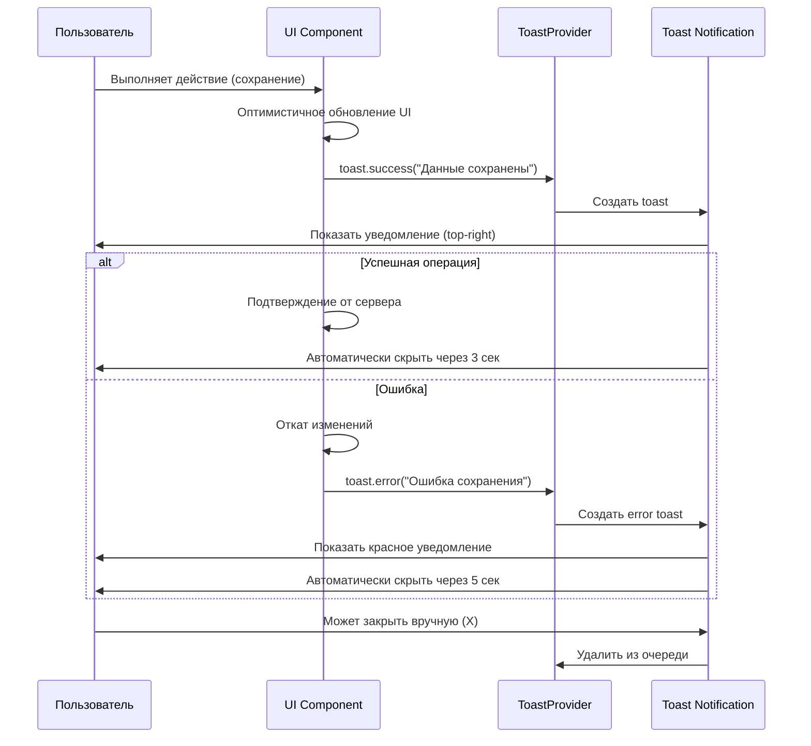
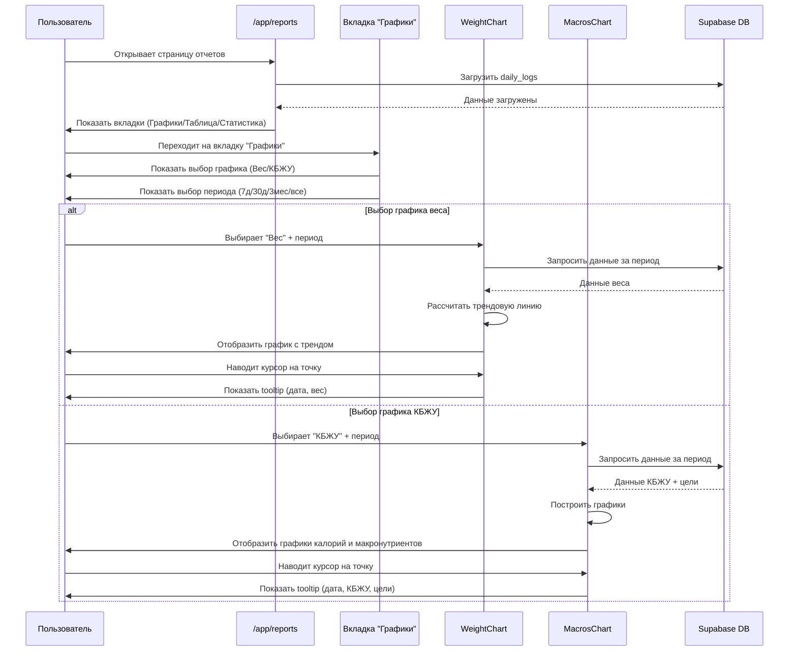
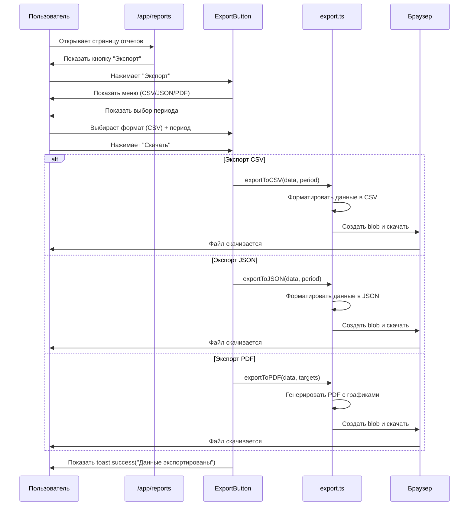
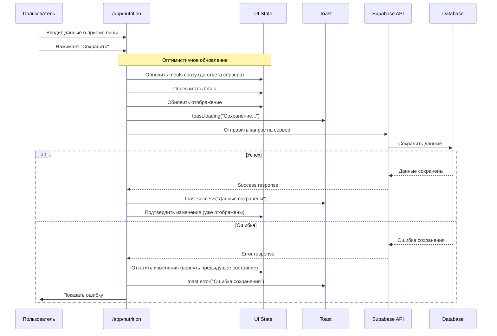
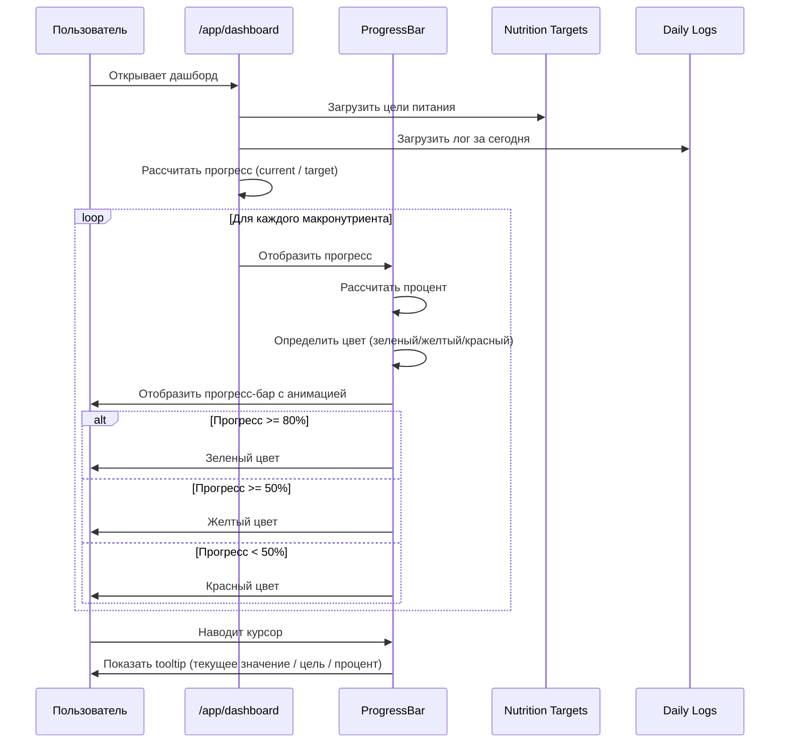
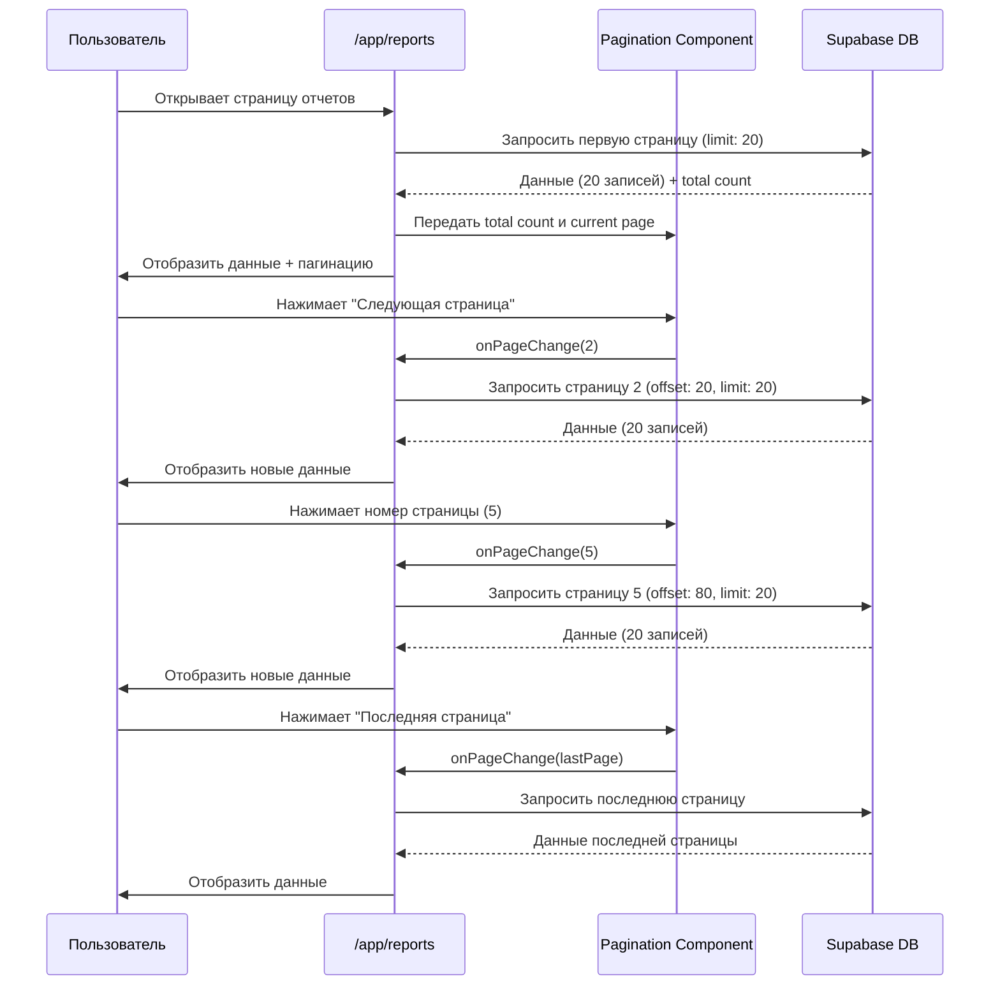
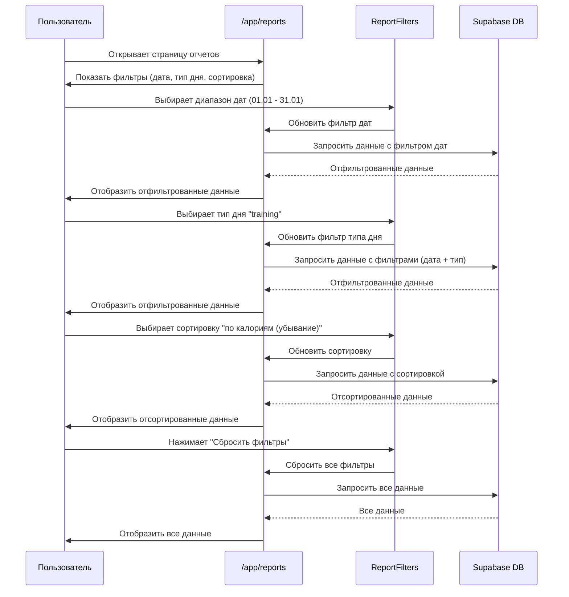

# Диаграммы навигации My Fitness App v4.0

Документация v4.0 отражает **планируемые изменения** навигации с добавлением функций **UX улучшений и визуализации данных**: Toast-уведомления, графики, прогресс-бары, улучшенные отчеты и экспорт данных.

---

## Общая навигация приложения (с UX улучшениями)

```mermaid
flowchart TD
    Start([Пользователь]) --> Landing[/ Landing Page]
    
    %% Auth Flow
    Landing -->|Guest| Login[/login]
    Landing -->|Guest| Register[/register]
    Landing -->|Auth: Client| CheckTargets{Есть цели?}
    Landing -->|Auth: Coach| CoachList[/app/coach]
    Landing -->|Auth: Admin| AdminPanel[/admin]
    
    %% Registration & Onboarding Flow
    Register -->|Success| CheckTargets
    Login -->|Client| CheckTargets
    
    CheckTargets -->|Нет| Onboarding[/onboarding]
    CheckTargets -->|Да| Dashboard[/app/dashboard]
    Onboarding -->|Save & Calc| Dashboard
    
    %% Client Zone
    subgraph ClientApp["/app/*"]
        Dashboard -->|Change Date| Dashboard
        Dashboard -->|Input| Nutrition[/app/nutrition]
        Dashboard -->|Add Meal| AddMealModal[AddMealModal]
        Dashboard -->|Check-in| CheckIn{Validate & Save}
        Dashboard -->|Read Note| CoachNote[Coach Note Widget]
        Dashboard -->|Settings| Settings[/app/settings]
        Dashboard -->|Reports| Reports[/app/reports]
        
        Nutrition -->|Save| ToastSuccess[Toast: Success]
        Nutrition -->|Error| ToastError[Toast: Error]
        AddMealModal -->|Save| ToastSuccess
        CheckIn -->|Free| SuccessModal[Success: Streak]
        CheckIn -->|Premium| NotifyCoach[Notify Coach]
        
        Reports -->|Tabs| ReportsTabs[Графики / Таблица / Статистика]
        ReportsTabs -->|Graphs| WeightChart[WeightChart]
        ReportsTabs -->|Graphs| MacrosChart[MacrosChart]
        ReportsTabs -->|Export| ExportMenu[Export: CSV/JSON/PDF]
        ReportsTabs -->|Filters| ReportFilters[Date Range / Type / Sort]
        
        Reports -->|Back| Dashboard
        Settings -->|Recalculate| RecalcTargets[Update Targets]
        Settings -->|Notifications| NotificationSettings[Notification Settings]
        Settings -->|Export| ExportData[Export All Data]
        Settings -->|Back| Dashboard
        Settings -->|Logout| Login
        
        %% Toast System (Global)
        ToastProvider[ToastProvider] -.->|Shows| ToastSuccess
        ToastProvider -.->|Shows| ToastError
        ToastProvider -.->|Shows| ToastWarning[Toast: Warning]
        ToastProvider -.->|Shows| ToastInfo[Toast: Info]
        
        %% Loading States
        Dashboard -.->|Loading| SkeletonLoader[SkeletonLoader]
        Reports -.->|Loading| SkeletonLoader
        Nutrition -.->|Loading| LoadingSpinner[LoadingSpinner]
    end
    
    %% Coach Zone
    subgraph CoachApp["/app/coach"]
        CoachList -->|Traffic Light Sort| ClientView[/app/coach/clientId]
        CoachList -->|Logout| Login
        ClientView -->|Write Note| SaveNote[Save Coach Note]
        ClientView -->|Update Targets| ValidateTargets[Validate & Save]
        ClientView -->|Back| CoachList
        SaveNote -.->|Success| ToastSuccess
        SaveNote -.->|Error| ToastError
        ValidateTargets -->|API| ValidateAPI[/api/nutrition-targets/update]
        ValidateAPI -->|Zod + Custom| ValidationResult{Valid?}
        ValidationResult -->|Error| ToastError
        ValidationResult -->|Success| DB[(Database)]
    end
    
    %% Admin Zone
    subgraph AdminArea["/admin"]
        AdminPanel -->|Manage Users| AdminPanel
        AdminPanel -->|Pagination| Pagination[Pagination Component]
        AdminPanel -->|Logout| Login
    end

    style Landing fill:#e1f5ff,stroke:#333
    style Login fill:#e1f5ff,stroke:#333
    style Register fill:#e1f5ff,stroke:#333
    style Onboarding fill:#ffebcc,stroke:#fd7e14,stroke-width:2px
    style Dashboard fill:#d4edda,stroke:#28a745
    style Nutrition fill:#d4edda,stroke:#28a745
    style Reports fill:#fff3cd,stroke:#ffc107
    style Settings fill:#e2e3e5,stroke:#333
    style CoachList fill:#cfe2ff,stroke:#0d6efd
    style ClientView fill:#cfe2ff,stroke:#0d6efd
    style AdminPanel fill:#f8d7da,stroke:#dc3545
    style AddMealModal fill:#fff9c4,stroke:#ffc107
    style CheckIn fill:#fff3cd,stroke:#ffc107,stroke-width:2px
    style CoachNote fill:#cfe2ff,stroke:#0d6efd,stroke-dasharray: 5 5
    style SaveNote fill:#cfe2ff,stroke:#0d6efd
    style ToastProvider fill:#28a745,stroke:#333,color:#fff,stroke-width:2px
    style ToastSuccess fill:#28a745,stroke:#333,color:#fff
    style ToastError fill:#dc3545,stroke:#333,color:#fff
    style ToastWarning fill:#ffc107,stroke:#333
    style ToastInfo fill:#0d6efd,stroke:#333,color:#fff
    style LoadingSpinner fill:#6c757d,stroke:#333,color:#fff
    style SkeletonLoader fill:#e9ecef,stroke:#333
    style WeightChart fill:#17a2b8,stroke:#333,color:#fff
    style MacrosChart fill:#17a2b8,stroke:#333,color:#fff
    style ExportMenu fill:#6c757d,stroke:#333,color:#fff
    style ReportFilters fill:#e2e3e5,stroke:#333
    style Pagination fill:#e2e3e5,stroke:#333
```

**Легенда цветов:**
- 🔵 Голубой — публичные страницы
- 🟠 Оранжевый — Onboarding
- 🟢 Зеленый — страницы клиентов
- 🟡 Желтый — Premium функции / Модальные окна / Check-in
- 🔵 Синий — функции тренера
- 🔴 Красный — админ панель
- 🟢 Зеленый (Toast) — успешные операции
- 🔴 Красный (Toast) — ошибки
- 🟡 Желтый (Toast) — предупреждения
- 🔵 Синий (Toast) — информация
- ⚪ Серый — утилиты (Loading, Skeleton, Pagination)
- 🔵 Голубой (Charts) — графики и визуализация

---

## Детальный флоу: Toast-уведомления



---

## Детальный флоу: Просмотр графиков в отчетах



---

## Детальный флоу: Экспорт данных



---

## Детальный флоу: Оптимистичные обновления



---

## Детальный флоу: Прогресс-бары на дашборде



---

## Детальный флоу: Пагинация в отчетах



---

## Детальный флоу: Фильтрация в отчетах



---

*Документ создан: Январь 2025 (планируемые изменения для Phase 4)*

