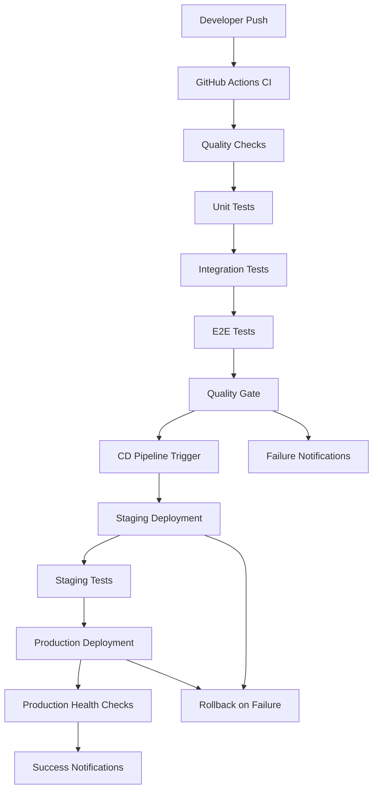

# CI/CD System Guide

## Overview

This document provides comprehensive documentation for the CI/CD (Continuous Integration/Continuous Deployment) system implemented for the BURCEV fitness application. The system ensures code quality, automated testing, and reliable deployments across staging and production environments.

## Table of Contents

1. [System Architecture](#system-architecture)
2. [Workflow Overview](#workflow-overview)
3. [CI Pipeline](#ci-pipeline)
4. [CD Pipeline](#cd-pipeline)
5. [Quality Gates](#quality-gates)
6. [Rollback Procedures](#rollback-procedures)
7. [Monitoring and Notifications](#monitoring-and-notifications)
8. [Troubleshooting Guide](#troubleshooting-guide)
9. [Performance Optimization](#performance-optimization)
10. [Security Considerations](#security-considerations)

## System Architecture

### Components



### Technology Stack

- **CI/CD Platform**: GitHub Actions
- **Testing Frameworks**: Jest (Unit/Integration), Playwright (E2E)
- **Code Quality**: ESLint, TypeScript, CodeQL
- **Coverage**: Istanbul/nyc, Codecov
- **Notifications**: Telegram Bot
- **Deployment**: Docker, Staging/Production environments
- **Monitoring**: Custom performance monitoring scripts

## Workflow Overview

### Trigger Events

1. **Push to main/develop branches**: Triggers full CI pipeline
2. **Pull Request to main**: Triggers CI pipeline with PR-specific checks
3. **CI Pipeline Success**: Automatically triggers CD pipeline
4. **Manual Deployment**: Emergency deployment via workflow_dispatch
5. **Manual Rollback**: Emergency rollback via workflow_dispatch

### Pipeline Stages

1. **Setup**: Environment preparation and dependency caching
2. **Quality Checks**: ESLint, TypeScript, Security scanning
3. **Testing**: Unit → Integration → E2E tests (sequential)
4. **Quality Gate**: Comprehensive quality validation
5. **Deployment**: Staging → Production (with gates)
6. **Monitoring**: Health checks and notifications

## CI Pipeline

### Workflow File: `.github/workflows/ci.yml`

#### Jobs Overview

1. **setup**: Environment setup and dependency caching
2. **quality-checks**: Code quality and security validation
3. **unit-tests**: Parallel unit test execution
4. **unit-tests-coverage**: Coverage aggregation and reporting
5. **integration-tests**: Integration test execution
6. **e2e-tests**: End-to-end test execution
7. **quality-gate**: Final quality validation

#### Job Dependencies

```
setup → quality-checks → unit-tests → unit-tests-coverage → integration-tests → e2e-tests → quality-gate
```

#### Key Features

- **Parallel Execution**: Tests run in parallel matrices for performance
- **Caching**: npm dependencies and node_modules cached
- **Coverage Thresholds**: 80% global, 90% for critical components
- **Security Scanning**: npm audit, CodeQL, dependency scanning
- **Quality Gates**: Blocks merge on any failure

### Configuration Details

#### Node.js Setup
```yaml
- uses: actions/setup-node@v4
  with:
    node-version: '20'
    cache: 'npm'
```

#### Caching Strategy
```yaml
- uses: actions/cache@v3
  with:
    path: |
      ~/.npm
      node_modules
    key: ${{ runner.os }}-node-${{ hashFiles('**/package-lock.json') }}
```

#### Test Matrix
```yaml
strategy:
  matrix:
    test-group: [components, utils, hooks, integration]
  max-parallel: 4
```

## CD Pipeline

### Workflow File: `.github/workflows/cd.yml`

#### Jobs Overview

1. **deploy-staging**: Automatic staging deployment
2. **deploy-production**: Production deployment (after staging success)
3. **rollback**: Automatic rollback on deployment failure

#### Deployment Flow

```
CI Success → Staging Deployment → Staging Health Checks → Production Deployment → Production Health Checks
```

#### Environment Configuration

##### Staging Environment
- **URL**: `https://staging.myfitnessapp.com`
- **Supabase**: Staging project
- **Monitoring**: Basic health checks

##### Production Environment
- **URL**: `https://myfitnessapp.com`
- **Supabase**: Production project
- **Monitoring**: Comprehensive health checks

#### Deployment Steps

1. **Checkout Code**: Get latest code from repository
2. **Setup Environment**: Node.js and dependencies
3. **Build Application**: Production build with environment variables
4. **Deploy**: Simulate deployment process
5. **Health Checks**: Verify deployment success
6. **Notifications**: Send deployment status updates

### Manual Deployment

For emergency deployments, use the manual trigger:

```bash
# Via GitHub UI
Actions → CD Pipeline → Run workflow
- Environment: staging/production
- Reason: Emergency fix description
```

## Quality Gates

### Coverage Requirements

#### Global Thresholds (80%)
- Lines: 80%
- Functions: 80%
- Branches: 80%
- Statements: 80%

#### Critical Components (90%)
- `src/middleware.ts`
- `src/utils/supabase/`
- `src/utils/validation/`

### Quality Checks

1. **ESLint**: Code style and quality (max-warnings=0)
2. **TypeScript**: Type checking (strict mode)
3. **Security**: npm audit, CodeQL scanning
4. **Coverage**: Jest coverage thresholds
5. **Tests**: All test suites must pass

### Failure Handling

When quality gates fail:
1. **Merge Blocked**: PR cannot be merged
2. **Notifications**: Team notified via Telegram
3. **Detailed Logs**: Failure reasons provided
4. **Guidance**: Specific fix instructions included

## Rollback Procedures

### Automatic Rollback

Triggers automatically when:
- Staging deployment fails
- Production deployment fails
- Health checks fail after deployment

#### Process
1. **Detect Failure**: Monitor deployment job results
2. **Determine Environment**: Staging or production based on failure point
3. **Execute Rollback**: Deploy previous successful version
4. **Verify Success**: Run health checks on rolled-back version
5. **Notify Team**: Send rollback status notifications

### Manual Rollback

#### Workflow File: `.github/workflows/rollback.yml`

#### Usage
```bash
# Via GitHub UI
Actions → Manual Rollback → Run workflow
- Environment: staging/production
- Version: commit SHA or tag to rollback to
- Reason: Description of why rollback is needed
```

#### Steps
1. **Input Validation**: Verify environment and version
2. **Checkout Version**: Get specified version code
3. **Deploy Previous Version**: Execute rollback deployment
4. **Health Checks**: Verify rollback success
5. **Audit Trail**: Create rollback record
6. **Notifications**: Inform team of rollback status

### Post-Rollback Monitoring

After successful rollback:
- **Enhanced Monitoring**: 30-minute intensive monitoring
- **Health Checks**: Continuous endpoint verification
- **Performance Tracking**: Monitor system performance
- **Incident Documentation**: Record rollback details

## Monitoring and Notifications

### Notification Channels

#### Telegram Integration
- **Bot Token**: Configured in GitHub Secrets
- **Chat ID**: Team notification channel
- **Message Types**: 
  - Deployment start/success/failure
  - Rollback notifications
  - Quality gate failures
  - Weekly reports

#### GitHub Integration
- **Status Checks**: PR status indicators
- **PR Comments**: Coverage and quality information
- **Workflow Status**: Visual pipeline status

### Monitoring Scripts

#### Performance Monitoring (`scripts/performance-optimizer.js`)
- Pipeline execution time tracking
- Resource usage monitoring
- Performance trend analysis

#### Pipeline Monitoring (`scripts/pipeline-monitor.js`)
- Job execution tracking
- Failure rate monitoring
- Success metrics collection

#### GitHub Status (`scripts/github-status.js`)
- PR status management
- Commit status updates
- Integration with external tools

### Weekly Reports

Automated weekly reports include:
- **Pipeline Performance**: Average execution times
- **Quality Metrics**: Coverage trends, failure rates
- **Deployment Frequency**: Staging and production deployments
- **Rollback Statistics**: Frequency and reasons

## Troubleshooting Guide

### Common Issues

#### 1. CI Pipeline Failures

**ESLint Failures**
```bash
# Fix locally
npm run lint
npm run lint -- --fix

# Check specific files
npx eslint src/path/to/file.ts
```

**TypeScript Errors**
```bash
# Check types locally
npm run type-check

# Fix common issues
npm run build
```

**Test Failures**
```bash
# Run specific test suite
npm run test -- --testPathPattern=unit
npm run test -- --testPathPattern=integration
npm run test:e2e

# Debug failing tests
npm run test -- --verbose --no-cache
```

**Coverage Failures**
```bash
# Generate coverage report
npm run test:coverage

# Check specific file coverage
npm run test:coverage -- --collectCoverageFrom="src/path/to/file.ts"
```

#### 2. Deployment Issues

**Staging Deployment Failure**
1. Check deployment logs in GitHub Actions
2. Verify environment variables are set
3. Check Supabase staging project status
4. Review health check failures

**Production Deployment Failure**
1. Automatic rollback should trigger
2. Check rollback success in logs
3. Verify production environment status
4. Review deployment artifacts

**Health Check Failures**
1. Check application endpoints manually
2. Verify database connectivity
3. Review application logs
4. Check external service dependencies

#### 3. Quality Gate Issues

**Coverage Below Threshold**
1. Identify uncovered code areas
2. Add missing unit tests
3. Focus on critical components (90% requirement)
4. Run coverage locally to verify

**Security Vulnerabilities**
1. Review npm audit output
2. Update vulnerable dependencies
3. Check CodeQL security alerts
4. Apply security patches

### Debug Commands

#### Local Testing
```bash
# Run full test suite
npm run test:all

# Run with coverage
npm run test:coverage

# Run specific test types
npm run test:unit
npm run test:integration
npm run test:e2e

# Check code quality
npm run lint
npm run type-check
```

#### Pipeline Debugging
```bash
# Check workflow syntax
npx @github/workflow-validator .github/workflows/ci.yml

# Test workflow locally (with act)
act -j quality-checks
act -j unit-tests
```

### Log Analysis

#### CI Pipeline Logs
- **Setup Job**: Dependency installation and caching
- **Quality Checks**: ESLint, TypeScript, security results
- **Test Jobs**: Test execution and coverage results
- **Quality Gate**: Final validation and failure reasons

#### CD Pipeline Logs
- **Deployment Jobs**: Build and deployment process
- **Health Checks**: Endpoint and connectivity verification
- **Rollback Jobs**: Rollback execution and verification

## Performance Optimization

### Current Optimizations

#### Caching Strategy
- **npm Dependencies**: Cached between runs
- **node_modules**: Cached for faster installs
- **Docker Layers**: Optimized for build performance

#### Parallel Execution
- **Unit Tests**: 4 parallel test groups
- **Integration Tests**: 3 parallel test groups
- **E2E Tests**: 4 parallel test groups (max 2 concurrent)

#### Conditional Execution
- **Quality Gate**: Always runs to check results
- **Deployment**: Only on main branch success
- **Rollback**: Only on deployment failure

### Performance Metrics

#### Target Times
- **CI Pipeline**: < 10 minutes for normal changes
- **CD Pipeline**: < 5 minutes for deployment
- **Rollback**: < 3 minutes for recovery

#### Monitoring
- **Pipeline Duration**: Tracked per job and overall
- **Resource Usage**: Memory and CPU monitoring
- **Cache Hit Rate**: Dependency cache effectiveness

### Optimization Recommendations

1. **Test Optimization**
   - Group related tests for better parallelization
   - Use test.concurrent for independent tests
   - Optimize test data setup and teardown

2. **Build Optimization**
   - Use incremental builds where possible
   - Optimize Docker layer ordering
   - Minimize build artifact size

3. **Caching Improvements**
   - Cache test results for unchanged code
   - Use build caches for faster compilation
   - Implement smart cache invalidation

## Security Considerations

### Secrets Management

#### GitHub Secrets
- `TELEGRAM_BOT_TOKEN`: Notification bot token
- `TELEGRAM_CHAT_ID`: Team notification channel
- `STAGING_SUPABASE_URL`: Staging database URL
- `STAGING_SUPABASE_ANON_KEY`: Staging database key
- `NEXT_PUBLIC_SUPABASE_URL`: Production database URL
- `NEXT_PUBLIC_SUPABASE_ANON_KEY`: Production database key

#### Security Practices
- **Least Privilege**: Minimal required permissions
- **Secret Rotation**: Regular token updates
- **Audit Trail**: All secret access logged
- **Environment Isolation**: Separate staging/production secrets

### Security Scanning

#### Dependency Scanning
- **npm audit**: Check for known vulnerabilities
- **Snyk**: Advanced vulnerability detection
- **Dependabot**: Automated dependency updates

#### Code Scanning
- **CodeQL**: Static application security testing
- **ESLint Security**: Security-focused linting rules
- **Custom Rules**: Project-specific security checks

### Access Control

#### Repository Protection
- **Branch Protection**: main branch requires PR reviews
- **Status Checks**: All CI checks must pass
- **Admin Override**: Limited admin bypass capability

#### Workflow Security
- **Token Permissions**: Minimal required scopes
- **Environment Protection**: Production requires approval
- **Audit Logging**: All workflow executions logged

## Maintenance and Updates

### Regular Maintenance Tasks

#### Weekly
- Review pipeline performance metrics
- Check for security vulnerability updates
- Analyze test failure patterns
- Update documentation as needed

#### Monthly
- Review and rotate secrets
- Update dependencies and tools
- Optimize pipeline performance
- Review rollback procedures

#### Quarterly
- Comprehensive security audit
- Performance optimization review
- Documentation updates
- Team training on new features

### Update Procedures

#### Workflow Updates
1. Create feature branch for workflow changes
2. Test changes in development environment
3. Review with team before merging
4. Monitor first few executions after deployment

#### Tool Updates
1. Update in development environment first
2. Test compatibility with existing workflows
3. Update documentation
4. Deploy to production workflows

#### Security Updates
1. Apply security patches immediately
2. Test in staging environment
3. Deploy to production with monitoring
4. Document changes and impact

## Support and Contact

### Team Contacts
- **DevOps Lead**: Primary CI/CD system owner
- **Development Team**: Code quality and testing
- **Security Team**: Security scanning and compliance

### Documentation Updates
- **Location**: `docs/CICD_System_Guide.md`
- **Updates**: Via pull request with team review
- **Versioning**: Document version in git history

### Emergency Procedures
1. **Pipeline Down**: Contact DevOps lead immediately
2. **Security Incident**: Follow security incident response plan
3. **Production Issue**: Execute rollback procedure
4. **Data Loss**: Follow disaster recovery procedures

---

*Last Updated: January 2025*
*Version: 1.0*
*Maintained by: DevOps Team*