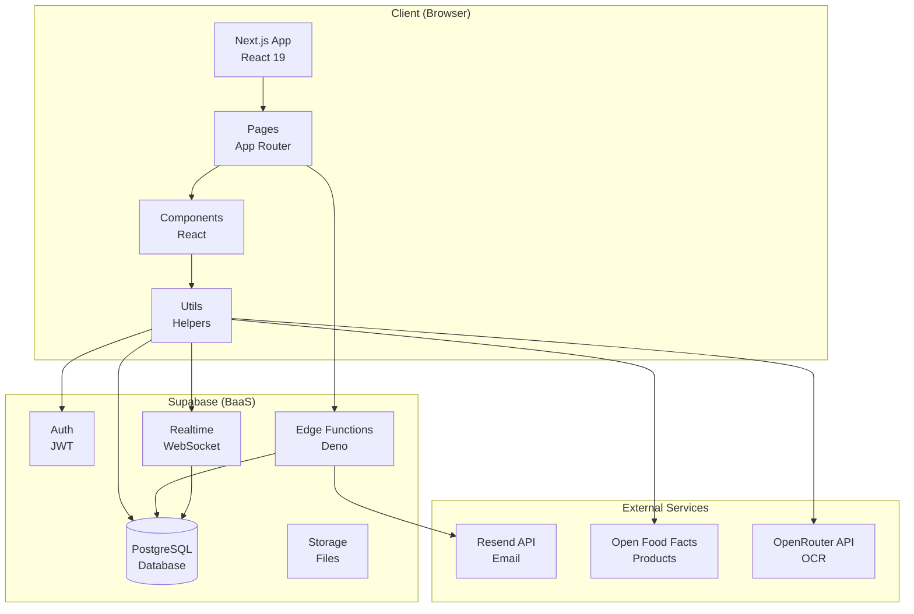
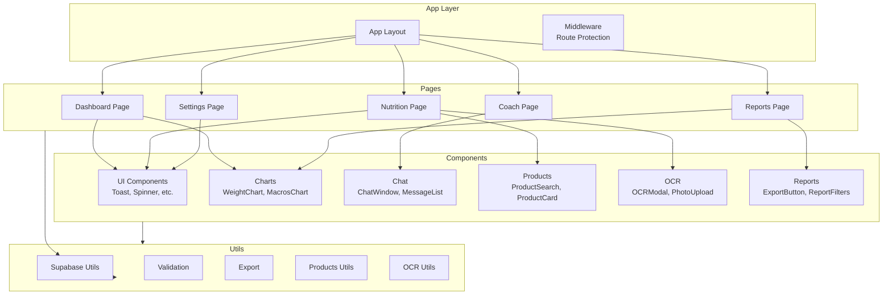
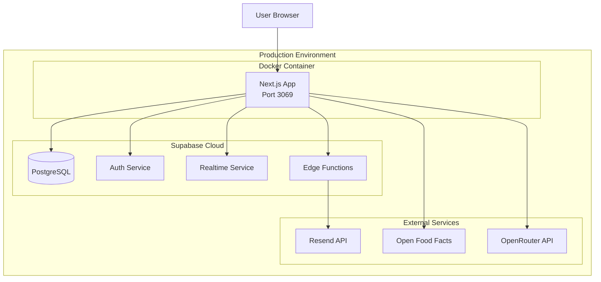
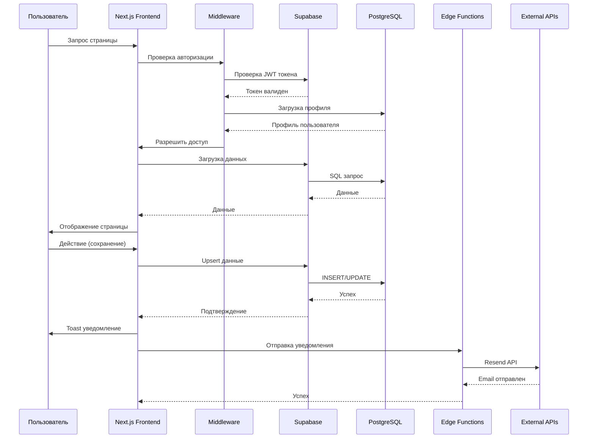

# Архитектурные диаграммы My Fitness App

**Версия документа:** 1.0  
**Дата создания:** Январь 2025  
**Статус:** Актуальная реализация v4.0+

---

## Общая архитектура системы

---

## Компонентная архитектура

---

## Диаграмма развертывания

---

## Схема взаимодействия Frontend-Backend-Database

---

## Связанные документы

- [Technical_Architecture.md](./Technical_Architecture.md) - Техническая архитектура
- [Diagrams_Index.md](./Diagrams_Index.md) - Индекс всех диаграмм

---

**Последнее обновление:** Январь 2025  
**Версия документа:** 1.0

