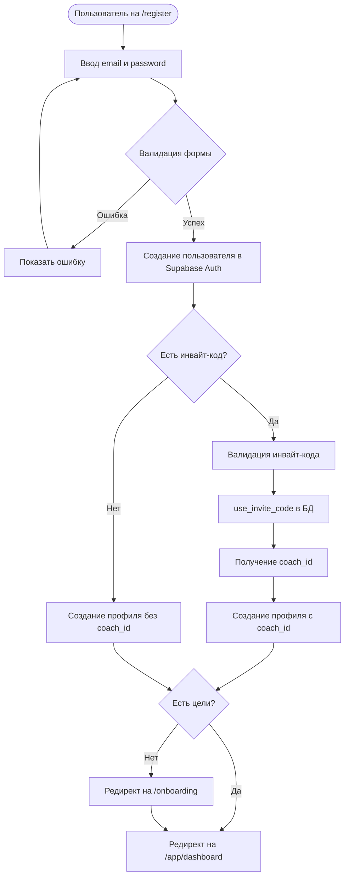
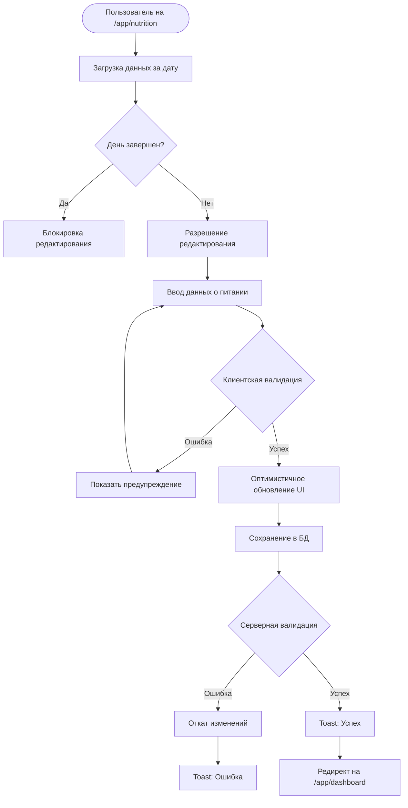
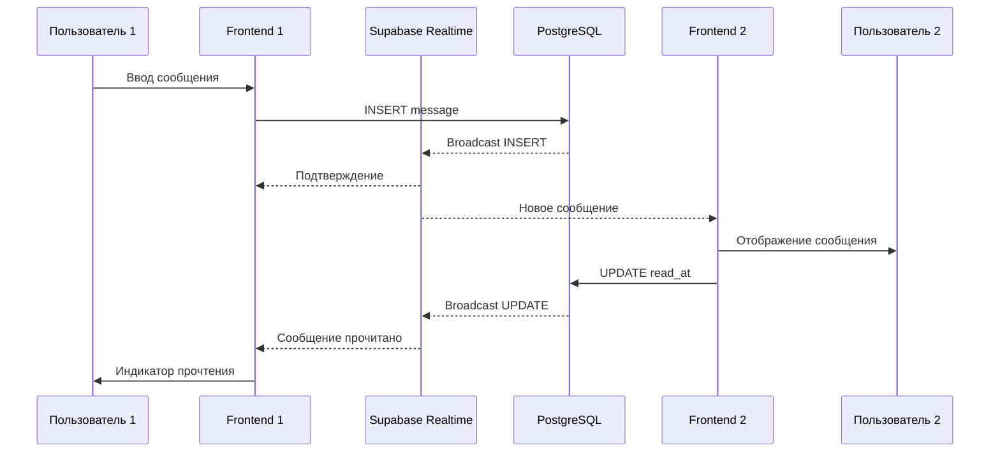
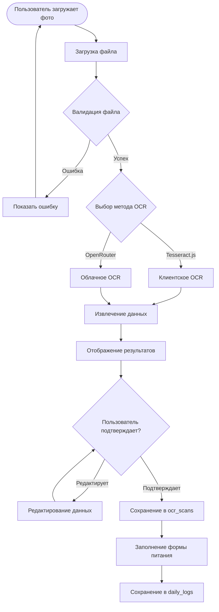
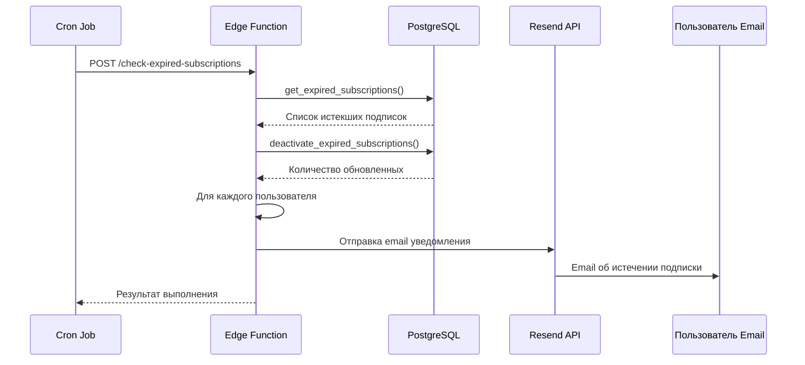
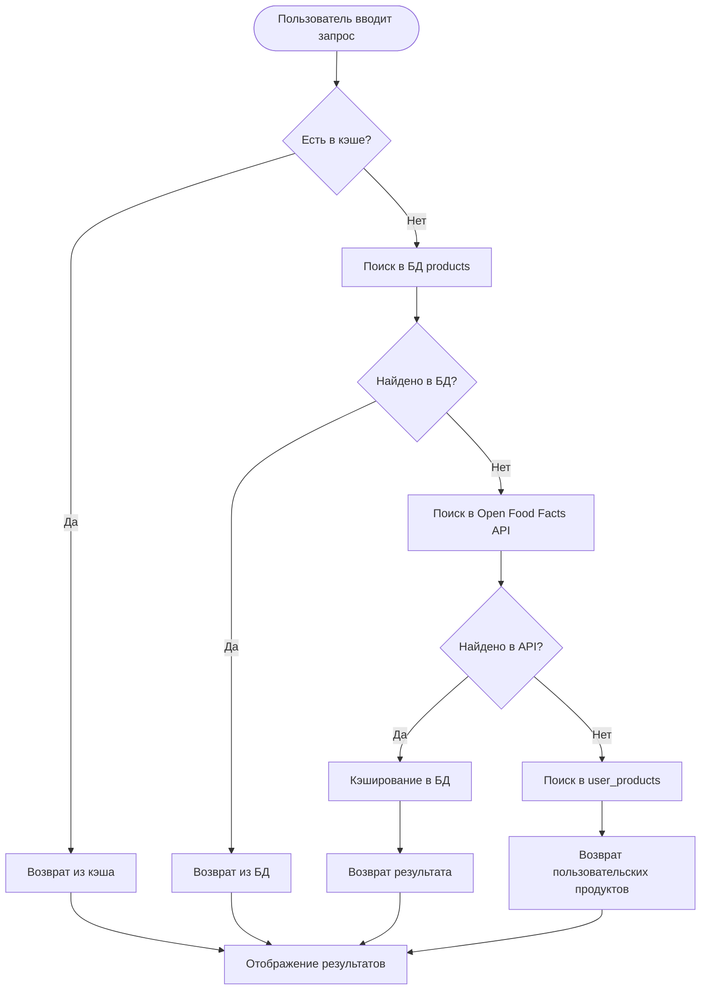

# Диаграммы потоков данных My Fitness App

**Версия документа:** 1.0  
**Дата создания:** Январь 2025  
**Статус:** Актуальная реализация v4.0+

---

## Поток данных при регистрации

---

## Поток данных при вводе питания

---

## Поток данных в чате

---

## Поток данных при OCR обработке

---

## Поток данных при автоматической деактивации подписок

---

## Поток данных при поиске продуктов

---

## Связанные документы

- [Functional_Specification.md](./Functional_Specification.md) - Функциональная спецификация
- [Diagrams_Index.md](./Diagrams_Index.md) - Индекс всех диаграмм

---

**Последнее обновление:** Январь 2025  
**Версия документа:** 1.0
