# ER-диаграмма базы данных My Fitness App

**Версия документа:** 1.0  
**Дата создания:** Январь 2025  
**Статус:** Актуальная реализация v4.0+

---

## Полная ER-диаграмма

```mermaid
erDiagram
    profiles ||--o{ nutrition_targets : "has"
    profiles ||--o{ daily_logs : "has"
    profiles ||--o{ coordinator_notes : "client receives"
    profiles ||--o{ coordinator_notes : "coordinator writes"
    profiles ||--o{ messages : "sends"
    profiles ||--o{ messages : "receives"
    profiles ||--o{ user_products : "creates"
    profiles ||--o{ product_usage_history : "uses"
    profiles ||--o{ favorite_products : "favorites"
    profiles ||--o{ invite_codes : "creates"
    profiles ||--o{ invite_code_usage : "uses"
    profiles ||--o{ ocr_scans : "scans"
    profiles ||--o{ user_achievements : "earns"
    profiles ||--o{ notification_settings : "has"
    profiles ||--o{ pending_notifications : "receives"
    profiles ||--o| profiles : "coach_id"
    
    nutrition_targets {
        uuid id PK
        uuid user_id FK
        text day_type
        integer calories
        integer protein
        integer fats
        integer carbs
        boolean is_active
    }
    
    daily_logs {
        uuid id PK
        uuid user_id FK
        date date
        text target_type
        integer actual_calories
        integer actual_protein
        integer actual_fats
        integer actual_carbs
        decimal weight
        integer hunger_level
        integer energy_level
        text notes
        jsonb meals
        boolean is_completed
        timestamptz completed_at
    }
    
    coach_notes {
        uuid id PK
        uuid client_id FK
        uuid coach_id FK
        date date
        text content
    }
    
    messages {
        uuid id PK
        uuid sender_id FK
        uuid receiver_id FK
        text content
        timestamptz created_at
        timestamptz read_at
        boolean is_deleted
    }
    
    products {
        uuid id PK
        text name
        text brand
        text barcode UK
        decimal calories_per_100g
        decimal protein_per_100g
        decimal fats_per_100g
        decimal carbs_per_100g
        text source
        integer usage_count
    }
    
    user_products {
        uuid id PK
        uuid user_id FK
        text name
        decimal calories_per_100g
        decimal protein_per_100g
        decimal fats_per_100g
        decimal carbs_per_100g
    }
    
    product_usage_history {
        uuid id PK
        uuid user_id FK
        uuid product_id FK
        uuid user_product_id FK
        timestamptz used_at
    }
    
    favorite_products {
        uuid user_id FK
        uuid product_id FK
        uuid user_product_id FK
    }
    
    invite_codes {
        uuid id PK
        text code UK
        uuid coach_id FK
        integer max_uses
        integer used_count
        timestamptz expires_at
        boolean is_active
    }
    
    invite_code_usage {
        uuid id PK
        uuid invite_code_id FK
        uuid user_id FK
        timestamptz used_at
    }
    
    ocr_scans {
        uuid id PK
        uuid user_id FK
        text image_hash
        text ocr_provider
        text model_name
        decimal confidence
        boolean success
        jsonb extracted_data
        integer processing_time_ms
        decimal cost_usd
    }
    
    achievements {
        uuid id PK
        text code UK
        text name
        text description
        text category
        text condition_type
        integer condition_value
        boolean is_active
    }
    
    user_achievements {
        uuid id PK
        uuid user_id FK
        uuid achievement_id FK
        timestamptz unlocked_at
        integer progress
    }
    
    notification_settings {
        uuid user_id PK
        boolean email_daily_digest
        boolean email_realtime_alerts
    }
    
    pending_notifications {
        uuid id PK
        uuid user_id FK
        text notification_type
        jsonb content
        timestamptz sent_at
        integer retry_count
    }
    
    profiles {
        uuid id PK
        text email
        text full_name
        text phone
        user_role role
        uuid coach_id FK
        text subscription_status
        text subscription_tier
        timestamptz subscription_start_date
        timestamptz subscription_end_date
        text gender
        date birth_date
        decimal height
        text activity_level
    }
    
    products ||--o{ product_usage_history : "used in"
    products ||--o{ favorite_products : "favorited"
    user_products ||--o{ product_usage_history : "used in"
    user_products ||--o{ favorite_products : "favorited"
    invite_codes ||--o{ invite_code_usage : "used by"
    achievements ||--o{ user_achievements : "earned"
```

---

## Основные связи

### 1. profiles (self-reference)
- `coach_id` → `profiles.id` (тренер клиента)

### 2. profiles → nutrition_targets
- `nutrition_targets.user_id` → `profiles.id`

### 3. profiles → daily_logs
- `daily_logs.user_id` → `profiles.id`

### 4. profiles → coach_notes
- `coach_notes.client_id` → `profiles.id`
- `coach_notes.coach_id` → `profiles.id`

### 5. profiles → messages
- `messages.sender_id` → `profiles.id`
- `messages.receiver_id` → `profiles.id`

### 6. profiles → products (через product_usage_history)
- `product_usage_history.user_id` → `profiles.id`
- `product_usage_history.product_id` → `products.id`

### 7. profiles → user_products
- `user_products.user_id` → `profiles.id`

### 8. profiles → invite_codes
- `invite_codes.coach_id` → `profiles.id`

### 9. profiles → achievements (через user_achievements)
- `user_achievements.user_id` → `profiles.id`
- `user_achievements.achievement_id` → `achievements.id`

---

## Индексы

### Основные индексы

- `profiles(role)` — по роли
- `profiles(coach_id)` — по тренеру
- `daily_logs(user_id, date DESC)` — по пользователю и дате
- `coach_notes(client_id, date DESC)` — по клиенту и дате
- `messages(sender_id, receiver_id, created_at DESC)` — по отправителю и получателю
- `products(name)` — по названию
- `invite_codes(code)` — по коду
- `user_achievements(user_id, unlocked_at DESC)` — по пользователю и дате получения

---

## Ограничения (Constraints)

### CHECK constraints

- `nutrition_targets`: calories (1000-6000), protein (20-500), fats (20-200), carbs (20-500)
- `messages`: content length (1-1000 символов)
- `products`: все значения КБЖУ >= 0
- `user_products`: все значения КБЖУ >= 0

### UNIQUE constraints

- `profiles(id)` — PK
- `daily_logs(user_id, date)` — один лог на день
- `coach_notes(client_id, coach_id, date)` — одна заметка на дату
- `invite_codes(code)` — уникальный код
- `achievements(code)` — уникальный код достижения
- `user_achievements(user_id, achievement_id)` — одно достижение на пользователя

---

## Связанные документы

- [Database_Schema.md](./Database_Schema.md) - Схема базы данных
- [Diagrams_Index.md](./Diagrams_Index.md) - Индекс всех диаграмм

---

**Последнее обновление:** Январь 2025  
**Версия документа:** 1.0

