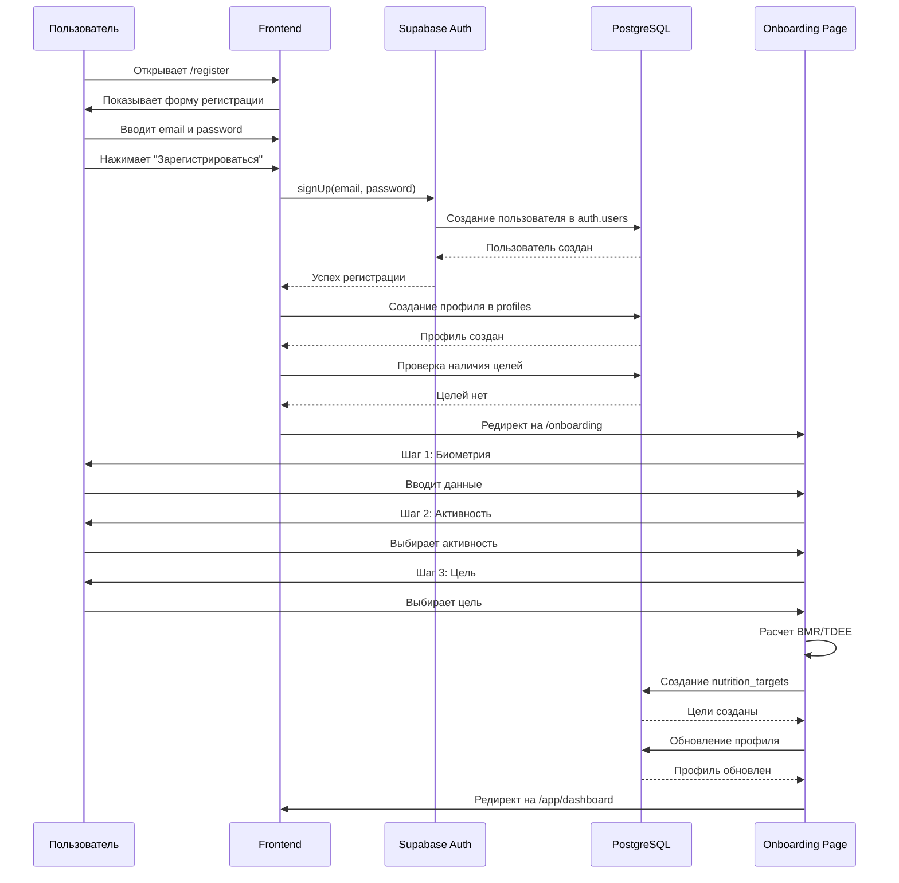
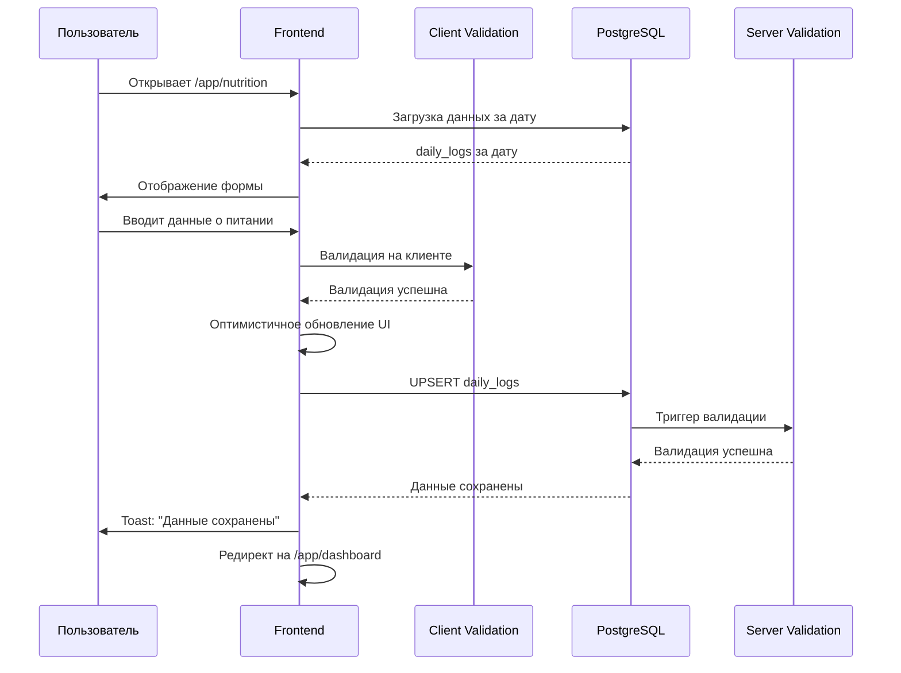
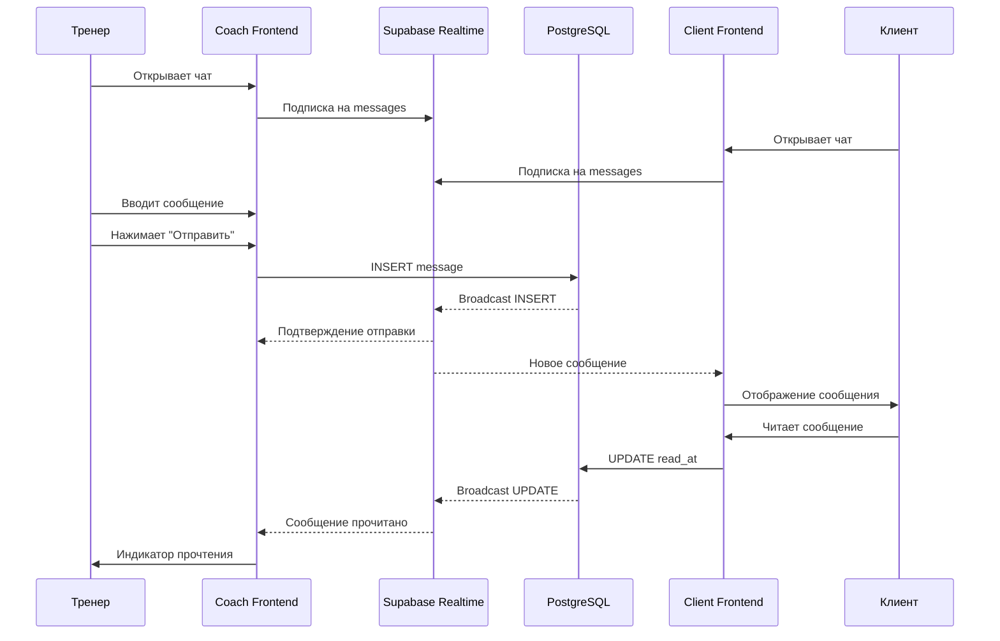
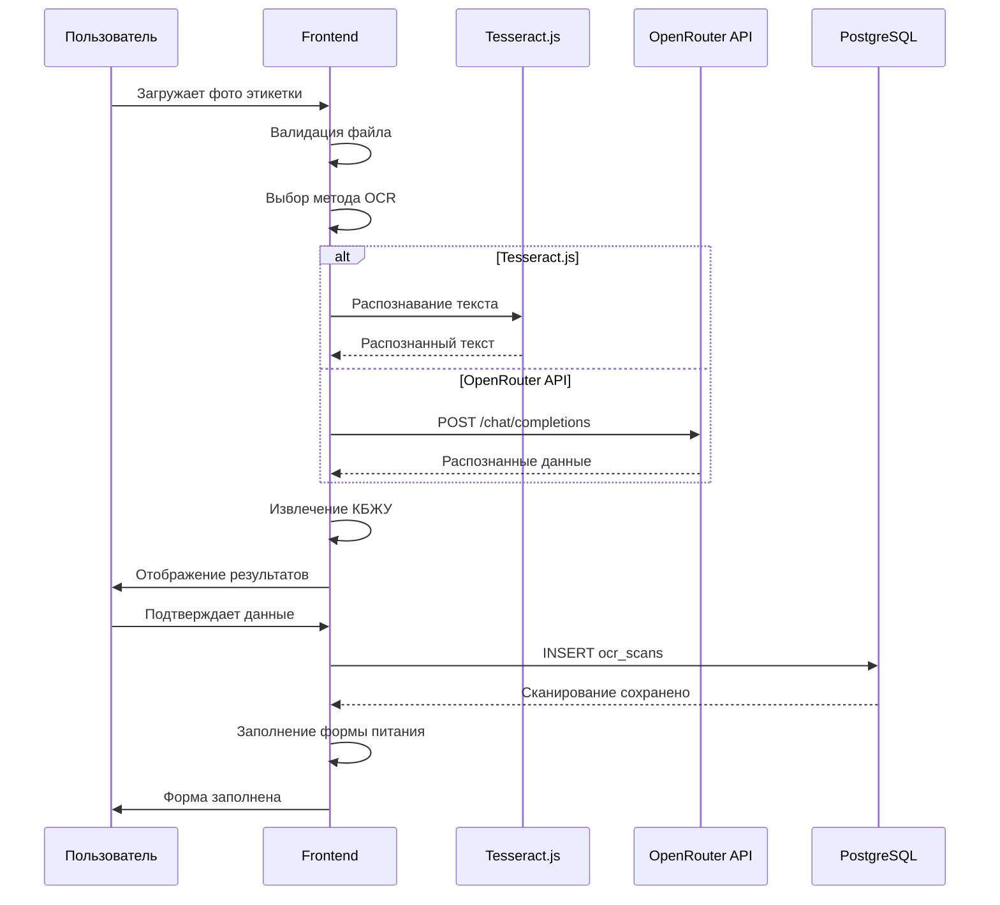
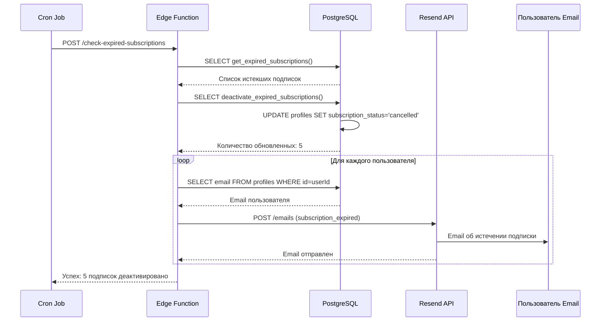
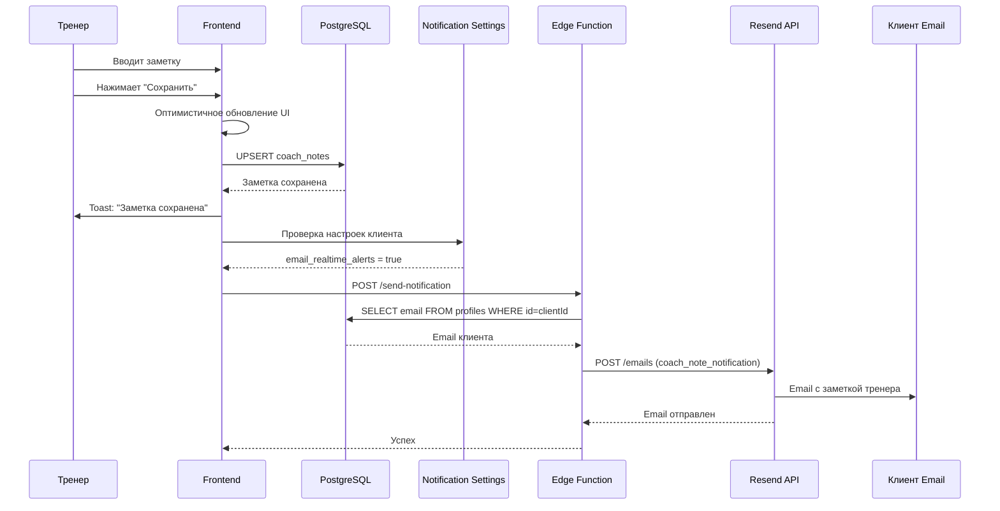
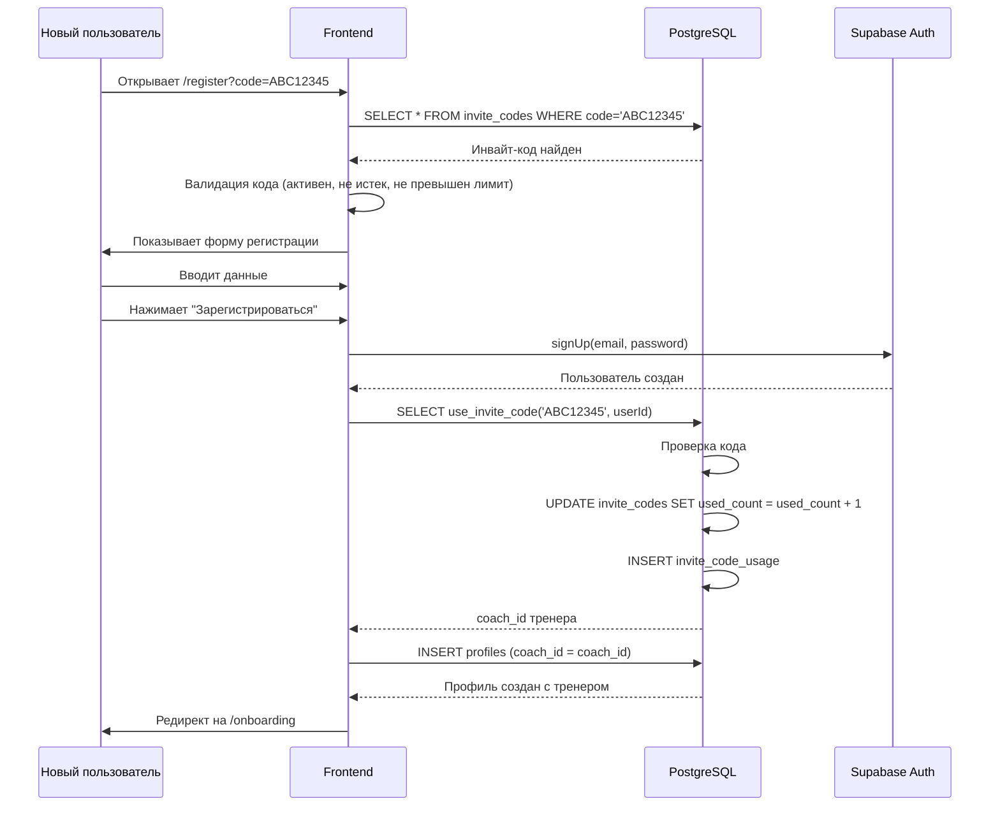

# Sequence диаграммы My Fitness App

**Версия документа:** 1.0  
**Дата создания:** Январь 2025  
**Статус:** Актуальная реализация v4.0+

---

## Регистрация и онбординг

---

## Ввод питания и сохранение

---

## Чат между тренером и клиентом

---

## OCR обработка фото

---

## Автоматическая деактивация подписок

---

## Сохранение заметки тренера

---

## Использование инвайт-кода

---

## Связанные документы

- [Functional_Specification.md](./Functional_Specification.md) - Функциональная спецификация
- [API_Reference.md](./API_Reference.md) - Справочник API
- [Diagrams_Index.md](./Diagrams_Index.md) - Индекс всех диаграмм

---

**Последнее обновление:** Январь 2025  
**Версия документа:** 1.0
