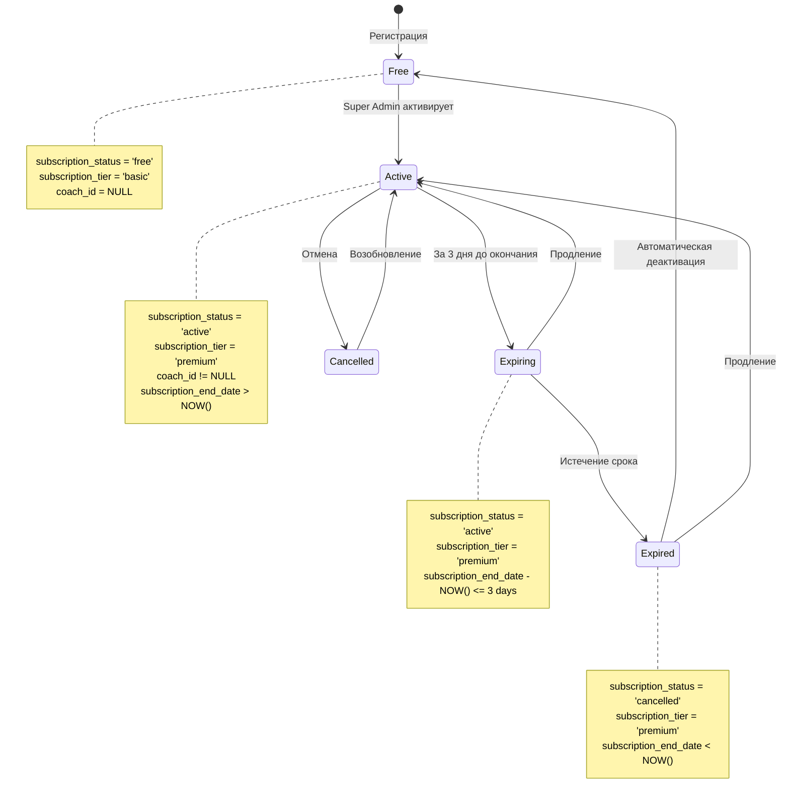

# Диаграммы состояний My Fitness App

**Версия документа:** 1.0  
**Дата создания:** Январь 2025  
**Статус:** Актуальная реализация v4.0+

---

## Состояния подписки

---

## Состояния дня (is_completed)

---

## Состояния онбординга

---

## Состояния сообщений в чате

---

## Состояния OCR обработки

---

## Состояния достижений

---

## Связанные документы

- [Functional_Specification.md](./Functional_Specification.md) - Функциональная спецификация
- [Database_Schema.md](./Database_Schema.md) - Схема базы данных
- [Diagrams_Index.md](./Diagrams_Index.md) - Индекс всех диаграмм

---

**Последнее обновление:** Январь 2025  
**Версия документа:** 1.0
