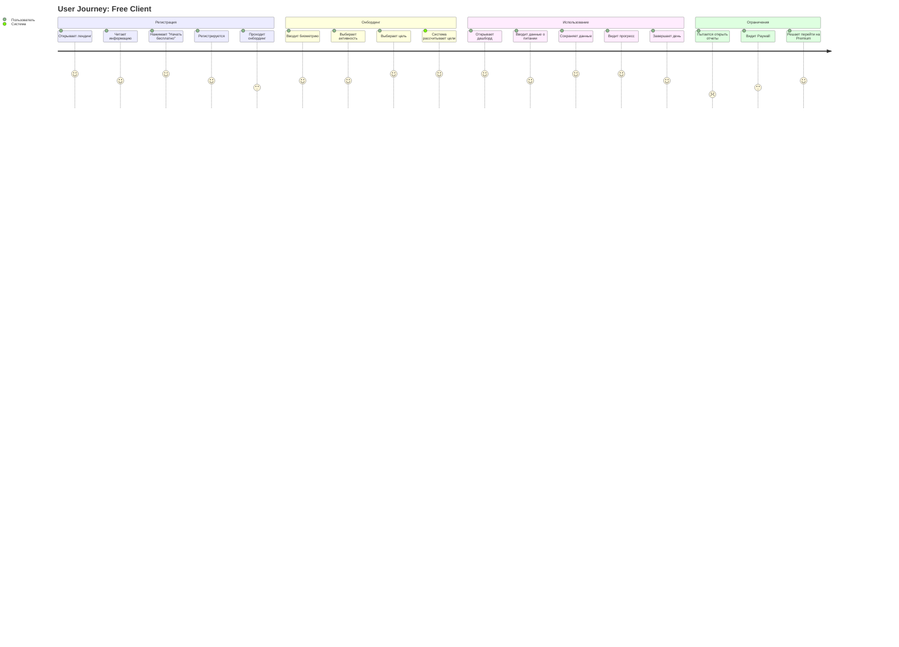
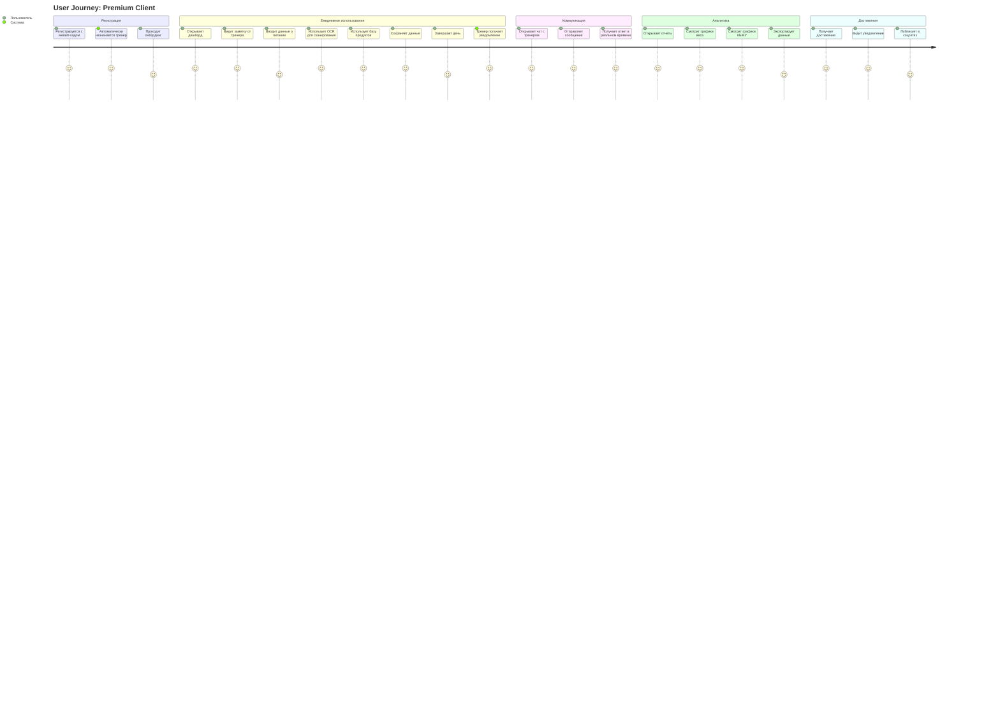
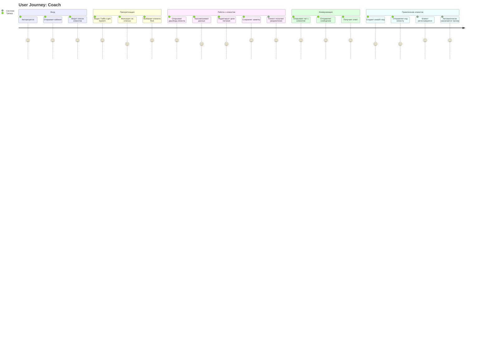
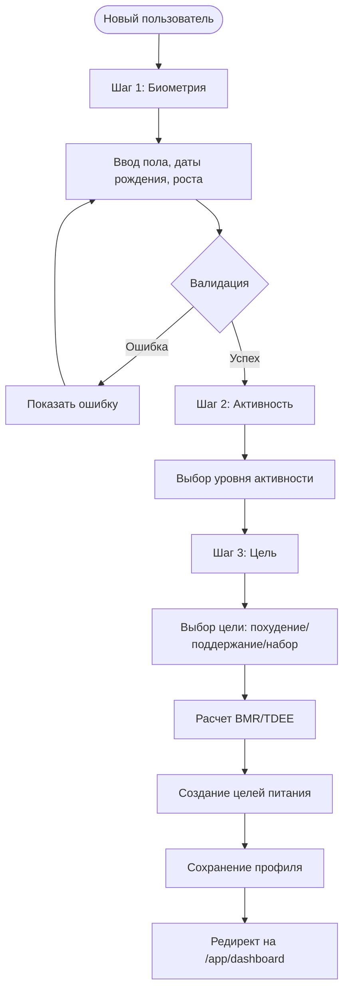
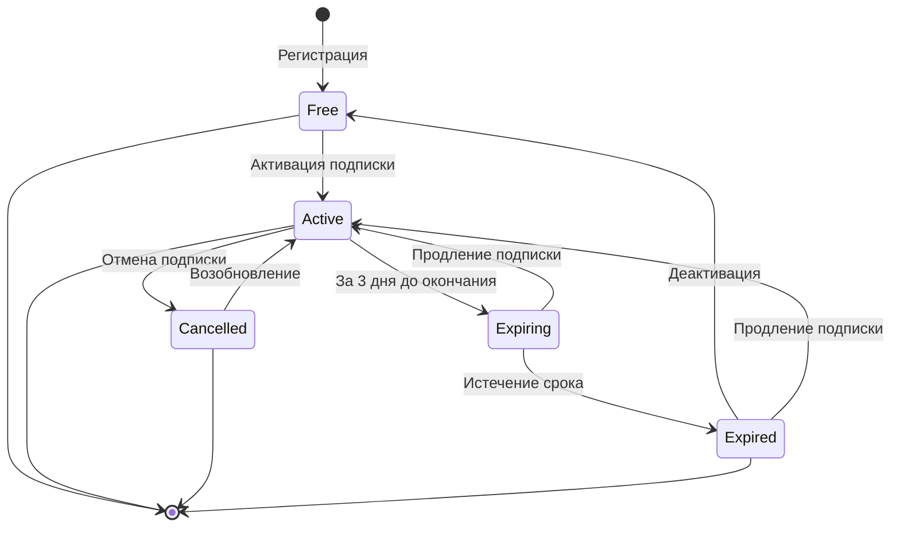

# Диаграммы пользовательских потоков My Fitness App

**Версия документа:** 1.0  
**Дата создания:** Январь 2025  
**Статус:** Актуальная реализация v4.0+

---

## Полный user journey для клиента (Free)

---

## Полный user journey для клиента (Premium)

---

## Полный user journey для тренера

---

## Onboarding flow

---

## Subscription lifecycle flow

---

## Связанные документы

- [Functional_Specification.md](./Functional_Specification.md) - Функциональная спецификация
- [Business_Model.md](./Business_Model.md) - Бизнес-модель
- [Diagrams_Index.md](./Diagrams_Index.md) - Индекс всех диаграмм

---

**Последнее обновление:** Январь 2025  
**Версия документа:** 1.0

