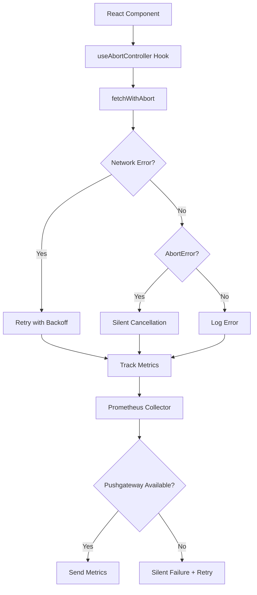

# Error Handling Guide

**Версия:** 1.0  
**Дата:** Январь 2025  
**Статус:** Production Ready

---

## Обзор

Это руководство описывает систему обработки ошибок в приложении, включая утилиты для работы с сетевыми запросами, отмены операций, загрузки изображений и сбора метрик.

## Архитектура



## Компоненты системы

### 1. Request Handler

**Файл:** `src/utils/request-handler.ts`

Центральная утилита для выполнения HTTP запросов с автоматической обработкой ошибок.

#### Основные функции

##### fetchWithAbort

Выполняет HTTP запрос с поддержкой отмены и автоматическим retry.

```typescript
async function fetchWithAbort<T>(
  url: string,
  options?: RequestOptions
): Promise<T>
```

**Параметры:**

```typescript
interface RequestOptions extends RequestInit {
  signal?: AbortSignal           // Сигнал для отмены запроса
  retries?: number               // Количество попыток (по умолчанию: 3)
  retryDelay?: number            // Начальная задержка в мс (по умолчанию: 1000)
  onRetry?: (attempt: number) => void  // Callback при retry
  showUserNotification?: boolean // Показать уведомление пользователю
}
```

**Примеры использования:**

```typescript
// Базовое использование
const data = await fetchWithAbort('/api/users')

// С отменой
const { signal } = useAbortController()
const data = await fetchWithAbort('/api/users', { signal })

// С настройкой retry
const data = await fetchWithAbort('/api/users', {
  retries: 5,
  retryDelay: 2000,
  showUserNotification: true,
  onRetry: (attempt) => {
    console.log(`Retry attempt ${attempt}`)
  }
})

// С обработкой ошибок
try {
  const data = await fetchWithAbort('/api/users', { signal })
} catch (error) {
  if (isAbortError(error)) {
    // Запрос был отменен - это нормально
    return
  }
  // Обработка других ошибок
  console.error('Request failed:', error)
}
```

##### isAbortError

Проверяет, является ли ошибка AbortError.

```typescript
function isAbortError(error: unknown): boolean
```

**Пример:**

```typescript
try {
  await fetchWithAbort('/api/data', { signal })
} catch (error) {
  if (isAbortError(error)) {
    // Запрос был отменен пользователем или при размонтировании
    console.log('Request cancelled')
  } else {
    // Реальная ошибка
    console.error('Request failed:', error)
  }
}
```

##### isNetworkError

Проверяет, является ли ошибка сетевой ошибкой.

```typescript
function isNetworkError(error: unknown): boolean
```

**Пример:**

```typescript
try {
  await fetchWithAbort('/api/data')
} catch (error) {
  if (isNetworkError(error)) {
    toast.error('Проблема с подключением к интернету')
  } else {
    toast.error('Произошла ошибка')
  }
}
```

##### shouldLogError

Определяет, нужно ли логировать ошибку.

```typescript
function shouldLogError(error: unknown): boolean
```

**Пример:**

```typescript
try {
  await fetchWithAbort('/api/data', { signal })
} catch (error) {
  if (shouldLogError(error)) {
    logger.error('Request failed', error)
  }
}
```

#### Retry механизм

Автоматический retry с экспоненциальной задержкой:

- **Попытка 1:** Немедленно
- **Попытка 2:** Задержка 1 секунда
- **Попытка 3:** Задержка 2 секунды
- **Попытка 4:** Задержка 4 секунды

**Формула:** `delay = retryDelay * 2^(attempt - 1)`

#### Логирование

Система логирует:
- ⚠️ Warning при каждой попытке retry
- ❌ Error при исчерпании всех попыток
- ✅ Успешное восстановление после retry
- 🔇 Не логирует AbortError (ожидаемое поведение)

**Пример лога:**

```json
{
  "level": "warn",
  "message": "Request failed, retrying",
  "url": "/api/users",
  "attempt": 2,
  "maxRetries": 3,
  "nextRetryIn": "2000ms",
  "error": "Failed to fetch"
}
```

### 2. useAbortController Hook

**Файл:** `src/hooks/useAbortController.ts`

React hook для автоматического управления AbortController.

#### Использование

```typescript
function MyComponent() {
  const { signal, abort } = useAbortController()
  
  const fetchData = async () => {
    try {
      const data = await fetchWithAbort('/api/data', { signal })
      setData(data)
    } catch (error) {
      if (!isAbortError(error)) {
        setError(error)
      }
    }
  }
  
  return (
    <div>
      <button onClick={fetchData}>Загрузить</button>
      <button onClick={abort}>Отменить</button>
    </div>
  )
}
```

#### Автоматическая очистка

Hook автоматически отменяет все активные запросы при размонтировании компонента:

```typescript
useEffect(() => {
  const controller = controllerRef.current
  
  return () => {
    // Автоматическая отмена при unmount
    controller?.abort()
  }
}, [])
```

#### Преимущества

- ✅ Предотвращает утечки памяти
- ✅ Устраняет ошибки "Can't perform a React state update on an unmounted component"
- ✅ Автоматическая очистка ресурсов
- ✅ Простой API

### 3. Image Loader

**Файл:** `src/utils/image-loader.ts`

Утилита для загрузки изображений с автоматическим fallback на placeholder.

#### Основные функции

##### loadImage

Загружает изображение с fallback при ошибке.

```typescript
async function loadImage(
  url: string,
  options?: ImageLoaderOptions
): Promise<string>
```

**Параметры:**

```typescript
interface ImageLoaderOptions {
  fallbackUrl?: string           // URL fallback изображения
  onError?: (error: Error) => void  // Callback при ошибке
  timeout?: number               // Таймаут в мс (по умолчанию: 5000)
}
```

**Примеры:**

```typescript
// Базовое использование
const imageUrl = await loadImage('https://example.com/image.jpg')

// С custom fallback
const imageUrl = await loadImage('https://example.com/image.jpg', {
  fallbackUrl: '/images/custom-placeholder.svg',
  timeout: 3000,
  onError: (error) => {
    console.error('Image load failed:', error)
  }
})

// В React компоненте
function ProductImage({ url }: { url: string }) {
  const [imageSrc, setImageSrc] = useState(getPlaceholder())
  
  useEffect(() => {
    loadImage(url).then(setImageSrc)
  }, [url])
  
  return 
}
```

##### getPlaceholder

Возвращает путь к placeholder изображению.

```typescript
function getPlaceholder(): string
```

**Пример:**

```typescript
const placeholder = getPlaceholder()
// Returns: '/images/product-placeholder.svg'
```

##### preloadImage

Предзагружает изображение для кэширования.

```typescript
async function preloadImage(url: string): Promise<void>
```

**Пример:**

```typescript
// Предзагрузка одного изображения
await preloadImage('https://example.com/image.jpg')

// Предзагрузка при наведении
<div onMouseEnter={() => preloadImage(imageUrl)}>
  Hover to preload
</div>
```

##### preloadImages

Предзагружает несколько изображений параллельно.

```typescript
async function preloadImages(urls: string[]): Promise<void>
```

**Пример:**

```typescript
// Предзагрузка галереи
const imageUrls = [
  'https://example.com/image1.jpg',
  'https://example.com/image2.jpg',
  'https://example.com/image3.jpg'
]

await preloadImages(imageUrls)
```

#### Обработка ошибок

Image loader обрабатывает следующие случаи:

- ❌ Невалидный URL → возвращает placeholder
- ❌ 404 Not Found → возвращает placeholder
- ❌ Network error → возвращает placeholder
- ⏱️ Timeout → возвращает placeholder
- ✅ Успешная загрузка → возвращает оригинальный URL

#### Оптимизация

- Использует `HEAD` запрос для проверки доступности
- Кэширует результаты через `cache: 'force-cache'`
- Не отправляет credentials для внешних изображений
- Таймаут по умолчанию 5 секунд

### 4. Prometheus Collector

**Файл:** `src/utils/metrics/prometheus-collector.ts`

Сборщик метрик с graceful degradation при недоступности Pushgateway.

#### Конфигурация

**Переменные окружения:**

```bash
# Включить сбор метрик
PROMETHEUS_ENABLED=true

# URL Pushgateway
PROMETHEUS_PUSHGATEWAY_URL=http://pushgateway:9091
```

#### Использование

##### pushMetric

Отправляет одну метрику.

```typescript
await prometheusCollector.pushMetric({
  name: 'app_requests_total',
  value: 1,
  labels: {
    method: 'GET',
    status: '200',
    endpoint: '/api/users'
  }
})
```

##### pushMetrics

Отправляет несколько метрик в batch.

```typescript
await prometheusCollector.pushMetrics([
  {
    name: 'app_requests_total',
    value: 1,
    labels: { method: 'GET', status: '200' }
  },
  {
    name: 'app_request_duration_seconds',
    value: 0.123,
    labels: { method: 'GET', endpoint: '/api/users' }
  }
])
```

##### isConnected

Проверяет доступность Pushgateway.

```typescript
if (prometheusCollector.isConnected()) {
  console.log('Pushgateway is available')
}
```

##### checkConnection

Вручную проверяет подключение.

```typescript
const isAvailable = await prometheusCollector.checkConnection()
```

#### Graceful Degradation

Система автоматически обрабатывает недоступность Pushgateway:

1. **Проверка при старте:** Проверяет доступность Pushgateway
2. **Silent failure:** Не бросает ошибки при недоступности
3. **Логирование:** Логирует только первую ошибку
4. **Retry:** Автоматически повторяет попытку каждые 60 секунд
5. **Восстановление:** Логирует успешное восстановление подключения

**Пример логов:**

```json
// Первая ошибка
{
  "level": "warn",
  "message": "Prometheus Pushgateway unavailable, entering silent failure mode",
  "url": "http://pushgateway:9091",
  "retryInterval": "60s"
}

// Восстановление
{
  "level": "info",
  "message": "Prometheus Pushgateway connection restored",
  "url": "http://pushgateway:9091"
}
```

#### Преимущества

- ✅ Не блокирует работу приложения
- ✅ Не спамит логи при длительной недоступности
- ✅ Автоматическое восстановление
- ✅ Минимальный overhead при недоступности

## Метрики

Система автоматически собирает следующие метрики:

### Error Handling Metrics

**Файл:** `src/utils/metrics/error-handling-metrics.ts`

#### abort_errors_total

Количество отмененных запросов.

```typescript
trackAbortError({
  url: '/api/users',
  reason: 'request_cancelled'
})
```

**Labels:**
- `url` - URL запроса
- `reason` - Причина отмены

#### network_retries_total

Количество retry попыток.

```typescript
trackNetworkRetry({
  url: '/api/users',
  attempt: 2,
  success: true,
  errorType: 'network'
})
```

**Labels:**
- `url` - URL запроса
- `attempt` - Номер попытки
- `success` - Успешность retry
- `error_type` - Тип ошибки

#### image_fallbacks_total

Количество fallback на placeholder.

```typescript
trackImageFallback({
  originalUrl: 'https://example.com/image.jpg',
  fallbackUrl: '/images/placeholder.svg',
  reason: 'not_found'
})
```

**Labels:**
- `original_url` - Оригинальный URL
- `fallback_url` - Fallback URL
- `reason` - Причина fallback (not_found, timeout, error)

#### prometheus_connection_status

Статус подключения к Pushgateway.

```typescript
trackPrometheusConnection(true)  // Connected
trackPrometheusConnection(false) // Disconnected
```

**Value:** 1 (connected) или 0 (disconnected)

#### prometheus_recoveries_total

Количество восстановлений подключения.

```typescript
trackPrometheusRecovery()
```

## Best Practices

### 1. Всегда используйте useAbortController

```typescript
// ✅ Правильно
function MyComponent() {
  const { signal } = useAbortController()
  
  useEffect(() => {
    fetchWithAbort('/api/data', { signal })
  }, [signal])
}

// ❌ Неправильно
function MyComponent() {
  useEffect(() => {
    fetch('/api/data') // Не отменяется при unmount
  }, [])
}
```

### 2. Проверяйте AbortError

```typescript
// ✅ Правильно
try {
  await fetchWithAbort('/api/data', { signal })
} catch (error) {
  if (!isAbortError(error)) {
    // Обрабатываем только реальные ошибки
    handleError(error)
  }
}

// ❌ Неправильно
try {
  await fetchWithAbort('/api/data', { signal })
} catch (error) {
  // Обрабатываем все ошибки, включая AbortError
  handleError(error)
}
```

### 3. Используйте showUserNotification для важных операций

```typescript
// ✅ Правильно - показываем уведомление при критической операции
await fetchWithAbort('/api/payment', {
  signal,
  showUserNotification: true
})

// ✅ Правильно - не показываем уведомление для фоновых операций
await fetchWithAbort('/api/analytics', {
  signal,
  showUserNotification: false
})
```

### 4. Предзагружайте изображения

```typescript
// ✅ Правильно - предзагрузка при наведении
<div onMouseEnter={() => preloadImage(imageUrl)}>
  
</div>

// ✅ Правильно - предзагрузка галереи
useEffect(() => {
  preloadImages(galleryUrls)
}, [galleryUrls])
```

### 5. Настраивайте retry для разных типов запросов

```typescript
// ✅ Правильно - больше попыток для критических операций
await fetchWithAbort('/api/payment', {
  retries: 5,
  retryDelay: 2000
})

// ✅ Правильно - меньше попыток для некритических операций
await fetchWithAbort('/api/suggestions', {
  retries: 1,
  retryDelay: 500
})
```

## Troubleshooting

### Проблема: Много AbortError в логах

**Решение:** Убедитесь, что используете `isAbortError()` для фильтрации:

```typescript
if (!isAbortError(error)) {
  logger.error('Request failed', error)
}
```

### Проблема: Запросы не отменяются при навигации

**Решение:** Используйте `useAbortController` hook:

```typescript
const { signal } = useAbortController()
await fetchWithAbort('/api/data', { signal })
```

### Проблема: Изображения не загружаются

**Решение:** Проверьте CORS и используйте fallback:

```typescript
const imageUrl = await loadImage(url, {
  fallbackUrl: getPlaceholder(),
  timeout: 5000
})
```

### Проблема: Prometheus спамит логи

**Решение:** Система автоматически логирует только первую ошибку. Если видите много логов, проверьте версию `prometheus-collector.ts`.

## Тестирование

### Unit тесты

```bash
# Request handler
npm test -- request-handler.test.ts

# useAbortController
npm test -- useAbortController.test.ts

# Image loader
npm test -- image-loader.test.ts

# Prometheus collector
npm test -- prometheus-collector.test.ts
```

### Property-Based тесты

```bash
# AbortError фильтрация
npm test -- abort-error.property.test.ts

# Component cleanup
npm test -- component-cleanup.property.test.ts

# Image fallback
npm test -- image-fallback.property.test.ts

# Prometheus silent failure
npm test -- prometheus-collector.silent-failure.property.test.ts

# Prometheus recovery
npm test -- prometheus-collector.recovery.property.test.ts
```

### Integration тесты

```bash
# Все integration тесты
npm test -- integration.test.ts
```

## Связанные документы

- [Technical Architecture](./Technical_Architecture.md) - Общая архитектура
- [API Reference](./API_Reference.md) - API документация
- [Testing Guide](../TESTING.md) - Руководство по тестированию
- [RLS Migration Guide](./RLS_Migration_Guide.md) - Миграция RLS политик

---

**Версия:** 1.0  
**Последнее обновление:** Январь 2025  
**Статус:** Production Ready
